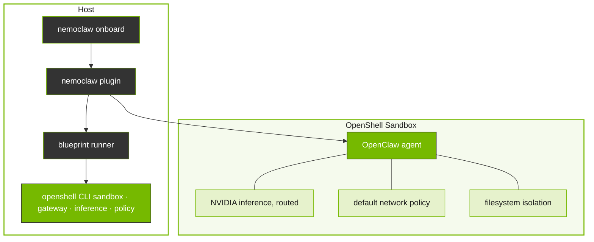

# NemoClaw Overview

Describes how NemoClaw combines a CLI plugin with a versioned blueprint to move OpenClaw into a controlled sandbox. Use when explaining the sandbox lifecycle, blueprint architecture, or how NemoClaw layers on top of OpenShell.

## Context

NemoClaw combines a lightweight CLI plugin with a versioned blueprint to move OpenClaw into a controlled sandbox.
This page explains the key concepts about NemoClaw at a high level.

## How It Fits Together

The `nemoclaw` CLI is the primary entrypoint for setting up and managing sandboxed OpenClaw agents.
It delegates heavy lifting to a versioned blueprint, a Python artifact that orchestrates sandbox creation, policy application, and inference provider setup through the OpenShell CLI.

NemoClaw adds the following layers on top of OpenShell.

| Layer | What it provides |
|-------|------------------|
| Onboarding | Guided setup that validates credentials, selects providers, and creates a working sandbox in one command. |
| Blueprint | A hardened Dockerfile with security policies, capability drops, and least-privilege network rules. |
| State management | Safe migration of agent state across machines with credential stripping and integrity verification. |
| Messaging bridges | Host-side processes that connect Telegram, Discord, and Slack to the sandboxed agent. |

OpenShell handles *how* to sandbox an agent securely. NemoClaw handles *what* goes in the sandbox and makes the setup accessible. For the full system diagram, see Architecture (see the `nemoclaw-reference` skill).

## Design Principles

*Full details in `references/how-it-works.md`.*

NVIDIA NemoClaw is an open source reference stack that simplifies running [OpenClaw](https://openclaw.ai) always-on assistants.
It incorporates policy-based privacy and security guardrails, giving users control over their agents’ behavior and data handling.
This enables self-evolving claws to run more safely in clouds, on prem, RTX PCs and DGX Spark.

NemoClaw uses open source models, such as [NVIDIA Nemotron](https://build.nvidia.com), alongside the [NVIDIA OpenShell](https://github.com/NVIDIA/OpenShell) runtime, part of the NVIDIA Agent Toolkit—a secure environment designed for executing claws more safely.
By combining powerful open source models with built-in safety measures, NemoClaw simplifies and secures AI agent deployment.

| Capability              | Description                                                                                                                                          |
|-------------------------|------------------------------------------------------------------------------------------------------------------------------------------------------|
| Sandbox OpenClaw        | Creates an OpenShell sandbox pre-configured for OpenClaw, with filesystem and network policies applied from the first boot.                   |
| Route inference         | Configures OpenShell inference routing so agent traffic flows through cloud-hosted Nemotron 3 Super 120B via [build.nvidia.com](https://build.nvidia.com). |
| Manage the lifecycle    | Handles blueprint versioning, digest verification, and sandbox setup.                                                                                |

## Key Features

NemoClaw provides the following capabilities on top of the OpenShell runtime.

| Feature | Description |
|---------|-------------|
| Guided onboarding | Validates credentials, selects providers, and creates a working sandbox in one command. |
| Hardened blueprint | A security-first Dockerfile with capability drops, least-privilege network rules, and declarative policy. |
| State management | Safe migration of agent state across machines with credential stripping and integrity verification. |
| Messaging bridges | Host-side processes that connect Telegram, Discord, and Slack to the sandboxed agent. |
| Routed inference | Provider-routed model calls through the OpenShell gateway, transparent to the agent. Supports NVIDIA Endpoints, OpenAI, Anthropic, Google Gemini, and local Ollama. |
| Layered protection | Network, filesystem, process, and inference controls that can be hot-reloaded or locked at creation. |

## Challenge

Autonomous AI agents like OpenClaw can make arbitrary network requests, access the host filesystem, and call any inference endpoint. Without guardrails, this creates security, cost, and compliance risks that grow as agents run unattended.

## Benefits

NemoClaw provides the following benefits.

| Benefit                    | Description                                                                                                            |
|----------------------------|------------------------------------------------------------------------------------------------------------------------|
| Sandboxed execution        | Every agent runs inside an OpenShell sandbox with Landlock, seccomp, and network namespace isolation. No access is granted by default. |
| NVIDIA Endpoint inference     | Agent traffic routes through cloud-hosted Nemotron 3 Super 120B via [build.nvidia.com](https://build.nvidia.com), transparent to the agent.          |
| Declarative network policy | Egress rules are defined in YAML. Unknown hosts are blocked and surfaced to the operator for approval.                 |
| Single CLI                 | The `nemoclaw` command orchestrates the full stack: gateway, sandbox, inference provider, and network policy.           |
| Blueprint lifecycle        | Versioned blueprints handle sandbox creation, digest verification, and reproducible setup.                             |

## Use Cases

You can use NemoClaw for various use cases including the following.

| Use Case                  | Description                                                                                  |
|---------------------------|----------------------------------------------------------------------------------------------|
| Always-on assistant       | Run an OpenClaw assistant with controlled network access and operator-approved egress.        |
| Sandboxed testing         | Test agent behavior in a locked-down environment before granting broader permissions.         |
| Remote GPU deployment     | Deploy a sandboxed agent to a remote GPU instance for persistent operation.                   |

*Full details in `references/overview.md`.*

## Reference

- [NemoClaw Release Notes](references/release-notes.md)

## Related Skills

- `nemoclaw-get-started` — Quickstart to install NemoClaw and run your first agent
- `nemoclaw-configure-inference` — Switch Inference Providers to configure the inference provider
- `nemoclaw-manage-policy` — Approve or Deny Network Requests to manage egress approvals
