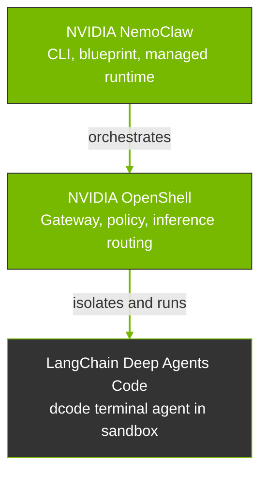

NemoClaw provides onboarding, lifecycle management, policy, and inference routing for LangChain Deep Agents Code in OpenShell containers.
Use the `nemo-deepagents` CLI alias when you work from the Deep Agents guide; it is equivalent to `nemoclaw` with `langchain-deepagents-code` pre-selected.

This page explains how Deep Agents, OpenShell, and NemoClaw fit together, and when to choose NemoClaw or a custom OpenShell integration.

## How the Stack Fits Together

A NemoClaw deployment for Deep Agents combines three pieces with distinct scopes: LangChain Deep Agents Code, OpenShell, and NemoClaw.
The following diagram shows how they fit together.

NemoClaw sits above OpenShell in the operator workflow.
It calls OpenShell APIs and CLI commands to create and configure the sandbox that runs `dcode`.
Models and endpoints sit behind OpenShell's inference routing.
NemoClaw onboarding connects your provider choice to that route and writes the managed Deep Agents configuration under `/sandbox/.deepagents`.

The following table shows the scope of each component in the stack.

| Project | Scope |
|---------|--------|
| LangChain Deep Agents Code | The terminal coding agent runtime, interactive TUI, headless `dcode -n` mode, skills, memory, and tool approval UI inside the container. |
| OpenShell | The execution environment: sandbox lifecycle, network, filesystem, process policy, inference routing, and the operator-facing `openshell` CLI for those primitives. |
| NemoClaw | The NVIDIA reference stack on the host: `nemo-deepagents` / `nemoclaw` CLI, versioned blueprint, managed Deep Agents runtime patches, credential-safe inference routing, policy presets, and state migration helpers. |

## NemoClaw Path versus OpenShell Path

Both paths assume OpenShell can sandbox a workload.
The difference is who owns the integration work.

| Path | What it means |
|------|---------------|
| **NemoClaw path** | You adopt the reference stack. NemoClaw's Deep Agents blueprint encodes the image, managed `dcode` launchers, default policies, inference configuration, and state handling so `nemo-deepagents onboard` creates a tested Deep Agents-on-OpenShell setup with less custom integration work. |
| **OpenShell path** | You use OpenShell as the platform and supply your own container, Deep Agents install steps, policy YAML, provider setup, and runtime wrappers. OpenShell stays the sandbox and policy engine; nothing requires NemoClaw's blueprint or CLI. |

## What NemoClaw Adds Beyond Custom OpenShell

You can run Deep Agents inside OpenShell without NemoClaw by building your own image, writing policy YAML, registering providers, and wiring inference routes yourself.
That path is valid when you need full control over the container layout.

NemoClaw builds on OpenShell with additional security hardening, automation, and lifecycle tooling for Deep Agents.
The following table compares custom OpenShell integration with `nemo-deepagents onboard`.

| Capability | Custom OpenShell + Deep Agents | `nemo-deepagents onboard` |
|---|---|---|
| Sandbox isolation | You define and apply OpenShell seccomp, Landlock, network namespace isolation, and no-new-privileges policy. | NemoClaw applies the managed Deep Agents policy through the blueprint and requires the runtime checks that the managed harness depends on. |
| Credential handling | You create OpenShell providers manually and decide how `dcode` receives endpoint credentials. | NemoClaw creates OpenShell providers during onboarding, points Deep Agents at `https://inference.local/v1`, and keeps provider credentials on the host. |
| Image hardening | Depends on your base image and install steps. | NemoClaw installs the pinned Deep Agents Code package in `/opt/venv`, uses managed launchers, and disables unsupported runtime escape paths such as unmanaged MCP autoloading, tracing exports, nested sandbox providers, and alternate model routes. |
| Filesystem policy | You define read-only and read-write paths in policy YAML. | NemoClaw defines a targeted layout: system paths are read-only, `/sandbox` and `/tmp` are writable, and Deep Agents state lives under `/sandbox/.deepagents`. |
| Inference setup | You configure OpenShell inference routing and Deep Agents provider settings manually. | NemoClaw validates the selected provider from the host, configures the OpenShell route, and writes `/sandbox/.deepagents/config.toml` for the managed OpenAI-compatible path. |
| Optional integrations | You decide how web search, MCP, tracing, and other integrations enter the sandbox. | NemoClaw supports a maintained MCP projection and opt-in Tavily policy path, while keeping LangSmith and OpenTelemetry tracing disabled for the managed harness. |
| Blueprint versioning | No NemoClaw blueprint; your image tag is whatever you built locally. | NemoClaw downloads the blueprint artifact, checks version compatibility, and verifies its digest before applying. |
| State migration | Not included unless you build it. | NemoClaw preserves manifest-declared Deep Agents state and omits credential-bearing user files from snapshots and rebuilds. |

## When to Use Which

Use the following table to choose NemoClaw or custom OpenShell integration.

| Situation | Prefer |
|-----------|--------|
| You want Deep Agents with NVIDIA defaults, managed inference routing, and the documented install and onboard flow. | NemoClaw (`nemo-deepagents`) |
| You need maximum flexibility for custom images, a layout that does not match the NemoClaw Deep Agents blueprint, or an unsupported Deep Agents extension path. | OpenShell with your own integration |
| You are standardizing on a managed terminal coding agent with sandbox policy and host-owned credentials. | NemoClaw (`nemo-deepagents`) |
| You are building internal platform abstractions where the NemoClaw CLI or blueprint is not the right fit. | OpenShell and your orchestration |

## Related Topics

- [Overview](overview) defines NemoClaw's capabilities, benefits, and use cases.
- [Architecture Overview](how-it-works) describes how NemoClaw runs, the blueprint, sandbox creation, routing, and protection layers for Deep Agents.
- [Architecture Details](../reference/architecture) describes the Deep Agents blueprint, file layout, policy paths, and managed runtime internals.
- [Quickstart with Deep Agents](../get-started/quickstart) installs NemoClaw and launches your first Deep Agents sandbox.
- [Inference Options](../inference/inference-options) explains provider choices and the `inference.local` route.
- [Deep Agents Code overview](https://docs.langchain.com/oss/python/deepagents/code/overview) explains upstream `dcode` capabilities and commands.
- [NemoClaw Community](https://github.com/NVIDIA/nemoclaw-community) collects community-driven blueprint examples, showcases, and integrations that demonstrate complete blueprint patterns.
