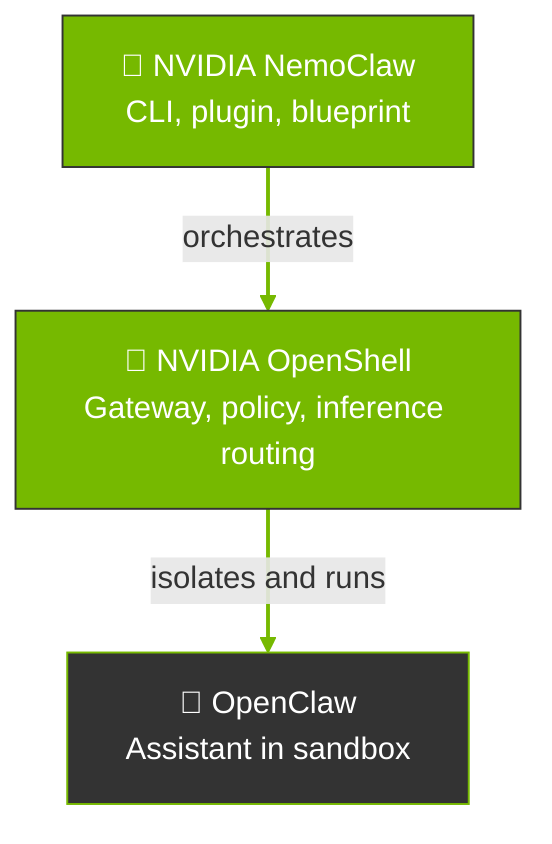

NemoClaw provides onboarding, lifecycle management, and OpenClaw operations in OpenShell containers.

This page explains how these projects fit together, where NemoClaw sits relative to [OpenShell](https://github.com/NVIDIA/OpenShell) and [OpenClaw](https://openclaw.ai), and when to choose NemoClaw or OpenShell directly.

## How the Stack Fits Together

A NemoClaw deployment for OpenClaw combines three pieces with distinct scopes: OpenClaw, OpenShell, and NemoClaw.
The following diagram shows how they fit together.

NemoClaw sits above OpenShell in the operator workflow.
It calls OpenShell APIs and CLI commands to create and configure the sandbox that runs OpenClaw.
Models and endpoints sit behind OpenShell's inference routing.
NemoClaw onboarding connects your provider choice to that route.

The following table shows the scope of each component in the stack.

| Project | Scope |
|---------|--------|
| [OpenClaw](https://openclaw.ai) | The assistant: runtime, tools, memory, and behavior inside the container. It does not define the sandbox or the host gateway. |
| [OpenShell](https://github.com/NVIDIA/OpenShell) | The execution environment: sandbox lifecycle, network, filesystem, and process policy, inference routing, and the operator-facing `openshell` CLI for those primitives. |
| NemoClaw | The NVIDIA reference stack on the host: `nemoclaw` CLI, OpenClaw plugin, versioned blueprint, managed inference and Model Context Protocol (MCP) servers, messaging-channel setup, host readiness reporting, and lifecycle operations. |

## NemoClaw Path versus OpenShell Path

Both paths assume OpenShell can sandbox a workload.
The difference is who owns the integration work.

| Path | What it means |
|------|---------------|
| **NemoClaw path** | You adopt the reference stack. NemoClaw's blueprint encodes a hardened image, default policies, and orchestration so `nemoclaw onboard` can create a tested OpenClaw-on-OpenShell setup with less custom integration work. |
| **OpenShell path** | You use OpenShell as the platform and supply your own container, OpenClaw install steps, policy YAML, provider setup, and host bridges. OpenShell stays the sandbox and policy engine; nothing requires NemoClaw's blueprint or CLI. |

## What NemoClaw Adds Beyond the OpenShell Community Sandbox

OpenShell ships a community sandbox for OpenClaw.
Running `openshell sandbox create --from openclaw` pulls that package, builds the image, applies the bundled policy, and starts a working sandbox.
This path produces a running OpenClaw environment with OpenShell isolation.

NemoClaw builds on that foundation with additional security hardening, automation, and lifecycle tooling.
The following table compares the two paths.

| Capability | `openshell sandbox create --from openclaw` | `nemoclaw onboard` |
|---|---|---|
| Sandbox isolation | Yes. OpenShell applies seccomp filters, Landlock filesystem restrictions, privilege dropping, network namespace isolation, and no-new-privileges enforcement. The community sandbox bundles its own policy tailored for OpenClaw. | Yes. NemoClaw applies these through the blueprint and layers a more restrictive policy on top (refer to rows below). |
| Credential handling | OpenShell's provider system replaces real credentials with placeholder tokens in the sandbox environment. The L7 proxy resolves placeholders to real values at egress. You create providers manually with `openshell provider create`. | NemoClaw creates OpenShell providers automatically during onboarding. It also filters sensitive host environment variables (provider API keys, `DISCORD_BOT_TOKEN`, `SLACK_BOT_TOKEN`, `TELEGRAM_BOT_TOKEN`) from the sandbox creation command to prevent accidental leakage through build args. |
| Image hardening | The community image includes standard system tools for general-purpose use. | NemoClaw removes build toolchains (`gcc`, `g++`, `make`) and network probes (`netcat`) from the runtime image to reduce attack surface. |
| Filesystem policy | The community sandbox bundles a policy for OpenClaw. | NemoClaw defines a targeted read-only and read-write layout. System paths (`/usr`, `/lib`, `/etc`) are read-only. The agent's home directory (`/sandbox`) and config directory (`/sandbox/.openclaw`) are writable by default so the agent can manage config, install skills, and write to standard paths. |
| Inference setup | The community sandbox includes an `openclaw-start` script that runs OpenClaw's onboarding wizard inside the sandbox. You can also create providers and configure OpenShell inference routing manually from the host. | NemoClaw validates the selected provider and model from the host, configures the OpenShell inference route, and writes the managed OpenClaw model reference. Provider credentials stay outside the sandbox. |
| Managed MCP | You register providers, network policy, and OpenClaw MCP configuration yourself. | NemoClaw manages authenticated HTTPS Streamable HTTP MCP server lifecycle, ownership records, policy, and credential placeholders through host-side commands. |
| Channel messaging | OpenShell provides the credential provider system and L7 proxy for channel traffic. You create providers and configure OpenClaw channel settings manually. | NemoClaw configures supported channels during onboarding or through lifecycle commands. Some experimental webhook channels also require a route-restricted host-side public endpoint. |
| Blueprint versioning | No blueprint. The community sandbox uses the published image version. | NemoClaw downloads the blueprint artifact, checks version compatibility, and verifies its digest before applying. Repeated onboarding uses the selected blueprint and recorded configuration; host and platform differences can still affect the result. |
| Lifecycle state | Not included. | NemoClaw records lifecycle progress, preserves manifest-declared state across rebuilds, and supports snapshot and restore with credential stripping and integrity checks. |
| Host readiness and operations | You inspect host prerequisites and operate OpenShell resources directly. | NemoClaw provides read-only host readiness reporting, sandbox status and logs, recovery guidance, rebuild, snapshot, restore, and uninstall workflows. |
| Process count limits | OpenShell applies seccomp and privilege dropping. You set process count limits manually with `--ulimit` or orchestrator configuration. | NemoClaw applies a best-effort `ulimit -u 512` in the container entrypoint. Refer to the platform and hardening guidance for hosts that cannot enforce the complete control set. |

## When to Use Which

Use the following table to choose NemoClaw or OpenShell.

| Situation | Prefer |
|-----------|--------|
| You want OpenClaw with minimal assembly, NVIDIA defaults, and the documented install and onboard flow. | NemoClaw |
| You need maximum flexibility for custom images, a layout that does not match the NemoClaw blueprint, or a workload outside this reference stack. | OpenShell with your own integration |
| You are standardizing on the NVIDIA reference for always-on assistants with policy and inference routing. | NemoClaw |
| You are building internal platform abstractions where the NemoClaw CLI or blueprint is not the right fit. | OpenShell (and your orchestration) |

## Related Topics

- [Overview](overview) defines NemoClaw's capabilities, benefits, and use cases.
- [How It Works](how-it-works) describes how NemoClaw runs, including the plugin, blueprint, sandbox creation, routing, and protection layers.
- [Architecture](../reference/architecture) shows the repository structure and technical diagrams.
- [Platform Support](../reference/platform-support) lists current support status and limitations.
- [About Managed MCP Servers](../manage-sandboxes/mcp-servers/about-managed-mcp-servers) explains the managed MCP security and lifecycle boundary.
- [Community Solutions](../resources/community-contributions) explains how to contribute community-driven examples, showcases, and complete blueprint patterns.
