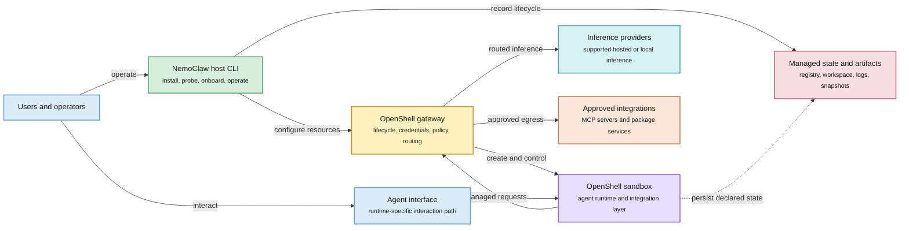

This page explains how NemoClaw runs supported agent runtimes inside OpenShell sandboxes. It covers the host CLI, OpenShell gateway, agent integration layer, lifecycle state, managed Model Context Protocol (MCP) servers and other integrations, and protection layers.

NemoClaw does not replace OpenShell or the selected agent runtime. It packages them as a repeatable setup with a versioned blueprint, agent-specific configuration, managed inference, network policy, and lifecycle operations.

## High-Level Flow

NemoClaw keeps operator control on the host while OpenShell enforces the sandbox boundary. The OpenShell gateway coordinates sandbox lifecycle, credentials, network policy, inference routes, and approved integration traffic.


```mermaid
flowchart LR
    USERS["Users and operators"]:::users
    CLI["NemoClaw host CLI<br/><small>install, probe, onboard, operate</small>"]:::control
    GATEWAY["OpenShell gateway<br/><small>lifecycle, credentials, policy, routing</small>"]:::gateway
    SANDBOX["OpenShell sandbox<br/><small>agent runtime and integration layer</small>"]:::sandbox
    INTERFACE["Agent interface<br/><small>runtime-specific interaction path</small>"]:::users
    STATE["Managed state and artifacts<br/><small>registry, workspace, logs, snapshots</small>"]:::state
    INFERENCE["Inference providers<br/><small>supported hosted or local inference</small>"]:::inference
    INTEGRATIONS["Approved integrations<br/><small>MCP servers and package services</small>"]:::integrations

    USERS -->|"operate"| CLI
    CLI -->|"configure resources"| GATEWAY
    GATEWAY -->|"create and control"| SANDBOX
    SANDBOX -->|"managed requests"| GATEWAY
    GATEWAY -->|"routed inference"| INFERENCE
    GATEWAY -->|"approved egress"| INTEGRATIONS
    USERS -->|"interact"| INTERFACE
    INTERFACE --> SANDBOX
    CLI -->|"record lifecycle"| STATE
    SANDBOX -.->|"persist declared state"| STATE

    classDef users fill:#d9ecf7,stroke:#6aa6c8,color:#1a1a1a,stroke-width:2px
    classDef control fill:#d7f0dc,stroke:#5a9f70,color:#1a1a1a,stroke-width:2px
    classDef gateway fill:#fff1be,stroke:#c4992f,color:#1a1a1a,stroke-width:2px
    classDef sandbox fill:#e7ddff,stroke:#8c6ccf,color:#1a1a1a,stroke-width:2px
    classDef state fill:#f7dfe4,stroke:#c86d7d,color:#1a1a1a,stroke-width:2px
    classDef inference fill:#d5f1f1,stroke:#4fa7a7,color:#1a1a1a,stroke-width:2px
    classDef integrations fill:#fce6d7,stroke:#c77e55,color:#1a1a1a,stroke-width:2px
```

The diagram has the following components:

| Component | Role in the flow |
| --- | --- |
| Users and operators | Install and operate NemoClaw from the host, then interact through the selected agent interface. |
| NemoClaw host CLI | Collects configuration, runs readiness checks and onboarding, resolves the blueprint, and operates managed resources. |
| OpenShell gateway | Coordinates sandbox lifecycle, credentials, networking, policy enforcement, inference routing, and approved integration egress. |
| OpenShell sandbox | Runs the selected agent runtime with its NemoClaw integration layer, configuration, and supporting tools. |
| Agent interface | Provides the interaction path exposed by the selected agent runtime. |
| Inference providers | Receive managed inference requests through the OpenShell gateway. |
| Approved integrations | Receive policy-approved requests to MCP servers, package indexes, and other configured services. |
| Managed state and artifacts | Preserve non-policy registry records, workspace files, logs, and manifest-declared snapshot content; OpenShell alone stores sandbox policy. |

For repository layout, file paths, and deeper diagrams, refer to [Architecture](../reference/architecture).

## Design Principles

NemoClaw follows these architecture principles.

Versioned blueprint : The blueprint runner resolves a versioned blueprint and verifies its digest before it changes managed resources.

Host credential custody : OpenShell stores inference provider credentials and managed MCP bearer values outside the sandbox and replaces placeholders at approved request boundaries.

Agent-specific integration : Each supported agent runtime receives the configuration, wrappers, plugin, or adapter required for its documented workflow.

Resumable lifecycle : NemoClaw records lifecycle progress and reconciles managed resources after supported interruptions or partial operations.

Manifest-declared state : Rebuild, snapshot, and restore operations preserve only the state declared for the selected agent runtime. Each agent manifest and operation defines which credential-bearing files to exclude.

<AgentOnly variant="openclaw,hermes">

Host-configured messaging credentials also use OpenShell credential delivery. Some messaging integrations, such as QR-paired WhatsApp, retain explicitly declared session credentials inside the sandbox so supported lifecycle operations can preserve them.

</AgentOnly>

## CLI, Integration Layer, and Blueprint

NemoClaw separates host orchestration, agent-specific behavior, and sandbox definition.

- The _host CLI_ runs readiness checks and onboarding, validates provider choices, records lifecycle state, and operates OpenShell resources.

<AgentOnly variant="openclaw">

- The _OpenClaw integration layer_ includes a TypeScript plugin that runs inside the sandbox. It registers the managed inference provider metadata, the `/nemoclaw` slash command, and runtime context hooks. Runtime context is prepended as system guidance, so sandbox and policy instructions stay active without appearing in the visible chat transcript.

</AgentOnly>
<AgentOnly variant="hermes">

- The _Hermes integration layer_ writes runtime configuration under `/sandbox/.hermes`, including `config.yaml`, environment files, and supported messaging-channel settings.

</AgentOnly>
<AgentOnly variant="deepagents">

- The _Deep Agents integration layer_ writes managed runtime configuration under `/sandbox/.deepagents`. It includes `config.toml`, managed MCP projection state, and the inference route used by `dcode`.

</AgentOnly>
- The _blueprint_ is a versioned YAML package with the sandbox image, agent manifest, network policy, inference profile, and supporting assets.
  The runner resolves and verifies the blueprint before applying it through OpenShell.

This separation keeps host orchestration, agent-specific assets, and the sandbox definition at explicit lifecycle boundaries.

## Inspect an External OpenShell Gateway

NemoClaw packages the experimental `nemoclaw-blueprint-runner` command for infrastructure that already owns an external OpenShell gateway.
This path supports target planning and one credential-free public health request for OpenShell `0.0.106`.
It does not manage the gateway or establish support for another OpenShell release.

Create a blueprint directory with a `blueprint.yaml` file that contains one external target.
The target must use a bare HTTPS origin, the exact OpenShell release, an absolute CA bundle path, and an absolute authentication file path.
The CA bundle must be a nonempty regular file, must not be a symbolic link, and must be no larger than 1 MiB.
The CA bundle must contain only PEM CA certificates.
Both operations read the CA bundle.
The plan requires a nonempty regular authentication file no larger than 1 MiB and inspects only its metadata.
The status command does not access the authentication file.
Neither operation creates or removes either administrator-owned file.

```yaml
version: 1.0.0
min_openshell_version: 0.0.106
max_openshell_version: 0.0.106
openshell_target:
  endpoint: https://openshell.example.test:8443
  workspace: default
  expected_release: 0.0.106
  lifecycle: external
  trust:
    ca_file: /var/run/openshell-target/ca.pem
  authentication:
    credential_file: /var/run/openshell-target/authentication
```

Run the target-only plan when you need to validate the complete target configuration and print a sanitized plan.
Planning requires the referenced authentication file, validates local input, fingerprints the CA bundle, and does not connect.

```bash
NEMOCLAW_BLUEPRINT_PATH=/absolute/path/to/blueprint nemoclaw-blueprint-runner plan
```

<Warning>
  The status command sends external traffic to the configured gateway.
  The OpenShell SDK uses platform DNS without IP address pinning and verifies the server certificate and hostname against the supplied CA bundle.
  You must control the target hostname and its DNS resolution.
</Warning>

Run the external status command directly when you only need public health.
Status requires the absolute authentication file reference but does not access the file.
It makes one public health request through the official OpenShell SDK.

```bash
NEMOCLAW_BLUEPRINT_PATH=/absolute/path/to/blueprint nemoclaw-blueprint-runner status --external-target
```

A successful status result reports `healthy`, release `0.0.106`, and `compatible` in JSON.
The command does not access the authentication file or authenticate.
The command supplies the validated CA bundle to the SDK and uses normal TLS hostname verification.

<Warning>
  This experimental path does not create, update, delete, or list gateways, workspaces, sandboxes, credentials, or policies.
  It does not establish workspace readiness or support machine authentication or Kubernetes.
  A failed status request makes no remote change, so correct the endpoint, CA bundle or its file metadata, gateway health, or release mismatch before you retry.
  If status reports that the approved OpenShell SDK is unavailable, restore a NemoClaw installation that includes `@nvidia/openshell-sdk` `0.0.106` before retrying.
</Warning>

## Readiness and Sandbox Creation

Run `$$nemoclaw host probe` when you need a read-only system readiness report before onboarding. The report combines host and gateway observations, capabilities, qualifications, findings, evidence, and CLI provenance without changing system state. Onboarding consumes the same stable host and gateway entities and applies its explicit admission policy. It revalidates live facts after permitted preparation and when a saved onboarding session resumes.

When you run `$$nemoclaw onboard`, the host CLI and blueprint runner complete these operations:

1. NemoClaw resolves gateway lifecycle authority and rejects blocking system readiness results before managed resource effects. A container-backed WSL GPU proof can run only after this admission check; explicit CPU-only intent skips it.
2. NemoClaw resolves the blueprint, checks version compatibility, and verifies the digest.
3. Onboarding validates the selected inference provider, credentials, agent settings, and platform requirements.
4. The runner determines which gateway, provider, policy, sandbox, and integration resources to create or update.
5. NemoClaw records progress so a supported interruption can resume or report a specific recovery action.

Before the blueprint runner writes a temporary policy update, it parses the merged live policy and refuses a literal credential value. Replace literal credentials with supported OpenShell credential bindings or resolver placeholders, then retry. The refusal happens before the policy file or OpenShell policy mutation is created.

After the sandbox starts, the selected agent uses its managed configuration and the controls supported by the host.

## Lifecycle and State

NemoClaw operates the sandbox and its manifest-declared state through host-side commands.

| Operation | Result |
| --- | --- |
| Inspect | `host probe`, `status`, and `logs` report system, sandbox, agent-runtime, inference, and recovery information without replacing the sandbox. |
| Configure | Inference, policy, managed MCP, and supported agent-runtime integration commands update the applicable managed resources. |
| Rebuild | Recreates the sandbox from the recorded configuration and restores supported agent state through a recorded transaction. |
| Recover | Repairs a stopped or degraded agent runtime and its sandbox-scoped forwards when the recorded identities still match. |
| Snapshot and restore | Captures manifest-declared state with the agent- and operation-specific credential exclusions, then applies that state to an eligible sandbox. |
| Destroy and uninstall | Removes the selected sandbox or host installation according to the command scope and preservation choices. |

Refer to [Recover and Rebuild Sandboxes](../manage-sandboxes/operate-sandboxes/recover-and-rebuild-sandboxes) and [Create and Restore Snapshots](../manage-sandboxes/state-and-backups/create-and-restore-snapshots) for lifecycle details.

## Inference Routing

Managed agent runtimes send model requests to `inference.local` instead of an upstream endpoint.
During onboarding, NemoClaw validates the selected provider and model, configures the OpenShell inference route, and writes the matching model reference into the managed agent configuration.
OpenShell keeps the provider credential outside the sandbox and sends approved requests to the upstream endpoint.
When you select the Model Router provider, `inference.local` routes to a host-side router that chooses from a configured model pool available through NVIDIA Endpoints for each request.

<AgentOnly variant="hermes">
  For Hermes, `$$nemoclaw inference set` updates `/sandbox/.hermes/config.yaml` at runtime without
  rebuilding the sandbox.
</AgentOnly>
<AgentOnly variant="deepagents">
  For Deep Agents, the managed `dcode` runtime reads the OpenAI-compatible route that NemoClaw
  writes into `/sandbox/.deepagents/config.toml`.
</AgentOnly>

## Managed Integrations

NemoClaw connects supported external services through OpenShell providers, network policy, and agent-specific adapters.

Managed MCP supports authenticated HTTPS Streamable HTTP MCP servers for OpenClaw, Hermes, and Deep Agents Code. NemoClaw stores the credential name and ownership metadata, while OpenShell stores the raw value outside the sandbox. The agent adapter receives a credential placeholder that OpenShell replaces only at the approved egress boundary.

<AgentOnly variant="openclaw,hermes">

Messaging channels use agent-specific channel manifests, credential delivery, network policy, and lifecycle commands. Some experimental webhook channels also require a route-restricted host-side public endpoint. Refer to [Choose Messaging Channels](../manage-sandboxes/messaging-channels/choose-messaging-channels) for agent and channel status.

</AgentOnly>
<AgentOnly variant="deepagents">

Deep Agents Code can also opt into bounded trace export to an operator-managed host collector. Native LangSmith tracing and ambient OpenTelemetry exporter configuration remain disabled inside the sandbox. Refer to [Understand Deep Agents Trace Export](../monitoring/understand-deepagents-trace-export) for the data and receiver trust boundaries.

</AgentOnly>

Refer to [About Managed MCP Servers](../manage-sandboxes/mcp-servers/about-managed-mcp-servers) for the managed MCP security and lifecycle design.

## Protection Layers

The sandbox starts with a baseline policy that controls network egress, filesystem access, process privileges, and inference routing.

| Layer | What it protects | When it applies |
| --- | --- | --- |
| Network | Blocks unauthorized outbound connections. | Hot-reloadable at runtime. |
| Filesystem | Restricts system paths to read-only; `/sandbox` and `/tmp` are writable. | Locked at sandbox creation. |
| Process | Blocks privilege escalation and dangerous syscalls. | Locked at sandbox creation. |
| Inference | Reroutes model API calls to controlled backends. | Hot-reloadable at runtime. |

When the agent tries to reach an unapproved host, OpenShell blocks the request and surfaces it in the terminal user interface (TUI) for operator approval. Approved endpoints persist within the current sandbox instance but are not saved to the baseline policy file. NemoClaw's runtime context tells supported agents to try allowed network and filesystem actions first, then report whether policy denial, DNS, timeout, TLS, or filesystem access caused a failure.

Host and platform limitations can change how individual controls apply. Refer to [Platform Support](../reference/platform-support) and [Security Best Practices](../security/best-practices) before you treat a control as an environment-wide guarantee.

## Next Steps

<AgentOnly variant="openclaw">

- Read [Ecosystem](ecosystem) for stack-level relationships and NemoClaw versus OpenShell-only paths.
- Follow [Quickstart with OpenClaw](../get-started/quickstart) to launch your first sandbox.
- Read [Architecture](../reference/architecture) for the full technical structure, including file layouts and the blueprint lifecycle.
- Read [Choose an Inference Provider](../inference/learn-and-choose/choose-inference-provider) for detailed provider configuration.
- Read [Network Policies](../reference/network-policies) for baseline rules and runtime changes.
- Read [Review Sandbox Hardening](../manage-sandboxes/configure-sandboxes/review-sandbox-hardening) for container-level controls and limitations.

</AgentOnly>
<AgentOnly variant="hermes">

- Read [Ecosystem](ecosystem) for stack-level relationships and NemoClaw versus OpenShell-only paths.
- Follow [Quickstart with Hermes](../get-started/quickstart) to launch your first sandbox.
- Read [Architecture](../reference/architecture) for the full technical structure, including file layouts and the blueprint lifecycle.
- Read [Choose an Inference Provider](../inference/learn-and-choose/choose-inference-provider) for detailed provider configuration.
- Read [Network Policies](../reference/network-policies) for baseline rules and runtime changes.

</AgentOnly>
<AgentOnly variant="deepagents">

- Read [Ecosystem](ecosystem) for stack-level relationships and NemoClaw versus OpenShell-only paths.
- Follow [Quickstart with Deep Agents](../get-started/quickstart) to launch your first sandbox.
- Read [Architecture](../reference/architecture) for the full technical structure, including file layouts and the blueprint lifecycle.
- Read [Choose an Inference Provider](../inference/learn-and-choose/choose-inference-provider) for detailed provider configuration.
- Read [Network Policies](../reference/network-policies) for baseline rules and runtime changes.

</AgentOnly>
