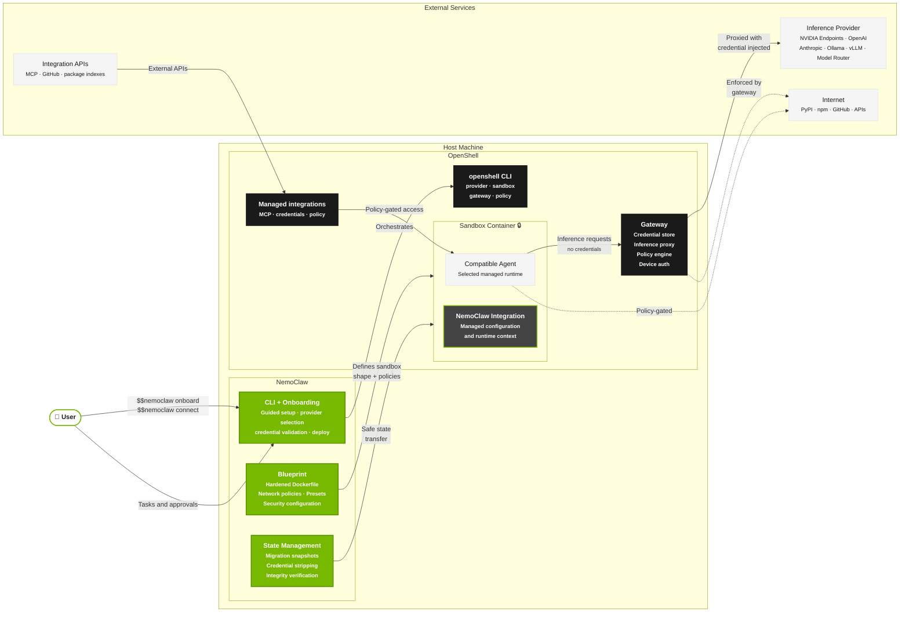
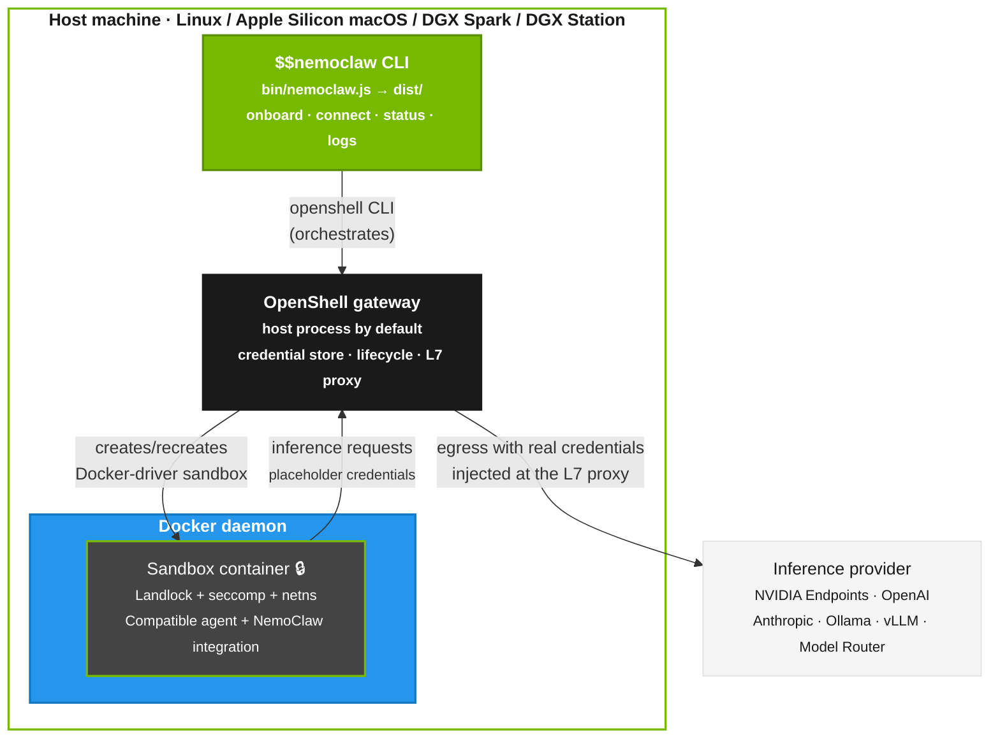
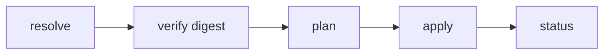

import { AgentOnly } from "../_components/AgentGuide";

NemoClaw combines a host CLI, an in-sandbox integration layer, and a versioned YAML blueprint that defines the sandbox image, policies, and inference profiles applied through OpenShell.

## System Overview

NVIDIA OpenShell is a general-purpose agent runtime.
It provides sandbox containers, a credential-storing gateway, inference proxying, and policy enforcement, but it has no opinions about what runs inside.
NemoClaw is an opinionated reference stack built on OpenShell that handles what goes in the sandbox, prepares agent-specific integration, and makes the setup accessible.



## Deployment Topology

The logical diagram above shows how components relate.
This section shows what actually runs where on the host.
NemoClaw's default Docker-driver topology does not place the sandbox in an embedded k3s cluster.
On Linux, NemoClaw configures and restarts the package-managed OpenShell gateway user service when it is installed, then creates the sandbox as a Docker container.
NemoClaw treats that service as authoritative only when `systemctl --user show openshell-gateway` reports a package/vendor unit path and an `openshell-gateway` `ExecStart`.
Per-user units, partial units, and user-manager or bus outages do not take over gateway ownership; NemoClaw falls back to the standalone gateway process used by earlier installs.
That compatibility fallback remains until supported upgrade paths no longer include pre-service OpenShell installs and the package-managed handoff has direct nightly coverage.
On Apple Silicon macOS, NemoClaw starts the OpenShell Docker-driver gateway and creates the sandbox as a Docker container.
In both Docker-driver modes, the sandbox is a Docker container, not a Kubernetes pod.
The in-container `/tmp/nemoclaw-gateway-local` marker is written only by entrypoint paths that actually launch an in-container gateway.
Terminal runtimes may not write it.
NemoClaw does not treat sandbox environment hints such as `OPENSHELL_DRIVERS` as authoritative for gateway ownership.
Legacy non-Docker-driver installs still use the k3s-based gateway path; the diagram below shows the standard Docker-driver topology.



Layering from top to bottom:

| Layer | Runs as | Role |
|---|---|---|
| Host CLI | Host process (`$$nemoclaw` on Node.js) | Orchestrates OpenShell via `openshell` CLI calls. |
| OpenShell gateway | Host process by default; optional Linux compatibility container when the gateway binary needs a newer host ABI | Hosts the credential store, owns sandbox lifecycle coordination, and provides the L7 proxy. |
| Docker daemon | Host service | Runs the Docker-driver sandbox container and, on affected Linux hosts, the optional gateway compatibility container. |
| Sandbox container | Docker container | Runs the selected compatible agent and NemoClaw integration under Landlock + seccomp + netns. |
| OpenShell L7 proxy | Gateway process | Intercepts agent egress and rewrites `Authorization` headers (Bearer/Bot) and URL-path segments to inject the real credential at the network boundary. |

NemoClaw never gives the sandbox a raw provider key.
At onboard time it registers credentials with OpenShell's provider/placeholder system, and the L7 proxy substitutes the real value into outbound requests at egress.
The CLI helper `isInferenceRouteReady` (in `src/lib/onboard.ts`) is a host-side readiness check used by the resume flow to decide whether the active route already covers the chosen provider and model.
It is not a runtime component.

For the DGX Spark-specific variant of this topology (cgroup v2, aarch64, unified memory), refer to the [NVIDIA Spark playbook](https://build.nvidia.com/spark/nemoclaw).

## NemoClaw Agent Integration

NemoClaw integrates with each supported agent through a runtime layer that adapts the agent to OpenShell-managed providers, policies, and sandbox state.
The concrete files differ by agent because each runtime has its own plugin system, config format, state layout, and startup command.

| Agent | Integration files | Runtime behavior |
|---|---|---|
<AgentOnly variant="openclaw">
| OpenClaw | `nemoclaw/openclaw.plugin.json`, `nemoclaw/src/runtime-context.ts`, and the TypeScript package under `nemoclaw/src/` | Registers the `/nemoclaw` slash command, adds the NemoClaw inference provider, and injects sandbox and policy context into OpenClaw turns. |
</AgentOnly>
<AgentOnly variant="hermes">
| Hermes | `agents/hermes/manifest.yaml`, `agents/hermes/plugin/plugin.yaml`, `agents/hermes/generate-config.ts`, `agents/hermes/config/`, and `agents/hermes/start.sh` | Declares the Hermes agent contract, installs the NemoClaw Hermes plugin, writes `/sandbox/.hermes/config.yaml` and `/sandbox/.hermes/.env`, and launches `hermes gateway run` behind the OpenShell proxy. |
</AgentOnly>
<AgentOnly variant="deepagents">
| Deep Agents | `agents/langchain-deepagents-code/manifest.yaml`, `agents/langchain-deepagents-code/generate-config.ts`, `agents/langchain-deepagents-code/start.sh`, and the managed `dcode` launchers | Declares the terminal agent contract, writes `/sandbox/.deepagents/config.toml`, installs managed wrappers for `dcode` and `dcode -n`, and routes inference through `inference.local`. |
</AgentOnly>

<AgentOnly variant="openclaw">
The OpenClaw integration is a thin TypeScript plugin that runs in-process with the OpenClaw gateway inside the sandbox.
Its durable entry points are `nemoclaw/src/index.ts`, `nemoclaw/src/runtime-context.ts`, and `nemoclaw/openclaw.plugin.json`.
The `nemoclaw/src/commands/` directory contains in-sandbox `/nemoclaw` command handlers and migration helpers.
The `nemoclaw/src/blueprint/` directory contains runner, state, snapshot, SSRF, and private-network validation code.
Before an OpenClaw turn starts, the plugin prepends a short system-context block with the active sandbox name, sandbox phase, network policy summary, and filesystem policy summary.
This guidance stays out of the visible chat transcript.
When the policy or phase changes during a session, the plugin sends a smaller update block instead of repeating the full context.
The context tells the agent to try allowed network and filesystem operations before reporting them unavailable, and to distinguish policy denials from DNS, timeout, TLS, or filesystem errors.
</AgentOnly>

<AgentOnly variant="hermes">
The Hermes integration follows the generic agent-manifest path instead of the OpenClaw plugin package path.
The manifest declares Hermes' binary, health probe, config directory, state directories, and OpenAI-compatible API endpoint.
Messaging channel availability is declared by each channel manifest's `supportedAgents` list under `src/lib/messaging/channels/`, not by the Hermes agent manifest.
The build-time config generator turns NemoClaw onboarding choices into Hermes YAML and environment files, and the Hermes plugin manifest exposes NemoClaw tools and an `on_session_start` hook.
</AgentOnly>
<AgentOnly variant="deepagents">
The Deep Agents integration follows the generic agent-manifest path for terminal runtimes.
The manifest declares the `dcode` binary, smoke checks, config directory, state directories, and OpenAI-compatible inference route.
The build-time config generator turns NemoClaw onboarding choices into `config.toml`, and the managed launchers enforce the supported credential, MCP, tracing, and sandbox boundaries before `dcode` starts.
</AgentOnly>

## NemoClaw Blueprint

The blueprint is a versioned YAML package with its own release stream.
The runner resolves, verifies, and applies the blueprint through the OpenShell CLI.
The blueprint defines the sandbox shape, default policies, and inference profiles; the runner performs the OpenShell operations.

```text
nemoclaw-blueprint/
├── blueprint.yaml                  Manifest: version, profiles, compatibility
├── model-specific-setup/           Agent-scoped model/provider compatibility manifests
├── router/                         Model Router config and routing engine
├── policies/
│   └── presets/                    Shared policy presets
```

<AgentOnly variant="openclaw">
The default OpenClaw policy starts from `nemoclaw-blueprint/policies/openclaw-sandbox.yaml`.
</AgentOnly>
<AgentOnly variant="hermes">
Hermes keeps its agent-owned image, plugin, config, entrypoint, and policy additions under `agents/hermes/`.
The default Hermes policy starts from `agents/hermes/policy-additions.yaml`.
</AgentOnly>
<AgentOnly variant="deepagents">
Deep Agents keeps its agent-owned image, config generator, entrypoint, wrappers, and policy additions under `agents/langchain-deepagents-code/`.
The default Deep Agents policy starts from `agents/langchain-deepagents-code/policy-additions.yaml`.
</AgentOnly>

The current blueprint runner implementation lives in the `nemoclaw/` TypeScript package:

```text
nemoclaw/src/blueprint/
├── runner.ts                       CLI runner: plan / apply / status / rollback
├── ssrf.ts                         SSRF endpoint validation (IP + DNS checks)
├── private-networks.ts             Shared private-network block list loader for SSRF checks
├── snapshot.ts                     Migration snapshot / restore lifecycle
├── state.ts                        Persistent run state management
```

### Blueprint Lifecycle



1. Resolve. The integration layer locates the blueprint artifact and checks the version against the OpenShell and agent runtime constraints in `blueprint.yaml`.
2. Verify. The integration layer checks the artifact digest against the expected value.
3. Plan. The runner determines what OpenShell resources to create or update, such as the gateway, providers, sandbox, inference route, and policy.
4. Apply. The runner executes the plan by calling `openshell` CLI commands.
5. Status. The runner reports current state.

## Sandbox Environment

<AgentOnly variant="openclaw,hermes">
Normal NemoClaw onboarding builds from the [`ghcr.io/nvidia/nemoclaw/sandbox-base`](https://github.com/NVIDIA/NemoClaw/pkgs/container/nemoclaw%2Fsandbox-base) base image and layers the NemoClaw runtime Dockerfile on top.
</AgentOnly>
<AgentOnly variant="deepagents">
Deep Agents onboarding builds from the agent-specific `agents/langchain-deepagents-code/Dockerfile.base` image and layers the managed Deep Agents runtime Dockerfile on top.
That base installs Node, Python, shell tools, and the hash-locked `deepagents-code` package needed by the terminal harness.
</AgentOnly>
<AgentOnly variant="openclaw">
The direct blueprint runner still carries a pinned OpenShell Community OpenClaw image for legacy `openshell sandbox create --from` compatibility.
</AgentOnly>
Inside the sandbox:

- The selected compatible agent runs with the NemoClaw integration layer installed or generated for that agent.
- Inference calls are routed through OpenShell to the configured provider.
- Network egress is restricted by the baseline policy for the selected agent profile.
- Filesystem access is confined to `/sandbox` and `/tmp` for read-write access, with system paths read-only.
<AgentOnly variant="openclaw">
- NemoClaw injects sandbox and policy context into agent turns when the selected agent supports runtime context hooks, so the agent can attempt allowed actions and report policy blocks or infrastructure failures accurately.
- The image exposes a Docker health check that probes the in-sandbox gateway, so container runtimes can report whether the agent service is responding.
</AgentOnly>
<AgentOnly variant="hermes">
- NemoClaw writes generated Hermes configuration into the sandbox, then the Hermes runtime exposes its own gateway and health surface.
- The image exposes health checks for the managed Hermes runtime.
</AgentOnly>
<AgentOnly variant="deepagents">
- NemoClaw writes generated Deep Agents configuration into the sandbox, then leaves interactive and headless execution to `dcode`.
- Deep Agents is a terminal runtime, so there is no long-running dashboard or gateway health surface inside the sandbox.
</AgentOnly>
<AgentOnly variant="openclaw,hermes">
- The image includes common runtime compatibility helpers such as Homebrew and a `python` to `python3` symlink for tools that still invoke `python`.
</AgentOnly>

## Inference Routing

Inference requests from the agent never leave the sandbox directly.
OpenShell intercepts them and routes them to the configured provider:

```text
Compatible agent (sandbox)  ──▶  OpenShell gateway  ──▶  Provider endpoint
```

When you select the Model Router provider, the OpenShell gateway routes to a host-side router process instead of a single upstream model.
The router selects from the configured pool, then calls the upstream NVIDIA endpoint with the credential held outside the sandbox.

Some model and provider combinations need agent-specific compatibility setup.
NemoClaw keeps those declarations under `nemoclaw-blueprint/model-specific-setup/<agent>/` so fixes for each supported agent can be tested and reviewed independently.

Refer to [Inference Options](../inference/inference-options) for provider configuration details.

## Provider Credential Storage

Provider credentials live in the OpenShell gateway store, not on the host filesystem.
NemoClaw never writes them to host disk.
The OpenShell L7 proxy injects values at egress.
Refer to [Credential Storage](../security/credential-storage) for the inspection, rotation, and migration flow.

## Host-Side State and Config

NemoClaw keeps non-secret operator-facing state on the host rather than inside the sandbox.

| Path | Purpose |
|---|---|
| `~/.nemoclaw/sandboxes.json` | Registered sandbox metadata, including the default sandbox selection. |
<AgentOnly variant="openclaw">
| `~/.openclaw/openclaw.json` | Host OpenClaw configuration that NemoClaw snapshots or restores during migration flows. |
</AgentOnly>

The following environment variables configure optional services and local access.

| Variable | Purpose |
|---|---|
<AgentOnly variant="openclaw">
| `TELEGRAM_BOT_TOKEN` | Telegram bot token you provide before `$$nemoclaw onboard`. OpenShell stores it in a provider; the sandbox receives placeholders, not the raw secret. |
| `TELEGRAM_ALLOWED_IDS` | Comma-separated Telegram user or chat IDs for allowlists when onboarding applies channel restrictions. |
| `TELEGRAM_GROUP_POLICY` | OpenClaw Telegram group access policy: `open` by default, `allowlist` to require explicit group entries, or `disabled` to turn off OpenClaw group access. Hermes ignores this value. |
| `SLACK_BOT_TOKEN` | Slack bot token (`xoxb-...`) you provide before `$$nemoclaw onboard`. Stored as an OpenShell provider; never passed directly to the sandbox. |
| `SLACK_APP_TOKEN` | Slack app-level token (`xapp-...`) required for Socket Mode. Stored alongside `SLACK_BOT_TOKEN` during onboarding. |
| `SLACK_ALLOWED_USERS` | Comma-separated Slack member IDs for DM and channel `@mention` user allowlisting. |
| `SLACK_ALLOWED_CHANNELS` | Comma-separated Slack channel IDs where channel `@mention` events are enabled (e.g. `C012AB3CD,C987ZY6XW`). Baked into the sandbox image at build time. Combine with `SLACK_ALLOWED_USERS` to restrict both channel and member. |
| `CHAT_UI_URL` | URL for the optional chat UI endpoint. |
| `NEMOCLAW_DISABLE_DEVICE_AUTH` | Build-time-only toggle that disables gateway device pairing when set to `1` before the sandbox image is created. |
</AgentOnly>
<AgentOnly variant="hermes">
| `TELEGRAM_BOT_TOKEN` | Telegram bot token you provide before `$$nemoclaw onboard`. OpenShell stores it in a provider; the sandbox receives placeholders, not the raw secret. |
| `TELEGRAM_ALLOWED_IDS` | Comma-separated Telegram user or chat IDs for allowlists when onboarding applies channel restrictions. |
| `SLACK_BOT_TOKEN` | Slack bot token (`xoxb-...`) you provide before `$$nemoclaw onboard`. Stored as an OpenShell provider; never passed directly to the sandbox. |
| `SLACK_APP_TOKEN` | Slack app-level token (`xapp-...`) required for Socket Mode. Stored alongside `SLACK_BOT_TOKEN` during onboarding. |
| `SLACK_ALLOWED_USERS` | Comma-separated Slack member IDs for DM and channel `@mention` user allowlisting. |
| `SLACK_ALLOWED_CHANNELS` | Comma-separated Slack channel IDs where channel `@mention` events are enabled (e.g. `C012AB3CD,C987ZY6XW`). Baked into the sandbox image at build time. Combine with `SLACK_ALLOWED_USERS` to restrict both channel and member. |
</AgentOnly>
<AgentOnly variant="deepagents">
| `NEMOCLAW_POLICY_TIER` | Optional non-interactive policy tier selection during onboarding. |
| `TAVILY_API_KEY` | Host-side input for the optional managed Tavily provider. Register it with `$$nemoclaw credentials add tavily-search --type tavily --credential TAVILY_API_KEY` before attaching the provider to Deep Agents. |
| `NEMOCLAW_GATEWAY_PORT` | Optional host-side gateway port override when running multiple independent OpenShell gateways. |
</AgentOnly>

For normal setup and reconfiguration, prefer `$$nemoclaw onboard` over editing these files by hand.
<AgentOnly variant="openclaw">
Do not treat `NEMOCLAW_DISABLE_DEVICE_AUTH` as a runtime setting for an already-created sandbox.
</AgentOnly>
