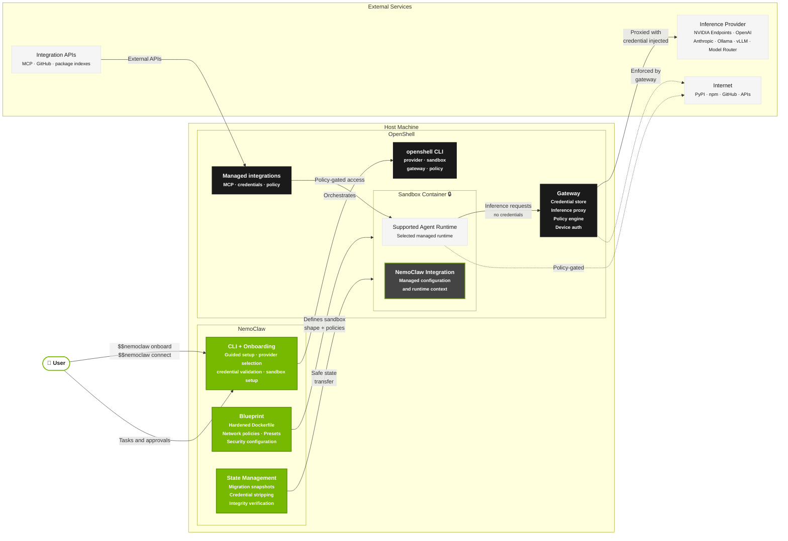
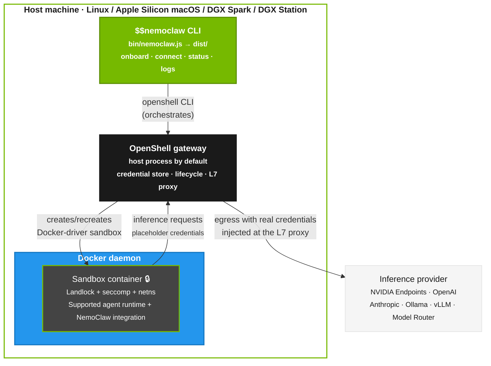
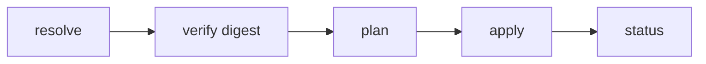

NemoClaw combines a host CLI, an in-sandbox integration layer, and a versioned YAML blueprint that defines the sandbox image, policies, and inference profiles applied through OpenShell.

## System Overview

NVIDIA OpenShell is a general-purpose sandbox runtime and policy platform.
It provides sandbox containers, a credential-storing gateway, inference proxying, and policy enforcement, but it has no opinions about what runs inside.
NemoClaw is an opinionated reference stack built on OpenShell that handles what goes in the sandbox, prepares agent-specific integration, and makes the setup accessible.


```mermaid
graph LR
    classDef nemoclaw fill:#76b900,stroke:#5a8f00,color:#fff,stroke-width:2px,font-weight:bold
    classDef openshell fill:#1a1a1a,stroke:#1a1a1a,color:#fff,stroke-width:2px,font-weight:bold
    classDef sandbox fill:#444,stroke:#76b900,color:#fff,stroke-width:2px,font-weight:bold
    classDef agent fill:#f5f5f5,stroke:#e0e0e0,color:#1a1a1a,stroke-width:1px
    classDef external fill:#f5f5f5,stroke:#e0e0e0,color:#1a1a1a,stroke-width:1px
    classDef user fill:#fff,stroke:#76b900,color:#1a1a1a,stroke-width:2px,font-weight:bold

    USER(["👤 User"]):::user

    subgraph EXTERNAL["External Services"]
        INFERENCE["Inference Provider<br/><small>NVIDIA Endpoints · OpenAI<br/>Anthropic · Ollama · vLLM · Model Router</small>"]:::external
        INTEGRATIONS["Integration APIs<br/><small>MCP · GitHub · package indexes</small>"]:::external
        INTERNET["Internet<br/><small>PyPI · npm · GitHub · APIs</small>"]:::external
    end

    subgraph HOST["Host Machine"]

        subgraph NEMOCLAW["NemoClaw"]
            direction TB
            NCLI["CLI + Onboarding<br/><small>Guided setup · provider selection<br/>credential validation · sandbox setup</small>"]:::nemoclaw
            BP["Blueprint<br/><small>Hardened Dockerfile<br/>Network policies · Presets<br/>Security configuration</small>"]:::nemoclaw
            MIGRATE["State Management<br/><small>Migration snapshots<br/>Credential stripping<br/>Integrity verification</small>"]:::nemoclaw
        end

        subgraph OPENSHELL["OpenShell"]
            direction TB
            GW["Gateway<br/><small>Credential store<br/>Inference proxy<br/>Policy engine<br/>Device auth</small>"]:::openshell
            OSCLI["openshell CLI<br/><small>provider · sandbox<br/>gateway · policy</small>"]:::openshell
            INTEG["Managed integrations<br/><small>MCP · credentials · policy</small>"]:::openshell

            subgraph SANDBOX["Sandbox Container 🔒"]
                direction TB
                AGENT["Supported Agent Runtime<br/><small>Selected managed runtime</small>"]:::agent
                PLUG["NemoClaw Integration<br/><small>Managed configuration<br/>and runtime context</small>"]:::sandbox
            end
        end
    end

    USER -->|"$$nemoclaw onboard<br/>$$nemoclaw connect"| NCLI
    USER -->|"Tasks and approvals"| NCLI

    NCLI -->|"Orchestrates"| OSCLI
    BP -->|"Defines sandbox<br/>shape + policies"| SANDBOX
    MIGRATE -->|"Safe state<br/>transfer"| SANDBOX

    AGENT -->|"Inference requests<br/><small>no credentials</small>"| GW
    GW -->|"Proxied with<br/>credential injected"| INFERENCE

    INTEGRATIONS -->|"External APIs"| INTEG
    INTEG -->|"Policy-gated access"| AGENT

    AGENT -.->|"Policy-gated"| INTERNET
    GW -.->|"Enforced by<br/>gateway"| INTERNET
```

## Deployment Topology

The logical diagram above shows how components relate.
This section shows what actually runs where on the host.
NemoClaw's default Docker-driver topology does not place the sandbox in an embedded k3s cluster.
Only the default gateway port `8080` uses a NemoClaw-managed service.

On Linux, NemoClaw prefers the upstream package-managed `openshell-gateway.service`.
Before adoption, NemoClaw asks systemd for the unit's effective `ExecStart`.
When systemd returns the service identity, NemoClaw requires trusted package paths for both the unit and its effective binary.
It then checks the effective binary's version against the blueprint range (`min_openshell_version` through `max_openshell_version`).
This check prevents a supported user-local OpenShell install from hiding an out-of-range binary selected by the package unit's absolute `ExecStart`.
NemoClaw rejects a known version below the minimum or a known stable version above the maximum.
An above-maximum development build remains eligible when `NEMOCLAW_OPENSHELL_CHANNEL=dev`.
An undetermined version or an unsupported version stops package-unit adoption.
When the systemd identity query reports a recognized unavailable user manager, NemoClaw checks the standard user unit paths before standalone fallback.
It checks `.wants`, `.requires`, and `.upholds` activation links for both gateway service names.
An activation path blocks fallback because its service can later claim port `8080`.
An active `SYSTEMD_UNIT_PATH` override also blocks fallback because NemoClaw cannot verify its activation state.
Other identity-query failures stop package-unit adoption.
NemoClaw stops when systemd identifies an untrusted unit or effective binary.
For a version rejection, NemoClaw reports the version once and blocks another gateway lifecycle.
Identity and path-trust failures also block another gateway lifecycle.
After `systemctl --user daemon-reload` and systemd identity validation, startup checks the effective binary's version again before any service-state mutation.
If a known version is now unsupported, startup does not stop, enable, or restart the package service.
Onboarding stops instead of starting a standalone gateway.
For tarball installs, the NemoClaw installer stages a marked user-level `nemoclaw-openshell-gateway.service` based on the upstream unit.
Onboarding validates and reuses a healthy selected service.
It enables or restarts the service when startup or verified runtime drift requires it, then checks gateway health.
The marked service generates the local OpenShell mTLS bundle and reads `$XDG_CONFIG_HOME/openshell/gateway.env`, or `~/.config/openshell/gateway.env` when `XDG_CONFIG_HOME` is not absolute.
NemoClaw preserves unrelated environment entries, accepts `DOCKER_HOST` only for an absolute local `unix://` socket, and refuses foreign or symlinked managed files.
For ordinary startup or health failures, NemoClaw prints the `journalctl` log command and attempts the standalone fallback.
Unknown inspection, trust, and version failures stop onboarding.

On Apple Silicon macOS, Homebrew makes the official OpenShell formula authoritative.
The installer stages the checksum-pinned formula and runs installation inside a formula-scoped Homebrew trust boundary.
Onboarding uses the same boundary for formula inspection and each service start or stop operation.
Each operation verifies the staged formula, removes any inherited formula trust, grants temporary trust only to `nvidia/openshell/openshell`, and removes that trust when the operation finishes.
An inability to grant or remove trust is a hard failure.
If the service fails inspection, startup, shutdown, or its health check, NemoClaw prints the formula log command and stops so Homebrew remains lifecycle authority.
A host without Homebrew, or with no staged formula and no installed OpenShell keg, uses the standalone macOS gateway.
A legacy installation, missing pin, changed formula, failed Homebrew operation, or invalid official-tap identity stops with repair guidance instead of changing lifecycle authority.
Rerunning the standard NemoClaw installer downloads and stages the pinned formula before onboarding is retried:

```bash
curl -fsSL https://www.nvidia.com/nemoclaw.sh | bash
```
On both platforms, standalone startup requires exclusive ownership of the gateway port.
A positively untrusted upstream package service is declined as described above.
Trust failures in a marked NemoClaw service or Homebrew formula, and unsafe environment configuration, remain hard failures.

NemoClaw-managed gateways on custom ports remain detached and separate from the default service.
An externally supervised gateway can use any matching configured port; its declared supervisor retains lifecycle authority.
In both Docker-driver modes, the sandbox is a Docker container, not a Kubernetes pod.

Entrypoint supervisors create the in-container `/tmp/nemoclaw-gateway-local` marker only when they actually launch an in-container gateway, and they normally keep it present while that supervisor is active.
On normal exits, handled `SIGTERM`/`SIGINT`, startup failures, and shell `errexit` termination through the `EXIT` trap, the supervisor removes the marker on a best-effort basis so the Docker health check does not keep trusting a stale gateway PID.
Terminal runtimes may not write it.
NemoClaw does not treat sandbox environment hints such as `OPENSHELL_DRIVERS` as authoritative for gateway ownership.

Legacy non-Docker-driver installs still use the k3s-based gateway path.
In that topology, the `openshell-cluster-nemoclaw` container runs an embedded k3s cluster that includes the OpenShell gateway, an `agent-sandbox-controller` workload, and a Kubernetes custom resource definition named `sandboxes.agents.x-k8s.io`.
Each NemoClaw sandbox appears as a `Sandbox` custom resource in the `openshell` namespace, and the controller reconciles that resource into the corresponding agent pod.
For example, `kubectl get sandboxes.agents.x-k8s.io -n openshell` inside the legacy cluster container lists the sandbox resources, and `kubectl describe pod -n openshell <sandbox-pod>` reports `Controlled By: Sandbox/<name>`.
That Kubernetes resource path is a legacy implementation detail of the non-Docker-driver gateway, and it is not present in the default Docker-driver topology.

The diagram below shows the standard Docker-driver topology.


```mermaid
graph TB
    classDef host fill:#fff,stroke:#76b900,stroke-width:2px,color:#1a1a1a,font-weight:bold
    classDef cli fill:#76b900,stroke:#5a8f00,color:#fff,stroke-width:2px,font-weight:bold
    classDef docker fill:#2496ed,stroke:#1577c2,color:#fff,stroke-width:2px,font-weight:bold
    classDef gateway fill:#1a1a1a,stroke:#1a1a1a,color:#fff,stroke-width:2px,font-weight:bold
    classDef sandbox fill:#444,stroke:#76b900,color:#fff,stroke-width:2px
    classDef external fill:#f5f5f5,stroke:#e0e0e0,color:#1a1a1a,stroke-width:1px

    subgraph HOST["Host machine · Linux / Apple Silicon macOS / DGX Spark / DGX Station"]
        direction TB
        CLI["$$nemoclaw CLI<br/><small>bin/nemoclaw.js → dist/<br/>onboard · connect · status · logs</small>"]:::cli
        GW["OpenShell gateway<br/><small>host process by default<br/>credential store · lifecycle · L7 proxy</small>"]:::gateway

        subgraph DOCKER["Docker daemon"]
            direction TB
            SANDBOX["Sandbox container 🔒<br/><small>Landlock + seccomp + netns<br/>Supported agent runtime + NemoClaw integration</small>"]:::sandbox
        end
    end

    INFER["Inference provider<br/><small>NVIDIA Endpoints · OpenAI<br/>Anthropic · Ollama · vLLM · Model Router</small>"]:::external

    CLI -->|"openshell CLI<br/>(orchestrates)"| GW
    GW -->|"creates/recreates<br/>Docker-driver sandbox"| SANDBOX
    SANDBOX -->|"inference requests<br/><small>placeholder credentials</small>"| GW
    GW -->|"egress with real credentials<br/>injected at the L7 proxy"| INFER

    class HOST host
    class DOCKER docker
    class GW gateway
    class SANDBOX sandbox
```

Layering from top to bottom:

| Layer | Runs as | Role |
|---|---|---|
| Host CLI | Host process (`$$nemoclaw` on Node.js) | Orchestrates OpenShell via `openshell` CLI calls. |
| OpenShell gateway | Host process by default; optional Linux compatibility container when the gateway binary needs a newer host ABI | Hosts the credential store, owns sandbox lifecycle coordination, and provides the L7 proxy. |
| Docker daemon | Host service | Runs the Docker-driver sandbox container and, on affected Linux hosts, the optional gateway compatibility container. |
| Sandbox container | Docker container | Runs the selected supported agent runtime and NemoClaw integration under Landlock + seccomp + netns. |
| OpenShell L7 proxy | Gateway process | Intercepts agent egress and rewrites `Authorization` headers (Bearer/Bot) and URL-path segments to inject the real credential at the network boundary. |

NemoClaw never gives the sandbox a raw provider key.
At onboard time it registers credentials with OpenShell's provider/placeholder system, and the L7 proxy substitutes the real value into outbound requests at egress.
The CLI helper `isInferenceRouteReady` (in `src/lib/onboard.ts`) is a host-side readiness check used by the resume flow to decide whether the active route already covers the chosen provider and model.
It is not a runtime component.

For the DGX Spark-specific variant of this topology (cgroup v2, aarch64, unified memory), refer to the [NVIDIA Spark playbook](https://build.nvidia.com/spark/nemoclaw).

## NemoClaw Agent Integration

NemoClaw integrates with each supported agent through a runtime layer that adapts the agent to OpenShell-managed providers, policies, and sandbox state.
The concrete files differ by agent because each runtime has its own plugin system, config format, state layout, and startup command.

| Agent | Integration files | Runtime behavior |
|---|---|---|
<AgentOnly variant="openclaw">
| OpenClaw | `nemoclaw/openclaw.plugin.json`, `nemoclaw/src/runtime-context.ts`, and the TypeScript package under `nemoclaw/src/` | Registers the `/nemoclaw` slash command, adds the NemoClaw inference provider, and injects sandbox and policy context into OpenClaw turns. |
</AgentOnly>
<AgentOnly variant="hermes">
| Hermes | `agents/hermes/manifest.yaml`, `agents/hermes/runtime-config-guard.py`, `agents/hermes/config/`, and `agents/hermes/start.sh` | Declares the Hermes agent contract, materializes and guards managed runtime configuration during startup, and launches `hermes gateway run` behind the OpenShell proxy. |
</AgentOnly>
<AgentOnly variant="deepagents">
| Deep Agents | `agents/langchain-deepagents-code/manifest.yaml`, `agents/langchain-deepagents-code/generate-config.ts`, `agents/langchain-deepagents-code/start.sh`, and the managed `dcode` launchers | Declares the terminal agent contract, writes `/sandbox/.deepagents/config.toml`, installs managed wrappers for `dcode` and `dcode -n`, and routes inference through `inference.local`. |
</AgentOnly>

<AgentOnly variant="openclaw">
The OpenClaw integration is a thin TypeScript plugin that runs in-process with the OpenClaw gateway inside the sandbox.
Its durable entry points are `nemoclaw/src/index.ts`, `nemoclaw/src/runtime-context.ts`, and `nemoclaw/openclaw.plugin.json`.
The `nemoclaw/src/commands/` directory contains in-sandbox `/nemoclaw` command handlers and migration helpers.
The `nemoclaw/src/blueprint/` directory contains runner, state, snapshot, SSRF, and private-network validation code.

Before an OpenClaw turn starts, the plugin prepends a short system-context block with the active sandbox name, sandbox phase, network policy summary, and filesystem policy summary.
This guidance stays out of the visible chat transcript.
When the policy or phase changes during a session, the plugin sends a smaller update block instead of repeating the full context.
The context tells the agent to try allowed network and filesystem operations before reporting them unavailable, and to distinguish policy denials from DNS, timeout, TLS, or filesystem errors.
</AgentOnly>

<AgentOnly variant="hermes">
The Hermes integration follows the generic agent-manifest path instead of the OpenClaw plugin package path.
The manifest declares Hermes' binary, health probe, config directory, state directories, and OpenAI-compatible API endpoint.
Messaging channel availability is declared by each channel manifest's `supportedAgents` list under `src/lib/messaging/channels/`, not by the Hermes agent manifest.
Managed startup materializes Hermes YAML and environment state from the recorded onboarding choices.
The runtime configuration guard validates that state before the supervised Hermes gateway starts.
</AgentOnly>
<AgentOnly variant="deepagents">
The Deep Agents integration follows the generic agent-manifest path for terminal runtimes.
The manifest declares the `dcode` binary, smoke checks, config directory, state directories, and OpenAI-compatible inference route.
The configuration generator turns NemoClaw onboarding choices into `config.toml`, and the managed launchers enforce the supported credential, MCP, tracing, and sandbox boundaries before `dcode` starts.
</AgentOnly>

## NemoClaw Blueprint

The blueprint is a versioned YAML package with its own release stream.
The runner resolves, verifies, and applies the blueprint through the OpenShell CLI.
The blueprint defines the sandbox shape, default policies, and inference profiles; the runner performs the OpenShell operations.

```text
nemoclaw-blueprint/
├── blueprint.yaml                  Manifest: version, profiles, compatibility
├── model-specific-setup/           Agent-scoped model/provider compatibility manifests
├── router/                         Model Router config and routing engine
├── policies/
│   └── presets/                    Shared policy presets
```

The blueprint schema and runner enforce these name constraints before the runner invokes OpenShell:

| Field | Constraint |
|---|---|
| `components.sandbox.name` | Use 1–19 lowercase letters, numbers, or single internal hyphens, starting with a letter and ending with a letter or number. Consecutive hyphens (`--`) are not allowed. |
| `components.inference.profiles.<profile>.provider_name` | Use 1–128 letters, numbers, dots, underscores, or hyphens, starting with a letter. |

<AgentOnly variant="openclaw">
The default OpenClaw policy starts from `nemoclaw-blueprint/policies/openclaw-sandbox.yaml`.
</AgentOnly>
<AgentOnly variant="hermes">
Hermes keeps its agent-owned image, plugin, config, entrypoint, and policy additions under `agents/hermes/`.
The default Hermes policy starts from `agents/hermes/policy-additions.yaml`.
</AgentOnly>
<AgentOnly variant="deepagents">
Deep Agents keeps its agent-owned image, config generator, entrypoint, wrappers, and policy additions under `agents/langchain-deepagents-code/`.
The default Deep Agents policy starts from `agents/langchain-deepagents-code/policy-additions.yaml`.
</AgentOnly>

The current blueprint runner implementation lives in the `nemoclaw/` TypeScript package:

```text
nemoclaw/src/blueprint/
├── runner.ts                       CLI runner: plan / apply / status / rollback
├── ssrf.ts                         SSRF endpoint validation (IP + DNS checks)
├── private-networks.ts             Shared private-network block list loader for SSRF checks
├── snapshot.ts                     Migration snapshot / restore lifecycle
├── state.ts                        Persistent run state management
```

### Blueprint Lifecycle


```mermaid
flowchart LR
    A[resolve] --> B[verify digest]
    B --> C[plan]
    C --> D[apply]
    D --> E[status]
```

1. Resolve. The integration layer locates the blueprint artifact and checks the version against the OpenShell and agent runtime constraints in `blueprint.yaml`.
2. Verify. The integration layer checks the artifact digest against the expected value.
3. Plan. The runner determines what OpenShell resources to create or update, such as the gateway, providers, sandbox, inference route, and policy.
4. Apply. The runner executes the plan by calling `openshell` CLI commands.
5. Status. The runner reports current state.

### Experimental Runtime Identity

<AgentOnly variant="openclaw">
The direct OpenClaw blueprint runner can opt in to a provider-neutral runtime identity component.

The shipped blueprint and normal `nemoclaw onboard` do not enable or configure this experimental capability.
Refer to [Configure Experimental Runtime Identity](configure-runtime-identity) for the trust boundary, Okta and Microsoft Entra reference profiles, apply lifecycle, inspection, and rollback behavior.
</AgentOnly>
<AgentOnly variant="hermes,deepagents">
Runtime identity is an experimental capability of the direct OpenClaw blueprint runner.
The maintained onboarding path for this agent does not consume the component.
</AgentOnly>

## Sandbox Environment

Stock onboarding through the OpenShell Docker driver for OpenClaw, Hermes, and LangChain Deep Agents Code selects an immutable managed image for the installed release and host architecture.
Before selecting one agent image, NemoClaw validates a complete three-agent cohort with one release, source revision, publication cohort, and compatible startup and capability contracts.
If registry or catalog availability prevents resolution, stock onboarding stops before sandbox creation and does not build a shipped Dockerfile.
Available catalog evidence that is incomplete, mixed, mutable, wrong-platform, or identity-inconsistent fails closed before sandbox creation.
An explicit `--from <Dockerfile>` remains a separate complete custom-image path.
The portable experimental profile retains its existing workload path, and native Podman remains disabled.
<AgentOnly variant="openclaw">
The direct blueprint runner still carries a pinned OpenShell Community OpenClaw image for legacy `openshell sandbox create --from` compatibility.
</AgentOnly>
Inside the sandbox:

- The selected supported agent runtime runs with the NemoClaw integration layer installed or generated for that runtime.
- Inference calls are routed through OpenShell to the configured provider.
- Network egress is restricted by the baseline policy for the selected agent profile.
- Filesystem access is confined to `/sandbox` and `/tmp` for read-write access, with system paths read-only.
<AgentOnly variant="openclaw">
- NemoClaw injects sandbox and policy context into agent turns when the selected agent supports runtime context hooks, so the agent can attempt allowed actions and report policy blocks or infrastructure failures accurately.
- The image exposes a Docker health check that probes the in-sandbox gateway, so container runtimes can report whether the agent service is responding.
</AgentOnly>
<AgentOnly variant="hermes">
- NemoClaw writes generated Hermes configuration into the sandbox, then the Hermes runtime exposes its own gateway and health surface.
- The image exposes health checks for the managed Hermes runtime.
</AgentOnly>
<AgentOnly variant="deepagents">
- NemoClaw writes generated Deep Agents configuration into the sandbox, then leaves interactive and headless execution to `dcode`.
- Deep Agents is a terminal runtime, so there is no long-running dashboard or gateway health surface inside the sandbox.
</AgentOnly>
<AgentOnly variant="openclaw,hermes">
- The image includes common runtime compatibility helpers such as Homebrew and a `python` to `python3` symlink for tools that still invoke `python`.
</AgentOnly>

## Inference Routing

Inference requests from the agent never leave the sandbox directly.
OpenShell intercepts them and routes them to the configured provider:

```text
Supported agent runtime (sandbox)  ──▶  OpenShell gateway  ──▶  Provider endpoint
```

When you select the Model Router provider, the OpenShell gateway routes to a host-side router process instead of a single upstream model.
The router selects from the configured pool, then calls the upstream NVIDIA endpoint with the credential held outside the sandbox.

Some model and provider combinations need agent-specific compatibility setup.
NemoClaw keeps those declarations under `nemoclaw-blueprint/model-specific-setup/<agent>/` so fixes for each supported agent can be tested and reviewed independently.

### Managed Inference Catalog

Managed inference profiles use definitions under `managed-inference/presets/` and `managed-inference/recipes/`.
The catalog compiler validates those definitions and includes them in the packaged runtime catalog.

For a managed-cluster recipe, the `nodeCount` field declares cluster cardinality.
Registered managed-cluster TypeScript adapters validate qualified topology and materialize each ranked node.
Contributors can define a compatible managed-cluster profile that uses an existing execution contract with preset and recipe YAML.
A managed-cluster profile that needs a different execution contract requires a registered adapter.

Refer to [Choose an Inference Provider](../inference/learn-and-choose/choose-inference-provider) for provider configuration details.

## Provider Credential Storage

Provider credentials live in the OpenShell gateway store, not on the host filesystem.
NemoClaw never writes them to host disk.
The OpenShell L7 proxy injects values at egress.
Refer to [Credential Storage](../security/credential-storage) for the inspection, rotation, and migration flow.

## Host-Side State and Config

NemoClaw keeps non-secret operator-facing state on the host rather than inside the sandbox.

| Path | Purpose |
|---|---|
| `~/.nemoclaw/sandboxes.json` | Registered sandbox metadata for the default gateway port, including the default sandbox selection. |
| `~/.nemoclaw/gateways/<port>/` | Segregated host state root (its own registry, snapshots, and legacy credential-migration files) for a non-default `NEMOCLAW_GATEWAY_PORT`. On upgrade, rows and related state move out of the legacy shared root only when their recorded gateway identity matches the selected port. Provider credentials remain in the OpenShell gateway store. The Ollama auth proxy token, backend URL, PID, and status files stay in the top-level `~/.nemoclaw/` location for every gateway port, because one proxy on the host serves them all. The default gateway port uses the top-level `~/.nemoclaw/` location, so existing single-gateway hosts are unchanged. |
<AgentOnly variant="openclaw">
| `~/.openclaw/openclaw.json` | Host OpenClaw configuration that NemoClaw snapshots or restores during migration flows. |
</AgentOnly>

The following environment variables configure optional services and local access.

| Variable | Purpose |
|---|---|
| `NEMOCLAW_GATEWAY_PORT` | Optional host-side gateway port override for an independent OpenShell gateway and port-scoped NemoClaw state root. Supported for OpenClaw, Hermes, and Deep Agents. |
<AgentOnly variant="openclaw">
| `TELEGRAM_BOT_TOKEN` | Telegram bot token you provide before `$$nemoclaw onboard`. OpenShell stores it in a provider; the sandbox receives placeholders, not the raw secret. |
| `TELEGRAM_ALLOWED_IDS` | Comma-separated Telegram user or chat IDs for allowlists when onboarding applies channel restrictions. |
| `TELEGRAM_GROUP_POLICY` | OpenClaw Telegram group access policy: `open` by default, `allowlist` to require explicit group entries, or `disabled` to turn off OpenClaw group access. Hermes ignores this value. |
| `SLACK_BOT_TOKEN` | Slack bot token (`xoxb-...`) you provide before `$$nemoclaw onboard`. Stored as an OpenShell provider; never passed directly to the sandbox. |
| `SLACK_APP_TOKEN` | Slack app-level token (`xapp-...`) required for Socket Mode. Stored alongside `SLACK_BOT_TOKEN` during onboarding. |
| `SLACK_ALLOWED_USERS` | Comma-separated Slack member IDs for DM and channel `@mention` user allowlisting. |
| `SLACK_ALLOWED_CHANNELS` | Comma-separated Slack channel IDs where channel `@mention` events are enabled (e.g. `C012AB3CD,C987ZY6XW`). Included in the generated sandbox configuration during onboarding. Combine with `SLACK_ALLOWED_USERS` to restrict both channel and member. |
| `CHAT_UI_URL` | URL for the optional chat UI endpoint. |
| `NEMOCLAW_DISABLE_DEVICE_AUTH` | Onboarding-time toggle that disables gateway device pairing when set to `1` before the sandbox is created. Stock managed-image onboarding carries it in the identity-bound startup profile; explicit custom Dockerfile onboarding carries it into the custom image. |
</AgentOnly>
<AgentOnly variant="hermes">
| `TELEGRAM_BOT_TOKEN` | Telegram bot token you provide before `$$nemoclaw onboard`. OpenShell stores it in a provider; the sandbox receives placeholders, not the raw secret. |
| `TELEGRAM_ALLOWED_IDS` | Comma-separated Telegram user or chat IDs for allowlists when onboarding applies channel restrictions. |
| `SLACK_BOT_TOKEN` | Slack bot token (`xoxb-...`) you provide before `$$nemoclaw onboard`. Stored as an OpenShell provider; never passed directly to the sandbox. |
| `SLACK_APP_TOKEN` | Slack app-level token (`xapp-...`) required for Socket Mode. Stored alongside `SLACK_BOT_TOKEN` during onboarding. |
| `SLACK_ALLOWED_USERS` | Comma-separated Slack member IDs for DM and channel `@mention` user allowlisting. |
| `SLACK_ALLOWED_CHANNELS` | Comma-separated Slack channel IDs where channel `@mention` events are enabled (e.g. `C012AB3CD,C987ZY6XW`). Baked into the sandbox image at build time. Combine with `SLACK_ALLOWED_USERS` to restrict both channel and member. |
</AgentOnly>
<AgentOnly variant="deepagents">
| `NEMOCLAW_POLICY_TIER` | Optional non-interactive policy tier selection during onboarding. |
| `TAVILY_API_KEY` | Host-side input for the optional managed Tavily provider. Register it with `$$nemoclaw credentials add tavily-search --type tavily --credential TAVILY_API_KEY` before attaching the provider to Deep Agents. |
</AgentOnly>

For normal setup and reconfiguration, prefer `$$nemoclaw onboard` over editing these files by hand.
<AgentOnly variant="openclaw">
Do not treat `NEMOCLAW_DISABLE_DEVICE_AUTH` as a runtime setting for an already-created sandbox.
</AgentOnly>
