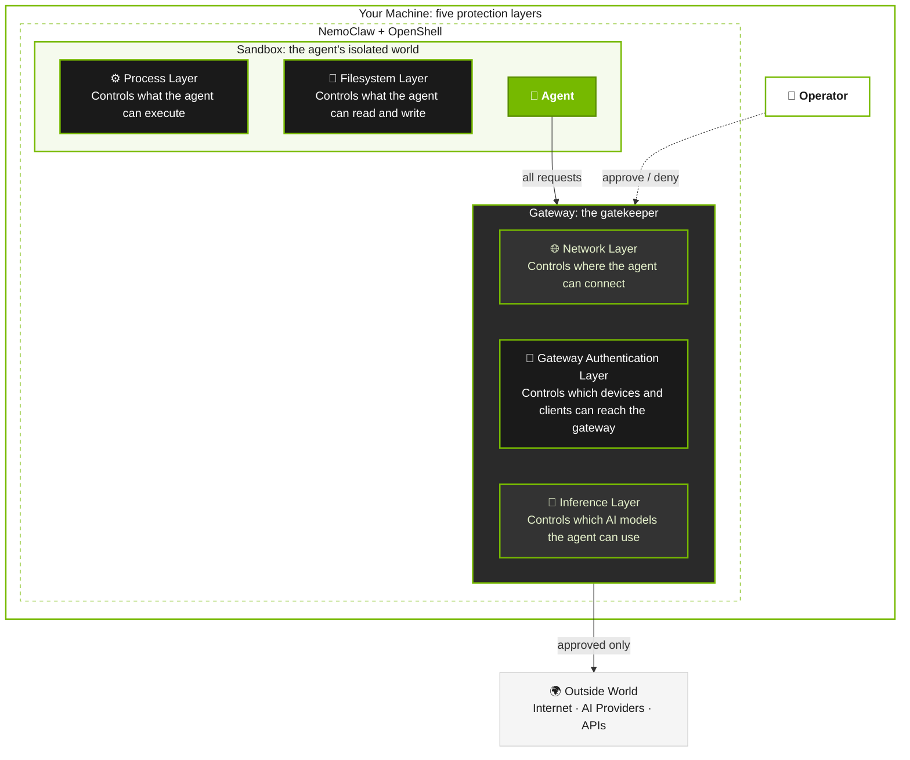

NemoClaw ships with deny-by-default security controls across five layers: network, filesystem, process, gateway authentication, and inference.
This page compares those layers, explains the controls that operators change at runtime, and helps you choose a posture profile.
The **Security Controls** navigation group owns the detailed filesystem, process, and gateway authentication guidance.

For background on how the layers fit together, refer to [How It Works](../about/how-it-works).

<Note>
OpenShell enforces the platform-level mechanisms that NemoClaw configures, including network namespace isolation, seccomp filters, SSRF protection, TLS termination, and gateway authentication.
For the full platform-level controls reference, refer to [OpenShell Security Best Practices](https://docs.nvidia.com/openshell/latest/security/best-practices.html).
</Note>

## Protection Layers at a Glance

NemoClaw enforces security at five layers.
NemoClaw locks some controls when it creates the sandbox and requires a restart to change them.
You can hot-reload others while the sandbox runs.

The following diagram shows the five protection layers.
It does not show onboarding tier presets, optional web search, or endpoints that you approve later.

| Layer | What it protects | Enforcement point | Changeable at runtime |
| --- | --- | --- | --- |
| Network | Unauthorized outbound connections and data exfiltration. | OpenShell gateway | Yes. Use `openshell policy set` or operator approval. |
| Filesystem | System binary tampering, credential theft, config manipulation. | Landlock LSM + container mounts | Landlock layout: no. Requires sandbox re-creation. Use host-side NemoClaw commands for durable config changes. |
| Process | Privilege escalation, fork bombs, syscall abuse. | Container runtime (Docker/K8s `securityContext`) | No. Requires sandbox re-creation. |
| Gateway Authentication | Unauthorized devices or clients reaching the OpenShell gateway or dashboard surfaces when present. | OpenShell gateway | No. Set at image build / onboarding time. |
| Inference | Credential exposure, unauthorized model access, cost overruns. | OpenShell gateway | Yes. Use the NemoClaw inference switching command. |

## Network Controls

NemoClaw controls which hosts, ports, and HTTP methods the sandbox can reach, and lets you approve or deny requests in real time.
OpenShell hard-blocks unspecified, loopback, and link-local destinations, including the common cloud metadata range.
An endpoint with `allowed_ips` can explicitly permit other private ranges, so treat that field as a server-side request forgery (SSRF) boundary change.

OpenShell provides additional network enforcement mechanisms not covered here, including network namespace isolation, SSRF protection, TLS auto-detection and termination, and audit-vs-enforce modes.
Refer to the [Network Controls](https://docs.nvidia.com/openshell/latest/security/best-practices.html#network-controls) section of the OpenShell Security Best Practices.

### Deny-by-Default Egress

The sandbox blocks all outbound connections unless you explicitly list the endpoint in the applicable baseline policy files.

| Aspect | Detail |
|---|---|
| Default | All egress denied. Only endpoints in the baseline policy can receive traffic. |
| What you can change | Add endpoints to the policy file (static) or with `openshell policy set` (dynamic). |
| Risk if relaxed | Each allowed endpoint is a potential data exfiltration path. The agent can send workspace content, credentials, or conversation history to any reachable host. |
| Recommendation | Add only endpoints the agent needs for its task. Prefer operator approval for one-off requests over permanently widening the baseline. |

### Credential Discovery Boundaries

Credential probes are active network behavior, not harmless fallback checks.
NemoClaw allows a credential source only in the process that is intended to hold those credentials and can reach that source.

| Execution path | Rule |
|---|---|
| Host-brokered provider | Discover and use host credentials only in the host adapter. The sandbox receives a narrow `inference.local` interface, not the host credentials. |
| Sandbox-direct provider | Keep only credential sources that are deliberately provisioned and reachable inside the sandbox. |
| Ambient metadata provider | Disable SDK discovery when the metadata endpoint cannot exist across the sandbox boundary. Do not make an internal or link-local endpoint reachable merely to satisfy an automatic probe. |
| New agent or provider | Declare the enabled credential sources and add agent-specific tests proving that unavailable sources are not probed. |

Network policy remains a second enforcement layer, not a substitute for disabling an impossible credential provider.
Adding support for a new metadata-backed source requires a separately designed broker and explicit credential-boundary review.

<AgentOnly variant="openclaw">

#### OpenClaw EC2 Instance Metadata Credential Discovery

NemoClaw forces `AWS_EC2_METADATA_DISABLED` to `true` for every OpenClaw process because OpenShell blocks the link-local EC2 Instance Metadata Service endpoint.
This disables only EC2 instance-role credential discovery inside the sandbox.
Static access keys, bearer tokens, shared profiles, SSO and process credentials, web identity, and ECS container credentials remain eligible.
NemoClaw's host-local Amazon Bedrock adapter runs outside this sandbox credential-discovery boundary and remains unaffected.

| Aspect | Detail |
|---|---|
| Default | OpenClaw images, gateway processes, child processes, cron jobs, and connected shells receive `AWS_EC2_METADATA_DISABLED=true`. |
| What you can change | This is a NemoClaw sandbox invariant, not a user-facing setting. |
| Risk if relaxed | Probing `169.254.169.254` cannot succeed through the OpenShell network boundary, and approving the link-local address would weaken SSRF protection. |
| Recommendation | Do not add `169.254.169.254` to a network policy or override this environment variable. Removing the defense requires a separately designed, brokered IMDS credential flow. |

</AgentOnly>

<AgentOnly variant="hermes">

#### Hermes Managed Inference Credential Discovery

NemoClaw configures Hermes with a custom provider through `inference.local`, and the shipped Hermes image does not install the optional native Bedrock dependency.
AWS credential discovery for supported Bedrock inference therefore remains in NemoClaw's host-local adapter, outside the sandbox.
If direct Hermes Bedrock support is added later, it must apply the same unavailable-metadata rule and include Hermes-specific credential-probe acceptance tests before it is enabled.

</AgentOnly>
<AgentOnly variant="deepagents">

#### Deep Agents Managed Inference Credential Discovery

NemoClaw configures the managed `dcode` runtime with a generated OpenAI-compatible route through `inference.local`.
The sandbox receives a placeholder route key, not the upstream provider credential.
The managed launchers reject credential-shaped environment values and upstream auth files before Deep Agents Code starts, so provider discovery stays on the host-side OpenShell boundary.
If you need a new sandbox-direct credential source, design it as an explicit provider or MCP integration instead of placing secrets in `/sandbox/.deepagents`.

</AgentOnly>

### Binary-Scoped Endpoint Rules

Each network policy entry uses the `binaries` field to restrict which executables can reach the endpoint.

OpenShell identifies the calling binary by reading `/proc/<pid>/exe` (the kernel-trusted executable path, not `argv[0]`), walking the process tree for ancestor binaries, and computing a SHA256 hash of each binary on first use.
If someone replaces a binary while the sandbox runs, the hash mismatch immediately denies the request.

| Aspect | Detail |
|---|---|
| Default | Each endpoint restricts access to specific binaries. For example, the `github` preset restricts access so only `/usr/bin/git` can reach `github.com`. Binary paths support glob patterns (`*` matches one path component, `**` matches recursively). |
| What you can change | Add binaries to an endpoint entry, or omit the `binaries` field to allow any executable. |
| Risk if relaxed | Removing binary restrictions lets any process in the sandbox reach the endpoint. An agent can use `curl`, `wget`, or a Python script to exfiltrate data to an allowed host, bypassing the intended usage pattern. |
| Recommendation | Always scope endpoints to the binaries that need them. If the agent needs a host from a new binary, add that binary explicitly rather than removing the restriction. |

### Path-Scoped HTTP Rules

Endpoint rules restrict allowed HTTP methods and URL paths.

| Aspect | Detail |
|---|---|
| Default | Some endpoints allow GET and POST on `/**` (for example, `clawhub.ai`). Others restrict methods and paths to specific API routes (for example, `integrate.api.nvidia.com` allows POST only to inference and embedding paths and GET to model listings). Read-only endpoints such as `docs.openclaw.ai`, the OpenClaw `npm_registry` baseline entry, and the `pypi` preset allow GET only (PyPI also allows HEAD). The broader `npm` preset is an intentional exception: npm/Yarn registry traffic uses L4 pass-through for Node 22 undici CONNECT compatibility. While that preset is active, NemoClaw temporarily aligns the overlapping baseline npm endpoint with the same reviewed L4 metadata because OpenShell 0.0.106 requires a single connection mode. |
| What you can change | Add methods (PUT, DELETE, PATCH) or restrict paths to specific prefixes. |
| Risk if relaxed | Allowing all methods on an API endpoint gives the agent write and delete access. For example, allowing DELETE on `api.github.com` lets the agent delete repositories. |
| Recommendation | Use GET-only rules for endpoints that the agent only reads. Add write methods only for endpoints where the agent must create or modify resources. Restrict paths to specific API routes when possible. |

### L4-Only vs L7 Inspection (`protocol` Field)

All sandbox egress goes through OpenShell's CONNECT proxy.
The `protocol` field on an endpoint controls whether the proxy also inspects individual HTTP requests inside the tunnel.

| Aspect | Detail |
|---|---|
| Default | Endpoints without a `protocol` field use L4-only enforcement: the proxy checks host, port, and binary identity, then relays the TCP stream without inspecting payloads. Setting `protocol: rest` enables L7 inspection: the proxy auto-detects and terminates TLS, then evaluates each HTTP request's method and path against the endpoint's `rules` or `access` preset. |
| What you can change | Set `protocol` to `rest`, `websocket`, `json-rpc`, or `mcp` and use rules that match that protocol. REST and WebSocket rules match methods and paths, JSON-RPC rules match RPC methods, and MCP rules can additionally match tools or parameter names. |
| Risk if relaxed | L4-only endpoints (no `protocol` field) allow the agent to send any data through the tunnel after the initial connection is permitted. The proxy cannot see or filter the HTTP method, path, or body. The `access: full` preset with `protocol: rest` enables inspection but allows all methods and paths, so it does not restrict what the agent can do at the HTTP level. |
| Recommendation | Select the matching L7 protocol and use the narrowest supported rules. Omit `protocol` only for protocols without an inspectable mode, endpoints that do not need request inspection, or documented compatibility exceptions that require a client-managed CONNECT tunnel. |

### Operator Approval Flow

When the agent reaches an unlisted endpoint, OpenShell blocks the request and prompts you in the TUI.

| Aspect | Detail |
|---|---|
| Default | Enabled. The gateway blocks all unlisted endpoints and requires approval. |
| What you can change | OpenShell merges approved endpoints into the sandbox's policy as a new durable revision. They persist across sandbox restarts within the same sandbox instance. When you destroy and recreate the sandbox through onboarding, the policy resets to the baseline defined in the blueprint. |
| Risk if relaxed | Approving an endpoint permanently widens the running sandbox's policy. If you approve a broad domain (such as a CDN that hosts arbitrary content), the agent can fetch anything from that domain until you destroy and recreate the sandbox. |
| Recommendation | Review each blocked request before approving. If you find yourself approving the same endpoint repeatedly, add it to the baseline policy with appropriate binary and path restrictions. To reset approved endpoints, destroy and recreate the sandbox. |

### Policy Presets

NemoClaw ships preset policy files in `nemoclaw-blueprint/policies/presets/` for common integrations.

| Preset | What it enables | Key risk |
|---|---|---|
| `brave` | Brave Search API. | Agent can issue search queries. |
| `brew` | Homebrew (Linuxbrew) package manager. The sandbox base image includes the `brew` binary; this preset opens network egress to GitHub and the Homebrew formulae index so `brew install` can fetch bottles. | Allows installing arbitrary Homebrew packages, which may contain malicious code. |
| `claude-code` | Claude Code CLI API, browser login, telemetry, and crash-report endpoints. | Allows a separately installed Claude Code CLI to reach Anthropic and telemetry hosts with its own credentials. On `platform.claude.com` the preset allows GET and POST on `/v1/oauth/**` only, which the browser login uses to exchange its authorization code. Do not use this preset for NemoClaw inference routing. |
| `discord` | Discord REST API, WebSocket gateway, CDN. | CDN endpoint (`cdn.discordapp.com`) allows GET to any path. WebSocket uses `access: full` (no inspection). |
| `github` | GitHub and GitHub REST API. | Gives agent read/write access to repositories and issues via `git`. |
| `huggingface` | Hugging Face Hub (download-only) and inference router. | Allows downloading arbitrary models and datasets. POST is restricted to the inference router only. |
| `jira` | Atlassian Jira API. | Gives agent read/write access to project issues and comments. |
| `local-inference` | Local Ollama and vLLM through the host gateway. | Allows sandbox access to host-side local inference ports covered by the preset. |
| `npm` | npm and Yarn registries via L4 pass-through. | Allows installing arbitrary npm packages, which may contain malicious code. OpenShell still gates by host, port, and binary, but does not inspect HTTP method, path, or body for this preset. |
| `outlook` | Microsoft 365, Outlook. | Gives agent access to email. |
| `personal-open-internet` | TCP connections to public and private address ranges on destination ports `80` and `443` from every sandbox binary. | Removes hostname, binary, application protocol, HTTP method, path, and request-body restrictions for matching connections. An agent can send sandbox-visible data to an arbitrary reachable service on either port without another approval prompt. |
| `pypi` | Python Package Index (GET and HEAD only). | Allows installing arbitrary Python packages, which may contain malicious code. Publishing is blocked. |
| `slack` | Slack API, Socket Mode, webhooks. | WebSocket uses `access: full`. Agent can post to any channel the bot token has access to. |
| `tavily` | Tavily Search API. | Agent can submit search queries and extraction targets to Tavily. The preset allows only `POST /search` and `POST /extract` from the maintained agent runtimes and enables request-body credential rewriting when the agent sends the placeholder in JSON. |
| `telegram` | Telegram Bot API. | Agent can send messages to any chat the bot token has access to. |

Apply presets only when the agent's task requires the integration.
Review the preset's YAML file before applying to understand the endpoints, methods, and binary restrictions it adds.
<AgentOnly variant="openclaw">
If the OpenClaw baseline includes `npm_registry`, that route remains GET-only until the `npm` preset is active.
Adding that preset temporarily gives the overlapping baseline route the same L4 transport while preserving its `openclaw`-only binary scope.
Removing the preset restores the exact reviewed GET-only baseline entry.
If you excluded `npm_registry`, adding or removing `npm` preserves that exclusion and does not recreate the baseline route.
When no exclusion exists, NemoClaw refuses the npm change if the live baseline differs from the reviewed GET-only entry or compatibility overlay.
The preset separately grants that registry transport to its listed npm, Yarn, and Node executables.
</AgentOnly>

<Warning title="Personal Tier">
The Personal tier selects `personal-open-internet` as its web authority and preserves non-web policy.
The open-internet preset allows every sandbox binary to reach public and private address ranges on destination ports `80` and `443` through L4 passthrough.
Traffic on those ports is not limited to HTTP or HTTPS.
OpenShell does not inspect the hostname, application protocol, HTTP method, path, or body for those connections.
The preset excludes unspecified, loopback, and link-local ranges, and other ports remain denied unless another entry permits them.
Use it only for trusted personal workloads with trusted prompts and data.
The sandbox's filesystem, process, gateway authentication, and managed credential controls remain active.
</Warning>

### Web Search Credential Rewriting

NemoClaw registers each selected web search credential in a sandbox-scoped OpenShell provider and writes a resolver placeholder into the agent configuration.
<AgentOnly variant="openclaw">
OpenClaw sends Brave's placeholder in the `X-Subscription-Token` header and Tavily's placeholder in the `Authorization` header.
</AgentOnly>
<AgentOnly variant="hermes">
Hermes sends the Tavily placeholder in the JSON `api_key` field, so the `tavily` policy preset enables `request_body_credential_rewrite` for `api.tavily.com`.
</AgentOnly>
<AgentOnly variant="deepagents">
Deep Agents uses the NemoClaw-managed Tavily opt-in path.
The managed `dcode` launchers reject direct `TAVILY_API_KEY` injection, and the sandbox can reach `api.tavily.com` only after you apply the `tavily` preset and attach the `tavily-search` OpenShell provider.
Because OpenShell attributes these calls to the sandbox Python interpreter, the Tavily egress grant is process-wide for managed sandbox Python, not a `dcode`-only boundary.
</AgentOnly>
OpenShell replaces these placeholders only when the request reaches the matching egress policy path.
<AgentOnly variant="openclaw">
The raw `BRAVE_API_KEY` or `TAVILY_API_KEY` is not written into the sandbox configuration.
</AgentOnly>
<AgentOnly variant="hermes">
The raw `TAVILY_API_KEY` is not written into the sandbox configuration.
</AgentOnly>
<AgentOnly variant="deepagents">
The raw `TAVILY_API_KEY` is not written into the managed Deep Agents configuration.
</AgentOnly>

The `tavily` preset restricts agent egress to the maintained Python and Node.js paths used by the supported agents.
Its exact curl paths are used only by onboarding's post-create verifier.
Do not replace these paths with a broad `/**` binary rule.
Broader binary access would let unrelated sandbox processes send data to Tavily through the same allowed endpoint.

## Filesystem Controls

Review filesystem defaults, writable paths, agent state, and Landlock enforcement in [Understand Filesystem Controls](./security-controls/filesystem-controls).

## Process Controls

Review capability drops, resource limits, runtime identity, and image hardening in [Understand Process Controls](./security-controls/process-controls).

## Gateway Authentication Controls

Review runtime-specific gateway access, dashboard exposure where applicable, secret redaction, and memory scanning in [Understand Gateway and Secret Controls](./security-controls/gateway-authentication-controls).

## Inference Controls

OpenShell routes all inference traffic through the gateway to isolate provider credentials from the sandbox.

### Routed Inference through `inference.local`

The OpenShell gateway intercepts all inference requests from the agent and routes them to the configured provider.
The agent never receives the provider API key.

| Aspect | Detail |
|---|---|
| Default | The agent talks to `inference.local`. The host owns the credential and upstream endpoint. |
| What you can change | You cannot configure this architecture. The system always enforces it. |
| Risk if bypassed | If the agent could reach an inference endpoint directly (by adding it to the network policy), it would need an API key. Since the sandbox does not contain credentials, this acts as defense-in-depth. However, adding an inference provider's host to the network policy without going through OpenShell routing could let the agent use a stolen or hardcoded key. |
| Recommendation | Do not add inference provider hosts (such as `api.openai.com` or `api.anthropic.com`) to the network policy for NemoClaw model traffic. Use OpenShell inference routing instead. The `claude-code` preset is a separate opt-in exception for running the Claude Code CLI with its own credentials, not a way to configure NemoClaw inference. |

### Provider Trust Tiers

Different inference providers have different trust and cost profiles.

| Provider | Trust level | Cost risk | Data handling |
|---|---|---|---|
| NVIDIA Endpoints | High. Hosted on `build.nvidia.com`. | Pay-per-token with an API key. Unattended agents can accumulate cost. | NVIDIA infrastructure processes requests. |
| OpenAI | High. Commercial API. | Pay-per-token. Same cost risk as NVIDIA Endpoints. | Subject to OpenAI data policies. |
| Anthropic | High. Commercial API. | Pay-per-token. Same cost risk as NVIDIA Endpoints. | Subject to Anthropic data policies. |
| Google Gemini | High. Commercial API. | Pay-per-token. Same cost risk as NVIDIA Endpoints. | Subject to Google data policies. |
| Local Ollama | Self-hosted. No data leaves the machine. | No per-token cost. GPU/CPU resource cost. | Data stays local. |
| Custom compatible endpoint | Varies. Depends on the proxy or gateway. | Varies. | Depends on the endpoint operator. |

For sensitive workloads, use local Ollama to keep data on-premise.
For general use, NVIDIA Endpoints provide a balance of capability and trust.
Review the data policies of any cloud provider you use.

### Experimental Providers

The `NEMOCLAW_EXPERIMENTAL=1` environment variable gates local NVIDIA NIM on eligible hosts other than N1x and generic Linux managed vLLM install/start.
DGX Spark and DGX Station managed vLLM entries appear by default.
N1x omits local NVIDIA NIM, and N1x Express offers only the Deferred managed-vLLM preview.
N1x remains outside the supported-platform set because its physical NemoClaw Express E2E validation is incomplete.
After NemoClaw qualifies the N1x identity, you must provide explicit managed-vLLM preview intent before onboarding can use this path.
On hosts other than N1x, an already-running vLLM server on `localhost:${NEMOCLAW_VLLM_PORT:-8000}` also appears in the menu without a flag because selecting it is an explicit user action.

| Aspect | Detail |
|---|---|
| Default | Local NVIDIA NIM and generic Linux managed vLLM install/start are hidden. DGX Spark and DGX Station managed vLLM entries are offered by default. On hosts other than N1x, already-running vLLM on `localhost:${NEMOCLAW_VLLM_PORT:-8000}` is offered when detected. |
| What you can change | On eligible hosts other than N1x, set `NEMOCLAW_EXPERIMENTAL=1` before onboarding to surface Local NIM and generic Linux managed vLLM. To request only the managed vLLM path non-interactively, set `NEMOCLAW_PROVIDER=install-vllm`. |
| Risk if selected | NemoClaw has not fully validated these providers. NIM requires a NIM-capable GPU. The managed vLLM path pulls a container image and starts it on a supported NVIDIA GPU host. Misconfiguration can cause failed inference or unexpected behavior. |
| Recommendation | Use experimental providers only for evaluation. Do not rely on them for always-on assistants. |

## Posture Profiles

The following profiles describe how to configure NemoClaw for different use cases.
These are not separate policy files.
They provide guidance on which controls to keep tight or relax.

### Locked-Down

Use for always-on assistants with minimal external access.

- Select the Restricted tier during onboarding.
  Onboarding defaults to the Balanced tier, which selects the `npm`, `pypi`, `huggingface`, and `brew` presets.
- Choose no web search when prompted.
  Enabling web search adds the selected `brave` or `tavily` preset even with the Restricted tier.
- Keep the remaining defaults and do not add other presets.
- Use operator approval for any endpoint the agent requests.
- Use NVIDIA Endpoints or local Ollama for inference.
- Monitor the TUI for unexpected network requests.

### Development

Use when the agent needs package registries, Docker Hub, or broader GitHub access during development tasks.

- Apply the `pypi` and `npm` presets for package installation.
- Keep binary restrictions on all presets.
- Review the agent's network activity periodically with `openshell term`.
- Use operator approval for any endpoint not covered by a preset.

### Personal

Use only for a trusted single-user sandbox that needs arbitrary TCP egress on destination ports `80` and `443`.

- Select the Personal tier during onboarding.
- Treat every prompt, downloaded package, webpage, and workspace file as able to trigger external TCP traffic on destination ports `80` and `443`.
- Do not place raw credentials or sensitive data in the sandbox unless the agent must use them.
- Create a new Balanced or Restricted sandbox when this broad egress is no longer required. NemoClaw refuses to remove Personal in place because its normalized policy has already replaced overlapping web entries.

### Integration Testing

Use when the agent talks to internal APIs or third-party services during testing.

- Add custom endpoint entries with tight path and method restrictions.
- Use `protocol: rest` for all HTTP APIs to maintain inspection.
- Use operator approval for unknown endpoints during test runs.
- Review and clean up the baseline policy after testing by removing endpoints that are no longer needed.

## Common Mistakes

The following patterns weaken security without providing meaningful benefit.

| Mistake | Why it matters | What to do instead |
|---------|---------------|-------------------|
| Omitting `protocol: rest` on REST API endpoints without a compatibility reason | Endpoints without a `protocol` field use L4-only enforcement. The proxy allows the TCP stream through after checking host, port, and binary, but cannot see or filter individual HTTP requests. | Add `protocol: rest` with explicit `rules` to enable per-request method and path control on REST APIs. Use L4 pass-through only for documented cases such as npm/Yarn on Node 22, where the client requires a CONNECT tunnel that L7 inspection would break. |
| Adding endpoints to the baseline policy for one-off requests | Adding an endpoint to the baseline policy makes it permanently reachable across all sandbox instances. | Use operator approval. Approved endpoints persist within the sandbox instance but reset when you destroy and recreate the sandbox. |
| Relying solely on the entrypoint for capability drops | The entrypoint drops dangerous capabilities using `capsh`, but this is best-effort. If `capsh` is unavailable or `CAP_SETPCAP` is not in the bounding set, the container runs with the default capability set. | Pass `--cap-drop=ALL` at the container runtime level as defense-in-depth. |
| Leaving generated agent config writable on sensitive workloads | The generated config tree contains model routing, channel settings, and runtime integration state (`/sandbox/.openclaw` for OpenClaw, `/sandbox/.hermes` for Hermes, `/sandbox/.deepagents` for Deep Agents). Writable config lets the agent drift from host-managed policy and routing. | Keep generated config under NemoClaw control for always-on assistants handling sensitive data. |
| Adding inference provider hosts to the network policy for NemoClaw inference | Direct network access to an inference host bypasses credential isolation and usage tracking. | Use OpenShell inference routing instead of adding hosts like `api.openai.com` or `api.anthropic.com` to the network policy. Apply `claude-code` only when intentionally running the separate Claude Code CLI inside the sandbox. |
| Disabling device auth for remote deployments | Without device auth, any device on the network can connect to the gateway without pairing. Combined with a cloudflared tunnel, this makes the dashboard publicly accessible and unauthenticated. | Keep `NEMOCLAW_DISABLE_DEVICE_AUTH` at its default (`0`). Only set it to `1` for local headless or development environments. |

## Known Limitations

| Limitation | Impact | Mitigation |
|-----------|--------|------------|
| Bypassing managed gateway paths | Network policy and inference auth are not enforced when an agent runtime is launched outside the NemoClaw-managed gateway path. | Use NemoClaw-managed sandbox entrypoints for production workflows. |
| Same-UID lifecycle control in the OpenShell-managed topology | The root controller authenticates the host action, verifies a stable process shape, pidfd-targets the exact observed child, and proves replacement health. It cannot establish malicious process provenance when the supervisor, gateway, and agent share the sandbox UID. Mutable config also has managed cold-start trust and time-of-check/time-of-use limits unless it is root-owned and locked. | Use a direct root-entrypoint deployment when UID isolation and the root restart seal are required. Lock managed config before treating the strict hash as a trust anchor, and recreate a sandbox after suspected same-UID compromise. |
| Direct filesystem writes bypass application-layer scanners | Application-layer scanners can intercept agent tool calls, not arbitrary raw filesystem writes (e.g., `echo secret > file`). | Landlock restricts writable paths. Application-layer scanning is defense-in-depth, not a filesystem-level control. |
| Base64/hex-encoded secrets are not detected | Content-based regex scanning cannot detect encoded or obfuscated secrets. | Use environment variables or credential stores instead of writing secrets to files. |

## Related Topics

<AgentOnly variant="openclaw">

- [Network Policies](../reference/network-policies) for the full baseline policy reference.
- [Customize the Network Policy](../network-policy/customize-network-policy) for static and dynamic policy changes.
- [Approve or Deny Network Requests](../network-policy/approve-network-requests) for the operator approval flow.
- [Review Sandbox Hardening](../manage-sandboxes/configure-sandboxes/review-sandbox-hardening) for container-level security measures.

</AgentOnly>
<AgentOnly variant="hermes">

- [Network Policies](../reference/network-policies) for the full baseline policy reference.
- [Customize the Network Policy](../network-policy/customize-network-policy) for static and dynamic policy changes.
- [Approve or Deny Network Requests](../network-policy/approve-network-requests) for the operator approval flow.

</AgentOnly>
<AgentOnly variant="deepagents">

- [Network Policies](../reference/network-policies) for the full Deep Agents baseline policy reference.
- [Customize the Network Policy](../network-policy/customize-network-policy) for static and dynamic policy changes.
- [Approve or Deny Network Requests](../network-policy/approve-network-requests) for the operator approval flow.
- [Credential Storage](credential-storage) for provider and managed MCP credential handling.
- [Understand Sandbox State](../manage-sandboxes/state-and-backups/understand-sandbox-state) for Deep Agents state and credential-bearing file exclusions.
- [About Managed MCP Servers](../manage-sandboxes/mcp-servers/about-managed-mcp-servers) for managed MCP credential replacement.

</AgentOnly>
- [Choose an Inference Provider](../inference/learn-and-choose/choose-inference-provider) for provider configuration details.
- [How It Works](../about/how-it-works) for the protection layer architecture.
- OpenShell [Security Best Practices](https://docs.nvidia.com/openshell/latest/security/best-practices.html) for the platform-level controls reference, including network namespace isolation, seccomp filters, SSRF protection, TLS termination, and gateway authentication.
