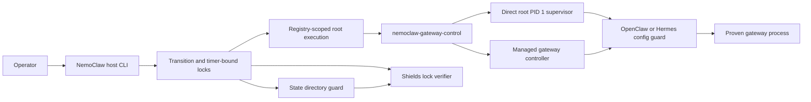

NemoClaw uses a small set of host and sandbox components to restart built-in gateways and change shields posture without granting lifecycle authority to the sandbox agent.
This page defines the trusted computing base for those operations and the evidence required when the boundary changes.

## Security Boundary

The operator, NemoClaw host CLI, OpenShell control plane, container runtime, and immutable image contents are trusted.
The agent process, agent-writable configuration and state, mutable environment variables, status files written by the sandbox user, and network responses are untrusted.
Host root compromise and replacement of root-owned image files are outside this boundary because either condition already controls the sandbox runtime.

The lifecycle boundary maintains these invariants.

- Only a registry-selected sandbox can receive a host lifecycle request.
- Only root-owned installed helpers can perform privileged lifecycle or filesystem transitions.
- A mutable path, status file, process ID, command line, or listener alone never grants authority.
- Process decisions bind the observed process ID to its start identity, parent chain, user identity, PID namespace, executable shape, and listener ownership where the topology exposes those signals.
- Filesystem transitions open trusted parents by descriptor, reject symlinks and unsafe hard links, bound traversal and input size, and verify the resulting inode state.
- A failed or ambiguous proof stops the operation without reporting recovery or a locked shields posture.
- The OpenShell-managed topology authenticates the host action but does not create gateway and agent UID isolation.

<Warning>
Changes to a component or invariant on this page require sensitive-path review and focused regression coverage before merge.
A successful build does not replace review of privilege, process identity, descriptor safety, rollback, and fail-closed behavior.
</Warning>

## Component Map

| Component | Execution and privilege | Trusted input | Security responsibility |
|---|---|---|---|
| `scripts/state-dir-guard.py` | The installed copy is root-owned and mode `0500`; the host reaches it through the shields transaction. | Fixed paths, a bounded action contract, and a lock token from the host coordinator. | Applies descriptor-rooted state-directory posture changes, rejects link and mount substitution, bounds traversal, and verifies the committed modes and ownership. |
| `scripts/lib/normalize_mutable_config_perms.py` | The installed copy is root-owned and mode `0555`; startup invokes it under the entrypoint identity, and only root can reclaim a root-owned tree. | The fixed OpenClaw config path, the resolved sandbox identity, and an exact `root:root 0700/0600` mutable-drift signature under the expected sandbox-owned parent. | Restores the mutable `2770/660` contract, pins every privileged handoff by descriptor, and rejects ambiguous posture, links, mount substitution, metadata races, and sealed config. |
| `scripts/openclaw-config-guard.py` | The installed copy is root-owned and mode `0500`; direct root PID 1 or the authenticated host transaction invokes it. | Bounded strict JSON for writes, stable captured config bytes for restart validation, and fixed installed parser paths for existing JSON5 config. | Seals and unseals OpenClaw config with no-follow descriptors, stable inode checks, atomic replacement, hash coherence, and recoverable transaction journals. |
| `scripts/managed-gateway-control.py` | The installed copy is root-owned and mode `0500`; the host invokes it through sanitized registry-scoped direct-container execution. | A fixed action, a 64-character nonce, fixed installed helpers, and a live OpenShell process tree observed through `/proc`. | Authenticates the host action, proves the managed supervisor and gateway identity, holds a root-owned mode `0600` lifecycle lock, publishes one root-owned mode `0444` exact-exit authorization bound to the gateway and live root controller identities, signals through a pidfd, waits for the normal respawn loop, and verifies listener and HTTP health. |
| `src/lib/shields/transition-lock.ts` | Runs in the host CLI under the operator account and owns the canonical per-sandbox transition lock. | Host state directory entries whose owner PID and start identity match the live lock owner. | Serializes shields mutations, rejects ambiguous or reused owners, and allows takeover only through the explicit recovery contract. |
| `src/lib/shields/timer-bound-lock.ts` | Runs in the host CLI and composes the transition lock with the recorded auto-restore generation. | A validated timer marker and transition owner from the host state directory. | Prevents an expired or replaced timer from authorizing a later mutation and keeps restore authority bound to one generation. |
| `src/lib/shields/verify-lock.ts` | Runs in the host CLI and delegates sandbox inspection through the privileged execution adapter. | Resolved built-in agent paths and the expected locked posture recorded by the host. | Verifies modes, ownership, immutable flags, layout, and recorded content hashes before NemoClaw reports shields as locked. |
| `agents/hermes/runtime-config-guard.py` | The installed copy is root-owned; its privileged actions require direct startup authority, a root-owned readiness lease, or the narrowly proven OpenShell-managed startup shape. | Fixed Hermes paths, bounded actions, stable descriptor snapshots, a transaction token, and authenticated startup or host authority. | Enforces the Hermes secret boundary, config and hash transactions, restart seals, shields transitions, rollback, and stable state-directory posture. |

The root-owned `/usr/local/bin/nemoclaw-gateway-control` entry point and the sourced `gateway-supervisor.sh` library are adjacent trusted entry points.
The entry point validates the action and nonce, rejects nonroot callers, classifies the direct and OpenShell-managed topologies, and forwards only to the matching controller.
The supervisor owns the direct PID 1 request channel and publishes bounded status for the matching nonce.

## Interaction Model

The host CLI first resolves the sandbox from host-owned registry state and selects the built-in agent topology.
Gateway restart generates a fresh nonce and enters `nemoclaw-gateway-control` as root with injection-capable environment variables cleared.
The direct topology publishes a root-owned request to PID 1, while the OpenShell-managed topology executes `managed-gateway-control.py` directly.
Both paths prove the exact replacement gateway and health state before the host repairs port forwards or reports success.

Shields mutations acquire the host transition lock before changing network policy, config posture, timer authority, or host state.
The coordinator invokes the agent-specific config guard and `state-dir-guard.py`, verifies the resulting posture, then commits host state and audit output.
Rollback keeps the same lock and transaction token so a stale callback cannot adopt the transition.

## Filesystem and Descriptor Proofs

Production Python guards bind privileged helpers and parser dependencies to fixed installed paths.
The managed controller enables alternate procfs and filesystem roots only when a source checkout also sets the explicit `NEMOCLAW_MANAGED_CONTROL_ALLOW_NONROOT_TEST=1` test flag.
They open trusted directories and files with no-follow and close-on-exec flags, compare descriptor metadata, and reject unsafe owners, modes, link counts, mounts, and inode replacement.
They bound file size, entry count, logical bytes, journal size, and process-table traversal before reading attacker-influenced state.
Atomic replacement uses fresh files in the already opened parent directory and verifies the installed inode before the transaction commits.

OpenClaw writes from NemoClaw must be strict JSON.
Existing OpenClaw runtime config can contain JSON5 comments or trailing commas, so restart validation retains the packaged JSON5 parser for read compatibility.
The guard verifies `/usr/local/bin/node` and `/opt/nemoclaw/node_modules/json5` as root-owned, non-writable installed objects before invoking the parser with a fixed environment, closed file descriptors, bounded input, and a timeout.
The image build repeats the ownership and writability checks after lockfile-based `npm ci` installation.

## Process and Listener Proofs

The direct supervisor records the gateway process ID and kernel start identity and verifies the parent relationship before signalling or reaping the process.
The Docker health fallback reads the same two-field record, verifies the process state and start identity before and after reading its command line, and accepts only the exact installed gateway arguments for the configured port or a known rewritten gateway process title.
A PID namespace inode would not distinguish PID reuse inside the same container because every process shares that namespace; PID 1 exit also terminates the container and removes the `/tmp` record.

The managed controller uses a stronger process key because OpenShell remains PID 1 while nonroot children can be replaced.
Its key includes PID, start identity, parent PID, user IDs, namespace PID and inode, command line, process state, and procfs device and inode metadata.
It verifies listener ownership in the same network namespace and uses a pidfd for signalling where the platform supports it.
For managed Hermes replacement, the controller binds the exact-exit authorization to the gateway process ID and start identity plus its own process ID and start identity.
The nonroot supervisor accepts that authorization only while the same root controller with the fixed installed command shape remains live.
The authorization records authenticated host intent for the exact exit rather than proving that the host signal was its sole cause; a mismatched or orphaned authorization counts as an unexpected exit.

## Topology Limits

The direct topology separates the root supervisor, `gateway` UID, and `sandbox` UID.
The root process belongs to the `sandbox` supplementary group because capability-dropped PID 1 still needs descriptor-safe access to the mutable tree before it can validate or transition the tree.
This membership is an intentional base-image invariant rather than a stale-base compatibility exception.

The OpenShell-managed topology runs the supervisor, gateway, and agent under the same `sandbox` UID.
The managed controller prevents accidental cross-process signalling and PID reuse, but it cannot prove provenance against a malicious same-UID agent or create UID isolation.
Remove this compatibility path only after the minimum supported OpenShell provides a root-owned lifecycle supervisor or a gateway UID distinct from the agent.

The macOS VM compatibility path accepts a nonroot NemoClaw PID 1 when the VM ownership remap prevents a root-owned readiness lease.
The guard first proves either the live NemoClaw PID 1 shape, a readiness lease bound to the current PID 1, or the complete OpenShell-managed supervisor shape.
Remove this path when the minimum supported OpenShell macOS VM preserves root ownership for the readiness lease.

## Review and Removal Conditions

Reviewers must re-check this page when a lifecycle helper, shields coordinator, config guard, installed mode, process proof, or test seam changes.
The following conditions govern current compatibility code and architecture work.

- Remove the final OpenClaw stale-base group repair when the minimum supported OpenClaw sandbox base tag is `v0.0.71` or newer, the source provisioning contract guarantees both memberships, and both final-image tests pass.
- Keep root membership in the base image while capability-dropped root PID 1 owns lifecycle validation for sandbox-group mutable state.
- Remove the managed shared-UID controller when the supported OpenShell topology provides a root-owned supervisor or a distinct gateway UID.
- Remove JSON5 restart validation only when every supported OpenClaw config is guaranteed to be strict JSON; NemoClaw write transactions already reject JSON5-only syntax.
- Decompose the host shields coordinator only with behavior-preserving changes that keep policy, config, timer, rollback, state, and audit ordering under one typed transaction contract.
- Keep the managed controller's source-path and fake-root overrides disabled unless the explicit source test flag is present, and keep installed helpers bound to fixed production paths.

Final-image validation must cover both built-in images.
It checks helper owners and modes, root and gateway supplementary groups, root execution of the read-only `probe` path, and refusal before helper entry when the sandbox user attempts execution.
