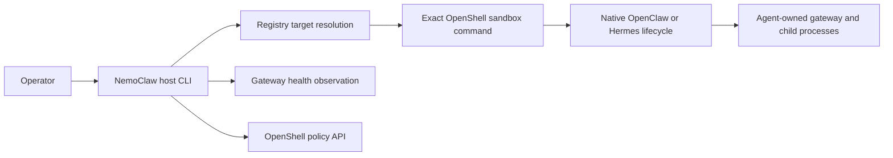

NemoClaw uses host and sandbox components to invoke native agent lifecycle commands and manage the resources that it creates.
This page defines the trusted computing base for those operations.

## Security Boundary

The operator, NemoClaw host CLI, OpenShell control plane, container runtime, and immutable image contents are trusted.
The agent process, agent-writable configuration and state, mutable environment variables, status files written by the sandbox user, and network responses are untrusted.
Host root compromise and replacement of root-owned image files are outside this boundary because either condition already controls the sandbox runtime.

NemoClaw does not provide post-provisioning immutability for agent configuration or persistent state.
OpenShell remains authoritative for sandbox filesystem and network policy enforcement.

The lifecycle boundary maintains these invariants:

- Only a registry-selected sandbox can receive a host lifecycle request.
- Privileged config and Hermes cron-restore operations use root-owned installed helpers.
- A mutable path, status file, process ID, command line, or listener alone never grants authority.
- Retained direct-container and Hermes cron-restore process decisions bind process identity to the evidence that each operation requires.
- Config transactions use descriptor-safe path checks, bounded input, atomic replacement, and post-write verification.
- Host mutations for one sandbox serialize through the canonical per-sandbox mutation lock.
- A failed or ambiguous proof stops the operation without reporting recovery or success.
- The OpenShell-managed topology authenticates the host action but does not create gateway and agent user-ID isolation.

<Warning>
  Changes to a component or invariant on this page require sensitive-path review
  and focused regression coverage before merge. A successful build does not
  replace review of privilege, process identity, descriptor safety, rollback,
  and fail-closed behavior.
</Warning>

## Component Map

| Component                                                                                | Execution and privilege                                                                                                            | Trusted input                                                                                                                                    | Security responsibility                                                                                                                    |
| ---------------------------------------------------------------------------------------- | ---------------------------------------------------------------------------------------------------------------------------------- | ------------------------------------------------------------------------------------------------------------------------------------------------ | ------------------------------------------------------------------------------------------------------------------------------------------ |
| `src/lib/sandbox/privileged-exec.ts` and `src/lib/adapters/sandbox/command-transport.ts` | Run in the host CLI under the operator account.                                                                                    | The canonical registry entry, sandbox lifecycle identity, and selected command transport.                                                        | Scope privileged execution to the registered sandbox and keep transport selection from changing the target.                                |
| `scripts/openclaw-config-guard.py`                                                       | The installed source is root-owned and mode `0555`. CLI actions require root; the normalizer imports its read-only process checks. | Bounded strict JSON for writes, active config and hash posture for inspection or repair, and fixed installed parser paths for existing JSON5 config. | Validate config with no-follow descriptors, stable inode checks, atomic replacement, hash coherence, and recoverable transaction journals. |
| `agents/hermes/runtime-config-guard.py`                                                  | The installed copy is root-owned; startup actions use fixed installed paths.                                                       | Fixed Hermes paths, bounded actions, and stable descriptor snapshots.                                                                            | Enforce credential projection, config integrity, and stable file replacement without controlling the native gateway lifecycle.             |
| `agents/hermes/cron-restore-control.py` and the patched Hermes drain predicate           | The installed controller is root-owned; the host invokes it through registry-scoped privileged execution.                          | Fixed control actions, a root-owned lock and marker, a pinned gateway identity, and bounded restored cron state.                                 | Serialize restore ownership, validate restored jobs and scripts while the gateway is idle, and clear only the NemoClaw-owned gate.         |
| `src/lib/actions/sandbox/gateway-restart.ts`                                             | Runs in the host CLI under the operator account and invokes the native command through OpenShell.                                  | The registry-selected sandbox and agent, the native command result, gateway health, and host-forward state.                                      | Request native restart, verify readiness and health, and repair host-side forwards without signalling or respawning the gateway.           |
| `src/lib/onboard/runtime-provider/docker-operation-authority.ts`                         | Runs in the host CLI and invokes Docker without a shell from a fixed working directory and sanitized environment.                  | A qualified Docker executable and interpreter chain, fixed `PATH`, endpoint bindings, and the relevant execution-environment identity.           | Revalidate the Docker command and endpoint before active provider and lifecycle operations can target a container.                         |

## Interaction Model

```mermaid
flowchart LR
    Operator[Operator] --> CLI[NemoClaw host CLI]
    CLI --> Registry[Registry target resolution]
    Registry --> OpenShell[Exact OpenShell sandbox command]
    OpenShell --> Agent[Native OpenClaw or Hermes lifecycle]
    Agent --> Gateway[Agent-owned gateway and child processes]
    CLI --> Health[Gateway health observation]
    CLI --> Policy[OpenShell policy API]
```

The host CLI first resolves the sandbox from host-owned registry state and selects the built-in agent topology.
Gateway restart executes the native agent command inside that OpenShell sandbox.
OpenShell owns sandbox containment and lifecycle.
The agent owns gateway, cron, hook, subprocess, and background-work lifecycle.
NemoClaw observes health before it repairs host forwards or reports success.

NemoClaw policy commands read and update the live OpenShell policy.
They do not persist a second desired-policy document.

## Filesystem and Descriptor Proofs

Production Python guards bind privileged helpers and parser dependencies to fixed installed paths.
They open trusted directories and files with no-follow and close-on-exec flags.
They compare descriptor metadata and reject unsafe owners, modes, link counts, mounts, and inode replacement.
They bound file size, entry count, journal size, and process-table traversal before reading attacker-influenced state.
Atomic replacement uses fresh files in an already opened parent directory and verifies the installed inode before the transaction commits.

OpenClaw writes from NemoClaw must be strict JSON.
Existing OpenClaw runtime config can contain JSON5 comments or trailing commas, so config inspection, repair, and transactions retain the packaged JSON5 parser for read compatibility.
The guard verifies `/usr/local/bin/node` and `/opt/nemoclaw/node_modules/json5` as root-owned, non-writable installed objects before invoking the parser with a fixed environment, closed file descriptors, bounded input, and a timeout.

These checks protect the privileged transaction itself.
They do not make the resulting agent config or state immutable after the transaction completes.

## Process and Listener Proofs

The direct supervisor records the gateway process ID and kernel start identity and verifies the parent relationship before signalling or reaping the process.
The Docker health fallback reads the same record and verifies process identity before and after reading its command line.

The Hermes cron-restore controller pins the initial gateway identity while it validates restored cron state.
It observes the replacement identity around health verification and releases the restore gate only for that live replacement.
This controller protects the cron-restore transaction and does not own ordinary Hermes gateway lifecycle.

## Topology Limits

The direct topology separates the root supervisor, `gateway` user ID, and `sandbox` user ID.
The direct-container root process belongs to the `sandbox` supplementary group so its current config transactions have descriptor-safe access to the mutable tree.

The OpenShell-managed topology runs the supervisor, gateway, and agent under the same `sandbox` user ID.
OpenShell containment and host health observations do not prove process provenance against a malicious same-user agent or create user-ID isolation.

The macOS virtual-machine compatibility path accepts a nonroot NemoClaw PID 1 when the ownership remap prevents a root-owned readiness lease.
The guard proves the expected process or readiness-lease shape before it accepts that path.

## Review and Removal Conditions

Reviewers must re-check this page when a lifecycle helper, config guard, installed mode, process proof, or test seam changes.
The following conditions govern current compatibility code:

- Remove the final OpenClaw stale-base group repair when the minimum supported image guarantees both required memberships.
- Remove root membership in the base image when the remaining direct-container config transactions no longer consume sandbox-group mutable state.
- Remove JSON5 compatibility from the config guard only when every supported OpenClaw config is strict JSON.
- Keep source-path and fake-root overrides disabled unless an explicit source test flag is present.
