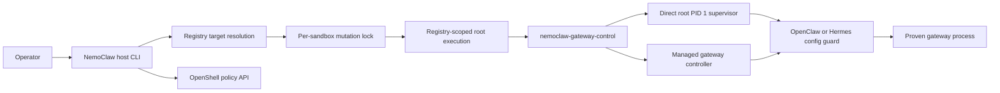

NemoClaw uses host and sandbox components to manage gateways and the resources that it creates without granting host lifecycle authority to the agent.
This page defines the trusted computing base for those operations.

## Security Boundary

The operator, NemoClaw host CLI, OpenShell control plane, container runtime, and immutable image contents are trusted.
The agent process, agent-writable configuration and state, mutable environment variables, status files written by the sandbox user, and network responses are untrusted.
Host root compromise and replacement of root-owned image files are outside this boundary because either condition already controls the sandbox runtime.

NemoClaw does not provide post-provisioning immutability for agent configuration or persistent state.
OpenShell remains authoritative for sandbox filesystem and network policy enforcement.

The lifecycle boundary maintains these invariants:

- Only a registry-selected sandbox can receive a host lifecycle request.
- Privileged lifecycle operations use root-owned installed helpers.
- A mutable path, status file, process ID, command line, or listener alone never grants authority.
- Process decisions bind a process ID to its start identity, parent chain, user identity, executable shape, and listener ownership where available.
- Config transactions use descriptor-safe path checks, bounded input, atomic replacement, and post-write verification.
- Host mutations for one sandbox serialize through the canonical per-sandbox mutation lock.
- A failed or ambiguous proof stops the operation without reporting recovery or success.
- The OpenShell-managed topology authenticates the host action but does not create gateway and agent user-ID isolation.

<Warning>
Changes to a component or invariant on this page require sensitive-path review and focused regression coverage before merge.
A successful build does not replace review of privilege, process identity, descriptor safety, rollback, and fail-closed behavior.
</Warning>

## Component Map

| Component | Execution and privilege | Trusted input | Security responsibility |
|---|---|---|---|
| `src/lib/sandbox/privileged-exec.ts` and `src/lib/adapters/sandbox/command-transport.ts` | Run in the host CLI under the operator account. | The canonical registry entry, sandbox lifecycle identity, and selected command transport. | Scope privileged execution to the registered sandbox and keep transport selection from changing the target. |
| `scripts/openclaw-config-guard.py` | The installed copy is root-owned and mode `0500`; direct root PID 1 or an authenticated host transaction invokes it. | Bounded strict JSON for writes, stable captured config bytes for restart validation, and fixed installed parser paths for existing JSON5 config. | Validate config with no-follow descriptors, stable inode checks, atomic replacement, hash coherence, and recoverable transaction journals. |
| `scripts/managed-gateway-control.py` | The installed copy is root-owned and mode `0500`; the host invokes it through registry-scoped privileged execution. | A fixed action, fresh nonce, fixed installed helpers, and a live OpenShell process tree observed through `/proc`. | Authenticate the host action, prove the managed supervisor and gateway identity, authorize one exact gateway exit, wait for normal respawn, and verify listener and HTTP health. |
| `agents/hermes/runtime-config-guard.py` | The installed copy is root-owned; privileged actions require authenticated startup or host authority. | Fixed Hermes paths, bounded actions, stable descriptor snapshots, a transaction token, and authenticated startup or host authority. | Enforce the Hermes secret boundary, config and hash transactions, restart validation, rollback, and stable file replacement. |
| `agents/hermes/cron-restore-control.py` and the patched Hermes drain predicate | The installed controller is root-owned; the host invokes it through registry-scoped privileged execution. | Fixed control actions, a root-owned lock and marker, a pinned gateway identity, and bounded restored cron state. | Serialize restore ownership, validate restored jobs and scripts while the gateway is idle, and clear only the NemoClaw-owned gate. |
| `src/lib/onboard/runtime-provider/docker-operation-authority.ts` | Runs in the host CLI and invokes Docker without a shell from a fixed working directory and sanitized environment. | A qualified Docker executable and interpreter chain, fixed `PATH`, endpoint bindings, and the relevant execution-environment identity. | Revalidate the Docker command and endpoint before active provider and lifecycle operations can target a container. |

The root-owned `/usr/local/bin/nemoclaw-gateway-control` entry point and the sourced `gateway-supervisor.sh` library are adjacent trusted entry points.
The entry point validates the action and nonce, rejects nonroot callers, classifies the direct and OpenShell-managed topologies, and forwards only to the matching controller.
The supervisor owns the direct PID 1 request channel and publishes bounded status for the matching nonce.

## Interaction Model

```mermaid
flowchart LR
    Operator[Operator] --> CLI[NemoClaw host CLI]
    CLI --> Registry[Registry target resolution]
    Registry --> Lock[Per-sandbox mutation lock]
    Lock --> RootExec[Registry-scoped root execution]
    RootExec --> Control[nemoclaw-gateway-control]
    Control --> Direct[Direct root PID 1 supervisor]
    Control --> Managed[Managed gateway controller]
    Direct --> Config[OpenClaw or Hermes config guard]
    Managed --> Config
    Config --> Gateway[Proven gateway process]
    CLI --> Policy[OpenShell policy API]
```

The host CLI first resolves the sandbox from host-owned registry state and selects the built-in agent topology.
Gateway restart generates a fresh nonce and enters `nemoclaw-gateway-control` as root with injection-capable environment variables cleared.
The direct topology publishes a root-owned request to PID 1, while the OpenShell-managed topology executes `managed-gateway-control.py` directly.
Both paths prove the replacement gateway and health state before the host repairs port forwards or reports success.

NemoClaw policy commands read and update the live OpenShell policy.
They do not persist a second desired-policy document.

## Filesystem and Descriptor Proofs

Production Python guards bind privileged helpers and parser dependencies to fixed installed paths.
They open trusted directories and files with no-follow and close-on-exec flags.
They compare descriptor metadata and reject unsafe owners, modes, link counts, mounts, and inode replacement.
They bound file size, entry count, journal size, and process-table traversal before reading attacker-influenced state.
Atomic replacement uses fresh files in an already opened parent directory and verifies the installed inode before the transaction commits.

OpenClaw writes from NemoClaw must be strict JSON.
Existing OpenClaw runtime config can contain JSON5 comments or trailing commas, so restart validation retains the packaged JSON5 parser for read compatibility.
The guard verifies `/usr/local/bin/node` and `/opt/nemoclaw/node_modules/json5` as root-owned, non-writable installed objects before invoking the parser with a fixed environment, closed file descriptors, bounded input, and a timeout.

These checks protect the privileged transaction itself.
They do not make the resulting agent config or state immutable after the transaction completes.

## Process and Listener Proofs

The direct supervisor records the gateway process ID and kernel start identity and verifies the parent relationship before signalling or reaping the process.
The Docker health fallback reads the same record and verifies process identity before and after reading its command line.

The managed controller uses a stronger process key because OpenShell remains PID 1 while nonroot children can be replaced.
Its key includes PID, start identity, parent PID, user IDs, namespace identity, command line, process state, and procfs metadata.
It verifies listener ownership in the same network namespace and uses a pidfd for signalling where the platform supports it.

For managed Hermes replacement, the controller binds the exit authorization to the gateway and live root-controller identities.
The nonroot supervisor accepts that authorization only while the same root controller with the fixed installed command shape remains live.
A mismatched or orphaned authorization counts as an unexpected exit.

## Topology Limits

The direct topology separates the root supervisor, `gateway` user ID, and `sandbox` user ID.
The root process belongs to the `sandbox` supplementary group because capability-dropped PID 1 needs descriptor-safe access to the mutable tree before validation and config transactions.

The OpenShell-managed topology runs the supervisor, gateway, and agent under the same `sandbox` user ID.
The managed controller prevents accidental cross-process signalling and process-ID reuse, but it cannot prove provenance against a malicious same-user agent or create user-ID isolation.

The macOS virtual-machine compatibility path accepts a nonroot NemoClaw PID 1 when the ownership remap prevents a root-owned readiness lease.
The guard proves the expected process or readiness-lease shape before it accepts that path.

## Review and Removal Conditions

Reviewers must re-check this page when a lifecycle helper, config guard, installed mode, process proof, or test seam changes.
The following conditions govern current compatibility code:

- Remove the final OpenClaw stale-base group repair when the minimum supported image guarantees both required memberships.
- Keep root membership in the base image while capability-dropped root PID 1 owns lifecycle validation for sandbox-group mutable state.
- Remove the managed shared-user controller when the supported OpenShell topology provides a root-owned supervisor or a distinct gateway user ID.
- Remove JSON5 restart validation only when every supported OpenClaw config is strict JSON.
- Keep source-path and fake-root overrides disabled unless an explicit source test flag is present.
