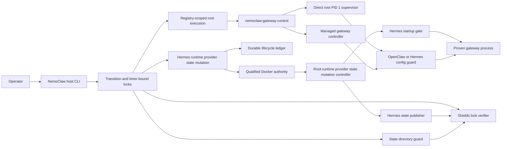

NemoClaw uses a small set of host and sandbox components to change Shields posture and, where present, restart built-in gateways without granting lifecycle authority to the sandbox agent.
This page defines the trusted computing base for those operations and the evidence required when the boundary changes.

## Security Boundary

The operator, NemoClaw host CLI, OpenShell control plane, container runtime, and immutable image contents are trusted.
The agent process, agent-writable configuration and state, mutable environment variables, status files written by the sandbox user, and network responses are untrusted.
Host root compromise and replacement of root-owned image files are outside this boundary because either condition already controls the sandbox runtime.

The lifecycle boundary maintains these invariants.

- Only a registry-selected sandbox can receive a host lifecycle request.
- Privileged lifecycle transitions use root-owned installed helpers.
- Filesystem transitions use `/usr/local/lib/nemoclaw/state-dir-guard.py` for current OpenClaw and Hermes images and historical images that include this helper.
  An agent manifest with `state_lock_plan_in_image: false` selects authenticated root execution of the host helper and manifest-derived plan.
  Historical images that contain neither installed path use the same execution path.
  Neither case writes the helper or plan to mutable sandbox state.
- A filesystem transition fails closed if the image contains `/usr/local/share/nemoclaw/state-lock-plan.json` but `/usr/local/lib/nemoclaw/state-dir-guard.py` is missing.
  It also fails closed if the installed plan differs from the current agent manifest.
- A mutable path, status file, process ID, command line, or listener alone never grants authority.
- Process decisions bind the observed process ID to its start identity, parent chain, user identity, PID namespace, executable shape, and listener ownership where the topology exposes those signals.
- Filesystem transitions open trusted parents by descriptor, reject symlinks and unsafe hard links, bound traversal and input size, and verify the resulting inode state.
- A current managed Hermes image on the Docker driver accepts a runtime provider state mutation only through a qualified Docker executable and endpoint authority bound to the registered sandbox lifecycle and runtime target.
- The owner-only runtime provider lifecycle ledger survives host process exit, excludes a second target, and remains authoritative until recovery and release complete.
- An active provider fence drains an earlier privileged sandbox execution lease and rejects later direct-container, SSH, and OpenShell command transports before command resolution or process spawn.
- Hermes startup cannot read mutable state or admit the gateway while the image-owned startup gate reports an active, malformed, or unauthenticated runtime provider state mutation.
- A failed or ambiguous proof stops the operation without reporting recovery or a successful Shields up transition.
- The OpenShell-managed topology authenticates the host action but does not create gateway and agent UID isolation.

<Warning>
Changes to a component or invariant on this page require sensitive-path review and focused regression coverage before merge.
A successful build does not replace review of privilege, process identity, descriptor safety, rollback, and fail-closed behavior.
</Warning>

## Component Map

| Component | Execution and privilege | Trusted input | Security responsibility |
|---|---|---|---|
| `scripts/state-dir-guard.py` | Current OpenClaw and Hermes images install a root-owned, mode `0500` copy at `/usr/local/lib/nemoclaw/state-dir-guard.py` and a generated plan at `/usr/local/share/nemoclaw/state-lock-plan.json`. A historical image that has the helper but no plan uses its co-bundled helper. An agent manifest with `state_lock_plan_in_image: false` selects the trusted host CLI copy over standard input to `python3 -I -` and a manifest-derived plan through authenticated root execution. Historical images that contain neither installed file use the same execution path. | Fixed paths and a bounded action contract. Current and host-injected transitions use a strict versioned path plan derived from the selected agent manifest. A historical co-bundled helper uses its reviewed legacy inventory. | Applies descriptor-rooted state-directory posture changes, rejects link and mount substitution, bounds traversal, and verifies the committed modes and ownership. The host refuses a filesystem transition for an image that contains the generated plan if the installed helper is missing or the plan differs from the current agent manifest. |
| `src/lib/shields/hermes-runtime-state-mutation.ts` | Runs in the host CLI after the Shields coordinator holds the per-sandbox transition authority. | The registered managed Hermes workload, lifecycle generation, root-owned image capability, current `AgentDefinition`, and a Docker provider that implements runtime provider state mutation. | Selects `provider-state-mutation-v2`, recovers a retained target with matching identity before acquiring another one, preserves a restrictive fence after same-locked failure, rolls a failed same-mutable transition back to locked posture, and releases only after fresh activation proof. An older managed image falls back only when the capability is proved absent; an invalid present capability fails closed. |
| `src/lib/onboard/runtime-provider/docker-operation-authority.ts` | Runs in the host CLI under the operator account and invokes Docker without a shell from a fixed working directory and sanitized environment. | One qualified absolute Docker executable and its absolute interpreter chain; an absolute-only fixed `PATH`; the effective PATH-selected `docker-credential-*` executables and their interpreter chains; the effective SSH executable for an `ssh://` endpoint; the context, host, TLS, and endpoint bindings; and the non-`PATH` execution-environment digest. The complete `PATH` enters authority identity for host-local inference and `ssh://`. A local `sandbox-lifecycle` authority omits helper-free added directories from persisted identity while still binding selected delegated helpers. | Revalidates executable, interpreter, delegated-command, and engine-endpoint metadata before provider actions; rejects authority drift and unverified remote TCP; and prevents ambient Docker configuration or command delegation from redirecting a fenced runtime provider state mutation. |
| `src/lib/onboard/runtime-provider/persisted-engine-lifecycle.ts` and `~/.nemoclaw/state/runtime-provider-lifecycle/` | The host CLI manages an owner-only private directory and durable artifacts under the operator account. | A runtime target claim and phase-bound transaction, release receipt, or tombstone whose sandbox lifecycle, engine binding, container, state root, plan, projection, target, rollback, and nonce match. | Preserves recovery authority across host process restart, excludes a second target, advances only the transaction through `prepared`, `mutation-authorized`, `fence-established`, and `completed` phases, and releases only the matching claim. |
| `src/lib/sandbox/privileged-exec.ts` and `src/lib/adapters/sandbox/command-transport.ts` | Run in the host CLI and hold a privileged sandbox execution lease through command completion and transport cleanup. | The canonical per-sandbox host transition lock, the durable runtime target claim, and the registered container identity. | Drains an earlier execution lease before provider fencing and rejects later direct-container, OpenShell, and SSH execution before argument resolution or process spawn. One OpenShell lease covers its direct Docker fallback so transport selection cannot cross the fence. |
| `scripts/runtime-state-mutation-transport-broker.py` | The current managed Hermes image installs a root-owned, mode `0500` copy. The qualified Docker provider starts its fixed path as root before the supervisor stops. | One 64-character transaction identifier, fixed controller and transport paths, root-owned private request files, and bounded action-specific timeouts. | Keeps the fixed controller reachable while ordinary command transports are fenced, validates transaction-bound requests and acknowledgements, normalizes helper failures, and removes its private session only after the released supervisor is confirmed running. |
| `scripts/runtime-state-mutation-control.py` | The current managed Hermes image installs a root-owned, mode `0500` copy, invoked as root through the qualified Docker provider authority. | Fixed actions; container, engine, mount-namespace, state-root, plan, projection, posture, and nonce bindings; installed controller and publisher identities; and stable process evidence. | Establishes and verifies the in-container fence, stops the bound entrypoint and sandbox processes, invokes only the fixed Hermes publisher, starts only the bound entrypoint, requires a fresh healthy gateway and authenticated startup checkpoint, and retains restrictive state when release is not proved. |
| `scripts/runtime_state_mutation_hermes_publisher.py` | The current managed Hermes image installs a root-owned, mode `0500` copy that only the runtime provider state mutation controller imports. | The root-owned controller marker, nonce-bound canonical plan and projection, installed state-lock plan, state-root descriptor, and requested posture. | Applies the normalized Hermes recursive posture, publishes fresh protected inodes where required, maintains its root-only journal, verifies the result, and returns a bounded receipt to the controller. |
| `scripts/runtime-state-mutation-startup-gate.py` and `agents/hermes/start.sh` | The gate is root-owned and mode `0555`; the Hermes entrypoint invokes it before sourcing helpers or reading mutable state. | The parent process, root-owned controller handoff, active runtime provider state mutation identity, candidate checkpoint, and authenticated release for the same target. | Holds or refuses startup on active, malformed, uninspectable, or unauthenticated state, publishes a checkpoint only after the complete Hermes topology is healthy, and resumes only the controller-authenticated candidate. |
| `scripts/lib/normalize_mutable_config_perms.py` | The installed copy is root-owned and mode `0555`; startup invokes it under the entrypoint identity, and only root can reclaim a root-owned tree. | The fixed OpenClaw config path, the resolved sandbox identity, and a `root:root 0700/0600` mutable-drift signature under the expected sandbox-owned parent. | Restores the mutable `2770/660` contract, pins every privileged handoff by descriptor, and rejects ambiguous posture, links, mount substitution, metadata races, and sealed config. |
| `scripts/openclaw-config-guard.py` | The installed copy is root-owned and mode `0500`; direct root PID 1 or the authenticated host transaction invokes it. | Bounded strict JSON for writes, stable captured config bytes for restart validation, and fixed installed parser paths for existing JSON5 config. | Seals and unseals OpenClaw config with no-follow descriptors, stable inode checks, atomic replacement, hash coherence, and recoverable transaction journals. |
| `scripts/managed-gateway-control.py` | The installed copy is root-owned and mode `0500`; the host invokes it through sanitized registry-scoped direct-container execution. | A fixed action, a 64-character nonce, fixed installed helpers, and a live OpenShell process tree observed through `/proc`. | Authenticates the host action, proves the managed supervisor and gateway identity, holds a root-owned mode `0600` lifecycle lock, publishes one root-owned mode `0444` exact-exit authorization bound to the gateway and live root controller identities, signals through a pidfd, waits for the normal respawn loop, and verifies listener and HTTP health. |
| `agents/hermes/cron-restore-control.py` and the patched Hermes drain predicate | The installed controller is root-owned and mode `0700`; the host invokes it through registry-scoped privileged direct-container execution. The sandbox-user gateway evaluates the image-pinned predicate. | Fixed control actions; a root-owned mode `0600` lock and mode `0400` marker with an ownership token; a pinned gateway process ID and start identity; bounded restored cron state; and separate Hermes operator-drain state. | Serializes gate ownership, validates restored jobs and scripts while the pinned gateway is idle, and clears only the NemoClaw gate. The predicate combines independent operator and NemoClaw ownership, descriptor-pins the root-owned marker directory, and remains drained when metadata fails validation or is ambiguous. Release restores the marker when it cannot prove the expected running or operator-drained state. |
| `src/lib/shields/transition-lock.ts` | Runs in the host CLI under the operator account and owns the canonical per-sandbox transition lock. | Host state directory entries whose owner PID and start identity match the live lock owner, or prove that the recorded owner is definitively dead or PID-reused. | Serializes shields mutations, recovers definitively stale owners through inode-checked quarantine, rejects ambiguous owners, and allows token-gated takeover only through the explicit recovery contract. |
| `src/lib/shields/timer-bound-lock.ts` | Runs in the host CLI and composes the transition lock with the recorded auto-restore generation. | A validated timer marker and transition owner from the host state directory. | Prevents an expired or replaced timer from authorizing a later mutation and keeps restore authority bound to one generation. |
| `src/lib/shields/verify-lock.ts` | Runs in the host CLI and delegates sandbox inspection through the privileged execution adapter. | Resolved built-in agent paths and the expected locked posture recorded by the host. | Verifies modes, ownership, immutable flags, layout, and recorded content hashes before NemoClaw reports shields as locked. |
| `agents/hermes/runtime-config-guard.py` | The installed copy is root-owned; its privileged actions require direct startup authority, a root-owned readiness lease, or the narrowly proven OpenShell-managed startup shape. | Fixed Hermes paths, bounded actions, stable descriptor snapshots, a transaction token, and authenticated startup or host authority. | Enforces the Hermes secret boundary, config and hash transactions, restart seals, shields transitions, rollback, and stable state-directory posture. |

The root-owned `/usr/local/bin/nemoclaw-gateway-control` entry point and the sourced `gateway-supervisor.sh` library are adjacent trusted entry points.
The entry point validates the action and nonce, rejects nonroot callers, classifies the direct and OpenShell-managed topologies, and forwards only to the matching controller.
The supervisor owns the direct PID 1 request channel and publishes bounded status for the matching nonce.

## Interaction Model

```mermaid
flowchart LR
    Operator[Operator] --> CLI[NemoClaw host CLI]
    CLI --> HostLock[Transition and timer-bound locks]
    HostLock --> RootExec[Registry-scoped root execution]
    RootExec --> Control[nemoclaw-gateway-control]
    Control --> Direct[Direct root PID 1 supervisor]
    Control --> Managed[Managed gateway controller]
    Direct --> Config[OpenClaw or Hermes config guard]
    Managed --> Config
    HostLock --> State[State directory guard]
    HostLock --> Verify[Shields lock verifier]
    HostLock --> Mutation[Hermes runtime provider state mutation]
    Mutation --> Ledger[Durable lifecycle ledger]
    Mutation --> DockerAuthority[Qualified Docker authority]
    DockerAuthority --> ProviderControl[Root runtime provider state mutation controller]
    ProviderControl --> Publisher[Hermes state publisher]
    ProviderControl --> StartupGate[Hermes startup gate]
    Publisher --> Verify
    StartupGate --> Gateway
    Config --> Gateway[Proven gateway process]
    State --> Verify
```

The host CLI first resolves the sandbox from host-owned registry state and selects the built-in agent topology.
Gateway restart generates a fresh nonce and enters `nemoclaw-gateway-control` as root with injection-capable environment variables cleared.
The direct topology publishes a root-owned request to PID 1, while the OpenShell-managed topology executes `managed-gateway-control.py` directly.
Both paths prove the replacement gateway and health state before the host repairs port forwards or reports success.
Terminal agents do not run these gateway branches; their Shields transitions use the state and verification branches.

Shields mutations acquire the host transition lock before changing network policy, config posture, timer authority, or host state.
The coordinator applies the selected agent's config transition, invokes `state-dir-guard.py`, verifies the resulting posture, then commits host state and audit output.
Rollback keeps the same lock and transaction token so a stale callback cannot adopt the transition.

For `provider-state-mutation-v2`, the coordinator first recovers any retained target with matching identity, then acquires and repeatedly asserts the durable provider fence around publication and fresh Hermes activation.
An in-flight privileged execution lease drains before the fence becomes active, and later ordinary command transports are rejected before they resolve or spawn a sandbox command.
The fixed publisher applies the recursive target, the startup gate authenticates the candidate after the complete topology is healthy, and only then can the provider record release and let ordinary execution resume.
If the host process exits, the durable ledger and in-container fence remain the recovery authority for the next Shields command.

## Filesystem and Descriptor Proofs

Production Python guards bind privileged helpers and parser dependencies to fixed installed paths.
The managed controller enables alternate procfs and filesystem roots only when a source checkout also sets the explicit `NEMOCLAW_MANAGED_CONTROL_ALLOW_NONROOT_TEST=1` test flag.
They open trusted directories and files with no-follow and close-on-exec flags, compare descriptor metadata, and reject unsafe owners, modes, link counts, mounts, and inode replacement.
They bound file size, entry count, logical bytes, journal size, and process-table traversal before reading attacker-influenced state.
Atomic replacement uses fresh files in the already opened parent directory and verifies the installed inode before the transaction commits.

OpenClaw writes from NemoClaw must be strict JSON.
Existing OpenClaw runtime config can contain JSON5 comments or trailing commas, so restart validation retains the packaged JSON5 parser for read compatibility.
The guard verifies `/usr/local/bin/node` and `/opt/nemoclaw/node_modules/json5` as root-owned, non-writable installed objects before invoking the parser with a fixed environment, closed file descriptors, bounded input, and a timeout.
The image build repeats the ownership and writability checks after lockfile-based `npm ci` installation.

## Process and Listener Proofs

The direct supervisor records the gateway process ID and kernel start identity and verifies the parent relationship before signalling or reaping the process.
The Docker health fallback reads the same two-field record, verifies the process state and start identity before and after reading its command line, and accepts only when the observed arguments equal the installed gateway argument vector for the configured port or a known rewritten gateway process title.
A PID namespace inode would not distinguish PID reuse inside the same container because every process shares that namespace; PID 1 exit also terminates the container and removes the `/tmp` record.

The managed controller uses a stronger process key because OpenShell remains PID 1 while nonroot children can be replaced.
Its key includes PID, start identity, parent PID, user IDs, namespace PID and inode, command line, process state, and procfs device and inode metadata.
It excludes an empty-command-line process only when two descriptor-pinned captures both report zombie state and exactly one thread.
Every other empty command line, including a zombie capture that reports additional threads, causes discovery to fail closed.
It verifies listener ownership in the same network namespace and uses a pidfd for signalling where the platform supports it.
For managed Hermes replacement, the controller binds the exit authorization to the gateway process ID and start identity plus its own process ID and start identity.
The nonroot supervisor accepts that authorization only while the same root controller with the fixed installed command shape remains live.
The authorization records authenticated host intent for that observed exit rather than proving that the host signal was its sole cause; a mismatched or orphaned authorization counts as an unexpected exit.

## Topology Limits

The direct topology separates the root supervisor, `gateway` UID, and `sandbox` UID.
The root process belongs to the `sandbox` supplementary group because capability-dropped PID 1 still needs descriptor-safe access to the mutable tree before it can validate or transition the tree.
This membership is an intentional base-image invariant rather than a stale-base compatibility exception.

The OpenShell-managed topology runs the supervisor, gateway, and agent under the same `sandbox` UID.
The managed controller prevents accidental cross-process signalling and PID reuse, but it cannot prove provenance against a malicious same-UID agent or create UID isolation.
Remove this compatibility path only after the minimum supported OpenShell provides a root-owned lifecycle supervisor or a gateway UID distinct from the agent.

The macOS VM compatibility path accepts a nonroot NemoClaw PID 1 when the VM ownership remap prevents a root-owned readiness lease.
The guard first proves either the live NemoClaw PID 1 shape, a readiness lease bound to the current PID 1, or the complete OpenShell-managed supervisor shape.
Remove this path when the minimum supported OpenShell macOS VM preserves root ownership for the readiness lease.

The Docker runtime provider state mutation path applies only to a current NemoClaw-managed Hermes image with the installed capability and a registered lifecycle generation.
An older managed image uses the sealed-plan path only after capability absence is proved.
Custom images and legacy Dockerfile workflows remain on their existing transition contract, and a present but invalid managed capability fails closed instead of falling back.

## Review and Removal Conditions

Reviewers must re-check this page when a lifecycle helper, shields coordinator, config guard, installed mode, process proof, or test seam changes.
The following conditions govern current compatibility code and architecture work.

- Remove the final OpenClaw stale-base group repair when the minimum supported OpenClaw sandbox base tag is `v0.0.71` or newer, the source provisioning contract guarantees both memberships, and both final-image tests pass.
- Keep root membership in the base image while capability-dropped root PID 1 owns lifecycle validation for sandbox-group mutable state.
- Remove the managed shared-UID controller when the supported OpenShell topology provides a root-owned supervisor or a distinct gateway UID.
- Remove JSON5 restart validation only when every supported OpenClaw config is guaranteed to be strict JSON; NemoClaw write transactions already reject JSON5-only syntax.
- Decompose the host shields coordinator only with behavior-preserving changes that keep policy, config, timer, rollback, state, and audit ordering under one typed transaction contract.
- Keep the managed controller's source-path and fake-root overrides disabled unless the explicit source test flag is present, and keep installed helpers bound to fixed production paths.
- Re-review the qualified Docker authority, durable provider ledger, privileged execution lease, provider controller, Hermes publisher, and startup gate together when any target-identity field, phase, mode, process proof, release condition, or retry boundary changes.

The agent manifest declaration drives both generated image-plan selection and the derived `AgentDefinition` used by host wiring.
Final-image validation must cover the recovery-capable OpenClaw and Hermes images.
It checks helper owners and modes, the Hermes provider capability and publisher descriptor, root and gateway supplementary groups, root execution of the read-only `probe` path, and refusal before helper entry when the sandbox user attempts execution.
Deep Agents uses the host-injected helper path instead of an installed recovery artifact.
Host wiring tests validate helper selection and plan handoff, while the shared helper tests validate the descriptor-safe behavior; installed-helper metadata checks do not cover Deep Agents.
