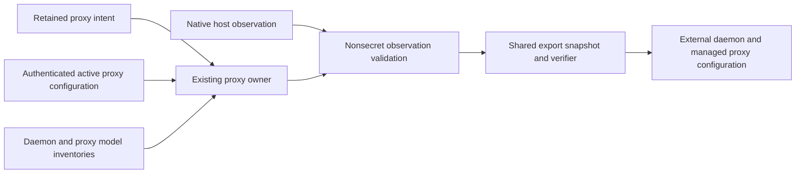

<!-- SPDX-FileCopyrightText: Copyright (c) 2026 NVIDIA CORPORATION & AFFILIATES. All rights reserved. -->
<!-- SPDX-License-Identifier: Apache-2.0 -->

# Inference

`src/lib/inference` is for model/provider configuration, inference health checks, local runtime support, and model catalog helpers.

Suggested homes:

```text
config.ts                 inference config parsing and normalization
health.ts                 inference endpoint health checks
local.ts                  local inference orchestration helpers
provider-models.ts        provider model catalog support
nvidia-featured-models.ts NVIDIA featured catalog parsing and fallback
model-prompts.ts          prompt/model display helpers
nim.ts                    NIM catalog and lifecycle support
ollama/model-size.ts      Ollama model size parsing
ollama/proxy.ts           Ollama auth proxy support
ollama/windows.ts         Windows Ollama support
vllm.ts                   vLLM support
web-search.ts             web-search capability helpers
onboard-probes.ts         onboarding-time inference validation probes
```

Longer term, pure inference decisions should move under `src/lib/domain/inference/**`, and HTTP/process boundaries should move under `src/lib/adapters/**`.

## Ollama configuration export

The native Linux Docker export slice composes the current proxy owner and nonsecret observer in
`adapters/config/live-export-source.ts`. Each snapshot asks `ollama/proxy.ts` for a fresh probe of
the retained descriptor, port, PID, and three fixed endpoint reads. `ollama/proxy-observation.ts`
observes the host platform and validates retained intent before requesting an authenticated read.
Only then does the proxy owner read its token, capturing it for that snapshot's proxy requests.
The token stays inside this owner and enters curl through stdin. Fixed loopback reads bypass ambient
HTTP proxies and have bounded responses. These reads must not acquire a lifecycle lock, migrate
state, restart a process, or call the token getters that can adopt legacy state.



The proxy's authenticated `GET /_nemoclaw/proxy-config` reports its current PID, actual listener,
and backend origin. It never forwards this request or returns backend userinfo, paths, queries, or
credentials. `ollama/proxy-observation.ts` compares that response with retained intent and the selected
model digest from both native model inventories. Older running proxies without this response cannot
be exported; upgrading or restarting them remains an operator lifecycle action.

The public `serving.backend: ollama` branch records the daemon as external and the auth proxy as
NemoClaw-managed. It does not claim ownership of the daemon process, software installation, or model
cache. The initial contract covers `qwen3.5:9b` on native Linux Docker with managed OpenClaw and no
direct sandbox GPU. Hosted inference and managed vLLM retain their existing schema variants.
