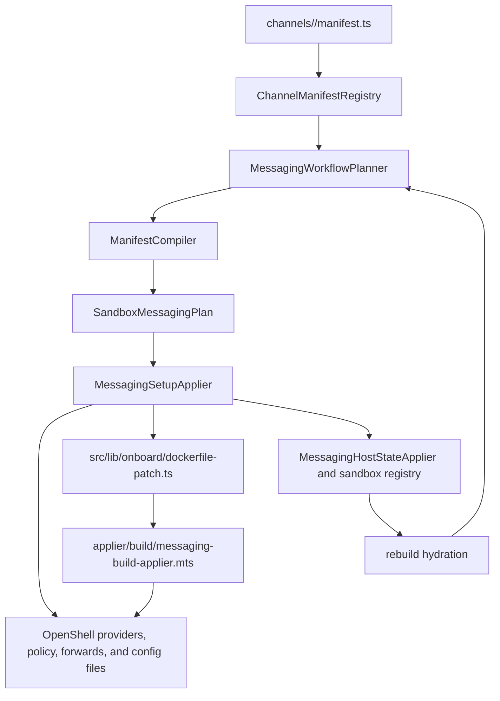
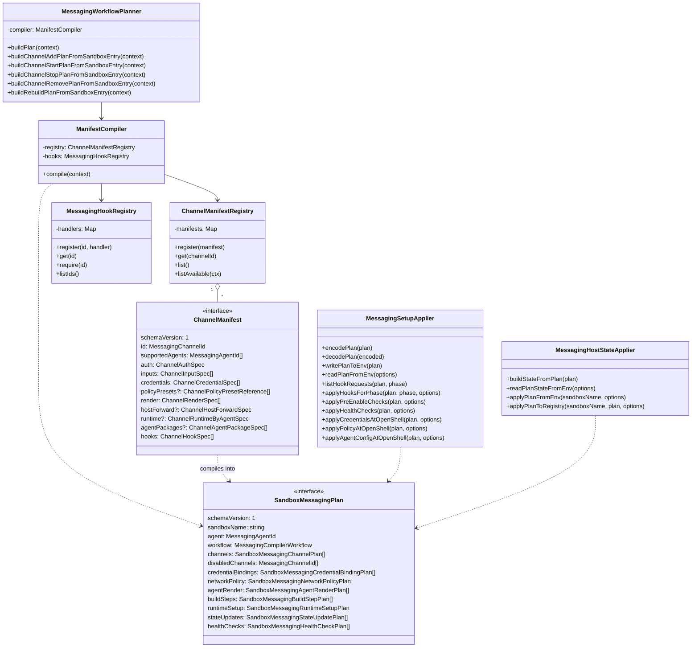
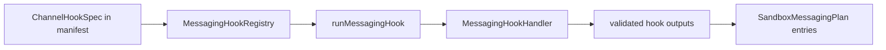

<!-- SPDX-FileCopyrightText: Copyright (c) 2026 NVIDIA CORPORATION & AFFILIATES. All rights reserved. -->
<!-- SPDX-License-Identifier: Apache-2.0 -->

# Messaging Architecture

`src/lib/messaging` owns NemoClaw's manifest-first messaging channel system.
It turns channel declarations into a serializable `SandboxMessagingPlan`, then applies that plan during onboard, channel lifecycle commands, rebuild, image build, runtime setup, diagnostics, status, and conflict checks.

The core rule is that manifests and plans are data.
Channel-specific behavior belongs in manifests, template resolvers, hook handlers, runtime assets, and policy metadata before it belongs in shared onboard or rebuild code.

## Architecture Flow



The workflow has these stages.

1. Built-in manifests live under `channels/<channel>/manifest.ts` and are registered by `channels/built-ins.ts`.
2. `MessagingWorkflowPlanner` chooses the workflow shape for onboard, add, remove, start, stop, or rebuild.
3. `ManifestCompiler` filters supported channels, resolves inputs, runs compiler-time hooks, and compiles a `SandboxMessagingPlan`.
4. `MessagingSetupApplier` serializes the plan through `NEMOCLAW_MESSAGING_PLAN_B64` and applies provider, policy, agent config, and hook phases on the host side.
5. `src/lib/onboard/dockerfile-patch.ts` passes the encoded plan into image builds.
6. `applier/build/messaging-build-applier.mts` applies build-time package installs, render entries, post-agent-install files, and the reduced runtime plan artifact.
7. `MessagingHostStateApplier` persists compact plan state under the sandbox registry entry.
8. Rebuild hydrates persisted plans from current manifests so compacted render, host-forward, package, runtime, and hook fields stay current.
   Non-empty persisted `networkPolicy` entries are preserved and regenerated only when they are absent or empty.

## Class Diagram



## Package Map

| Path | Role |
|---|---|
| `manifest/` | Serializable manifest and plan contracts plus `ChannelManifestRegistry`. |
| `channels/` | Built-in channel manifests, channel metadata, template resolvers, runtime preload assets, and channel hook implementations. |
| `compiler/` | Manifest-to-plan compilation for inputs, credentials, policy, render, host forwards, build steps, runtime setup, state, and health checks. |
| `hooks/` | Hook contracts, registries, runner validation, common handlers, and conflict errors. |
| `applier/` | Host/OpenShell side effects for credentials, policy, config writes, hook phase execution, plan env serialization, filtering, conflicts, registry persistence, and build-time application. |
| `persistence.ts` | Compact persisted plan shape plus hydration from current manifests. |
| `plan-validation.ts` | Defensive parsing for persisted or env-provided plans. |
| `diagnostics.ts` | Manifest-derived channel diagnostics used by status and doctor paths. |
| `host-forward.ts` | Active host-forward extraction from a hydrated plan. |
| `utils.ts` | Agent and channel availability helpers. |

## Plan Contents

`SandboxMessagingPlan` is the boundary between planning and side effects.
It must be JSON-serializable because it is written to env, persisted in registry state, and consumed by sandbox build scripts.

Important plan sections are:

| Plan field | Source | Consumer |
|---|---|---|
| `channels` | Manifest metadata plus resolved inputs, disabled state, hooks, and optional host-forward data. | Lifecycle commands, hook request builders, status, diagnostics, host-forward setup. |
| `credentialBindings` | `manifest.credentials`. | OpenShell provider creation or reuse and agent config placeholder preservation. |
| `networkPolicy` | `manifest.policyPresets`. | Policy application during onboard and channel lifecycle changes. |
| `agentRender` | `manifest.render` after template and credential placeholder resolution. | Host config applier and build-time config applier. |
| `buildSteps` | `manifest.agentPackages` and hook outputs of kind `build-arg`, `build-file`, or `package-install`. | Image build and post-agent-install application. |
| `runtimeSetup` | `manifest.runtime`. | Runtime preload, env alias, secret scan, and reduced runtime artifact generation. |
| `stateUpdates` | Config inputs with `statePath`. | Registry persistence and rebuild hydration. |
| `healthChecks` | Health-check hook declarations. | Lifecycle success gates. |

Disabled channels must not produce side effects.
Use `enabledPlanChannels()` and `filterEnabledPlanEntries()` before applying providers, policy, render entries, runtime setup, hooks, host forwards, or conflict checks.

## Hooks Architecture

Hooks let manifests name behavior without importing behavior.
A manifest declares a hook with a stable `handler` string, and `MessagingHookRegistry` maps that string to a `MessagingHookHandler`.



Hook declarations use this shape.

```ts
{
  id: "teams-host-forward-port-conflict",
  phase: "pre-enable",
  handler: "teams.hostForwardPortConflict",
  inputs: ["webhookPort"],
  onFailure: "abort",
}
```

The runner enforces three invariants.

- The handler ID must exist in the registry.
- Required outputs declared by the manifest must be present.
- Every output must use the declared output kind and be JSON-serializable.

### Hook Registration

Register built-in handlers in the channel's `hooks/index.ts`, then add the channel registration factory to `hooks/builtins.ts`.

```ts
export function createTeamsHookRegistrations(
  options: TeamsHookOptions = {},
): readonly MessagingHookRegistration[] {
  return [
    createTeamsHostForwardPortConflictHookRegistration(options.hostForwardPortConflict),
    createTeamsHostForwardPortStatusHookRegistration(options.hostForwardPortStatus),
  ];
}
```

Tests should create a small `MessagingHookRegistry` with injected handlers when the behavior does not need the full built-in registry.

### Hook Inputs

The applier and compiler build hook inputs from serializable plan data.

| Input source | Key shape |
|---|---|
| Config inputs | `<inputId>`, such as `webhookPort`. |
| Config state paths | `<statePath>`, such as `teamsConfig.webhookPort`. |
| Credential placeholders | `credential.<credentialId>.placeholder`. |
| Pre-enable context | `currentSandbox`, `currentGatewayName`, and `registryEntries`. |

If a hook declares `inputs`, the runner receives only those keys.
If `inputs` is omitted, the hook receives the available input map for that channel.

### Hook Phases

| Phase | Where it runs | Purpose |
|---|---|---|
| `enroll` | `ManifestCompiler` during onboard and add-channel. | Collect or derive secret and config inputs. |
| `reachability-check` | `ManifestCompiler` after required inputs are available. | Validate external API or gateway reachability before a channel is enabled. |
| `pre-enable` | Host applier before enabling channel effects. | Abort on conflicts such as reused gateway names or host-forward port overlap. |
| `render` | `ManifestCompiler` through `common.staticOutputs`. | Convert static manifest render declarations into `agentRender` plan entries. |
| `agent-install` | Compiler and build applier. | Produce or apply package installs, build args, or build files needed before agent config generation. |
| `apply` | Host config applier before static render writes. | Perform host-side config work that cannot be expressed as static render data. |
| `post-agent-install` | Host config applier or build applier after package install. | Write files or repair config after agent tooling rewrites config. |
| `health-check` | Lifecycle success gate. | Confirm a channel is usable before reporting success. |
| `diagnostic` | Diagnostics command paths. | Return structured diagnostic output. |
| `status` | Status and inventory paths. | Return status output, including cross-sandbox conflict summaries. |

`onFailure: "abort"` is the default behavior because an unexpected hook failure should stop the workflow.
Use `onFailure: "skip-channel"` only for enrollment paths where a channel can be omitted without breaking the rest of the sandbox.

## Manifest Definition

`ChannelManifest` is defined in `manifest/types.ts`.
It is a serializable declaration for one channel and one set of supported agents.

| Field | Meaning |
|---|---|
| `schemaVersion` | Manifest schema version. Use `1`. |
| `id` | Stable channel ID used by CLI, plans, persistence, and tests. |
| `displayName` | Human-readable name for prompts, status, and diagnostics. |
| `description`, `enrollmentHelp`, `enrollmentNotes` | Optional operator-facing guidance. |
| `supportedAgents` | Agents that can consume this channel, such as `openclaw` or `hermes`. |
| `auth` | High-level enrollment mode: `none`, `token-paste`, `host-qr`, or `in-sandbox-qr`. |
| `inputs` | Secret and config inputs, env keys, prompts, validation, and persistence paths. |
| `credentials` | Provider bindings derived from secret inputs. |
| `policyPresets` | Optional network policy presets and policy keys required by the channel. |
| `render` | Agent config fragments or env-file lines to render when the channel is active. |
| `hostForward` | Optional host-side forward for inbound webhooks. |
| `runtime` | Optional runtime visibility, preload, env alias, and secret scan metadata. |
| `agentPackages` | Optional build-time agent package installs. |
| `hooks` | Hook references for enrollment, checks, render, apply, status, and diagnostics. |

Secret inputs cannot declare `statePath` or defaults.
Plans may carry `credentialAvailable`, `credentialHash`, and placeholders, but they must not carry raw tokens.

## Manifest Skeleton

Use `satisfies ChannelManifest` so TypeScript checks the manifest while preserving literal IDs and template strings.

```ts
import type { ChannelManifest } from "../../manifest";

export const exampleManifest = {
  schemaVersion: 1,
  id: "example",
  displayName: "Example",
  supportedAgents: ["openclaw"],
  auth: { mode: "token-paste" },
  inputs: [
    {
      id: "apiToken",
      kind: "secret",
      required: true,
      envKey: "EXAMPLE_API_TOKEN",
      prompt: {
        label: "Example API token",
      },
    },
    {
      id: "allowedUsers",
      kind: "config",
      required: false,
      envKey: "EXAMPLE_ALLOWED_USERS",
      statePath: "allowedIds.example",
    },
  ],
  credentials: [
    {
      id: "exampleApiToken",
      sourceInput: "apiToken",
      providerName: "{sandboxName}-example",
      providerEnvKey: "EXAMPLE_API_TOKEN",
      placeholder: "openshell:resolve:env:EXAMPLE_API_TOKEN",
      primary: true,
    },
  ],
  policyPresets: [{ name: "example", policyKeys: ["example"] }],
  render: [
    {
      id: "example-openclaw-channel",
      kind: "json-fragment",
      agent: "openclaw",
      target: "openclaw.json",
      fragment: {
        path: "channels.example",
        value: {
          enabled: true,
          token: "{{credential.exampleApiToken.placeholder}}",
          allowFrom: "{{allowedIds.example.values}}",
        },
      },
    },
  ],
  hooks: [
    {
      id: "example-token-paste",
      phase: "enroll",
      handler: "common.tokenPaste",
      outputs: [{ id: "apiToken", kind: "secret", required: true }],
      onFailure: "skip-channel",
    },
  ],
} as const satisfies ChannelManifest;
```

## Template Resolution

Render values may contain template references such as `{{credential.exampleApiToken.placeholder}}` or `{{allowedIds.example.values}}`.
The compiler resolves credential placeholders generically from `manifest.credentials`.
Channel-specific derived values belong in `channels/<channel>/template-resolver.ts` and are registered from `channels/template-resolver.ts`.

Template resolvers should return `undefined` when a reference belongs to a different channel.
They should validate derived values near the channel boundary, such as checking that a webhook port is an integer between `1` and `65535`.

## Host Forwarding

Channels with inbound webhooks can declare `hostForward`.
The compiler converts it to `SandboxMessagingHostForwardPlan` only when the channel is active and any `when` template is truthy.

```ts
hostForward: {
  port: "{{teamsConfig.webhookPort}}",
  label: "Microsoft Teams webhook",
}
```

Host-forward plans are consumed by onboard and recovery helpers to start OpenShell forwards.
Conflict checks that need cross-sandbox registry state should be channel-owned `pre-enable` hooks.
For example, the Teams channel uses `teams.hostForwardPortConflict` and `teams.hostForwardPortStatus` to prevent and report duplicate webhook ports.

## Using the Planner

Most callers should use `MessagingWorkflowPlanner`, not `ManifestCompiler` directly.
The planner understands lifecycle workflows and persisted sandbox state.

```ts
import {
  createBuiltInChannelManifestRegistry,
  createBuiltInMessagingHookRegistry,
  createBuiltInRenderTemplateResolver,
  MessagingWorkflowPlanner,
} from "../messaging";

const planner = new MessagingWorkflowPlanner(
  createBuiltInChannelManifestRegistry(),
  createBuiltInMessagingHookRegistry(),
  createBuiltInRenderTemplateResolver(),
);

const plan = await planner.buildPlan({
  sandboxName: "dev-sandbox",
  agent: "openclaw",
  workflow: "onboard",
  isInteractive: true,
  configuredChannels: ["slack", "teams"],
  credentialAvailability: {
    SLACK_BOT_TOKEN: true,
    MSTEAMS_APP_PASSWORD: true,
  },
});
```

Use the lifecycle helpers when an existing sandbox entry is available.

```ts
await planner.buildChannelAddPlanFromSandboxEntry({
  sandboxName,
  agent,
  sandboxEntry,
  channelId: "teams",
  isInteractive: true,
});
```

## Applying a Plan

`MessagingSetupApplier` is the host-side facade for plan application.

```ts
MessagingSetupApplier.writePlanToEnv(plan);

MessagingSetupApplier.applyCredentialsAtOpenShell(plan, credentialOptions);
MessagingSetupApplier.applyPolicyAtOpenShell(plan, policyOptions);
await MessagingSetupApplier.applyPreEnableChecks(plan, hookOptions);
await MessagingSetupApplier.applyAgentConfigAtOpenShell(plan, configOptions);
await MessagingSetupApplier.applyHealthChecks(plan, hookOptions);
```

Build-time code should read `NEMOCLAW_MESSAGING_PLAN_B64` through `applier/build/messaging-build-applier.mts`.
Do not duplicate channel-specific rendering in `scripts/generate-openclaw-config.mts` or `agents/hermes/generate-config.ts`.

## Adding a Built-In Channel

Add the channel through the manifest-first path.

1. Create `channels/<channel>/manifest.ts`.
2. Add template derivation in `channels/<channel>/template-resolver.ts` only when static manifest data needs computed values.
3. Add hook handlers under `channels/<channel>/hooks/` only for side effects, enrollment, checks, diagnostics, status, or host-only conflict detection.
4. Register the manifest in `channels/built-ins.ts`.
5. Register template resolution in `channels/template-resolver.ts`.
6. Register hook handlers in `channels/<channel>/hooks/index.ts` and `hooks/builtins.ts`.
7. Add runtime preload assets under `channels/<channel>/runtime/` only when the agent runtime needs boot or connect-time shims.
8. Add `src/lib/messaging/channels/<channel>/policy/<agent>.yaml` when `policyPresets` declares a new policy preset.
9. Add manifest, compiler, applier, lifecycle, build-applier, and policy tests for the behavior you changed.

## Invariants

- Manifests, plans, hook inputs, and hook outputs must stay JSON-serializable.
- Secret values must remain outside manifests and persisted plans.
- Hook handlers are resolved by stable string IDs and should be injected in tests.
- Hook output declarations must exist before code consumes the output.
- Agent render and hook build-file targets must stay inside `/sandbox/.openclaw`, `/sandbox/.hermes`, or `/sandbox/.deepagents`.
- Disabled channels must be filtered before side effects run.
- Rebuild should hydrate compacted or missing derived fields from current manifests instead of trusting stale persisted render, package, host-forward, runtime, or hook data.
- Rebuild preserves non-empty persisted `networkPolicy` entries and regenerates policy only when entries are absent or empty.
