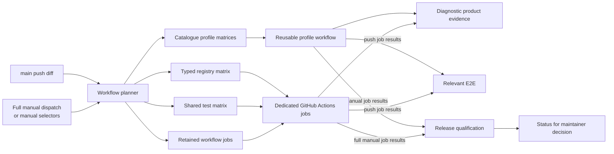

<!-- SPDX-FileCopyrightText: Copyright (c) 2026 NVIDIA CORPORATION & AFFILIATES. All rights reserved. -->
<!-- SPDX-License-Identifier: Apache-2.0 -->

# NemoClaw E2E CI

Direct E2E coverage runs through Vitest.

Interactive TUI targets require `expect`. The unified workflow installs it
before those targets run; local runners must provide it themselves.

- `.github/workflows/e2e.yaml` compares the commits before and after each push to `main`.
  It selects targets and jobs that own changed files, then publishes the `Relevant E2E` check.
  It also supports trusted manual dispatches for the latest PR commit.
  Full manual runs dispatched against `main` publish the `Release qualification` check for the candidate commit SHA.
  Each trusted push to `main` selects the CPU-only `jetson-nvmap-gpu` proof.
  Push runs skip the DGX Spark llama.cpp jobs because their required workflow
  dispatch flag cannot be set by a push event.
- `.github/workflows/hosted-runner-recovery.yaml` evaluates first-attempt
  failures from approved `main` workflows and requests one full rerun only when
  every non-passing job has authenticated GitHub-hosted runner-loss evidence.
- `.github/workflows/e2e-main-retry.yaml` evaluates eligible `E2E main` push
  attempts and uploads attempt evidence. It never authorizes a broad failed-job
  rerun; retry decisions belong to bounded operation-level policies.
- The `staging-brev-launchable` job in `.github/workflows/e2e.yaml` validates
  the baked candidate without installing or copying NemoClaw source.
- The explicit-only `staging-brev-launchable-identity` job verifies a real
  Launchable boot, SSH access, the exact image, and the baked runtime identity.
  It does not run onboarding or inference and does not satisfy release
  qualification.
- `.github/workflows/platform-vitest-main.yaml` publishes `CI / Platform Compatibility` for Ubuntu 26.04, macOS, and WSL.
  On shard 1, its macOS and WSL live E2E run only when the workflow tests `main` and Docker is available.
  This workflow does not publish or satisfy `Release qualification`.
- `.github/workflows/portable-profile-e2e.yaml` publishes experimental portable-profile evidence.
- `.github/workflows/podman-cpu-proof.yaml` publishes PR-only experimental runtime evidence.
- `.github/workflows/sandbox-images-and-e2e.yaml` provides reusable sandbox-image build and test evidence.
  `.github/workflows/e2e.yaml` selects free-standing jobs, including `whatsapp-qr-compact` and `ollama-auth-proxy`.

## CI execution shape

### Candidate CLI Artifact

The candidate CLI comes from the source commit that an E2E run tests.
The `generate-matrix` job builds it once.
The job publishes root `dist/` and `nemoclaw/dist/shared/` in one content-addressed artifact.
The boundary validator derives artifact consumers from jobs that use the pinned preparation action.
It excludes `generate-matrix` and the no-build and trusted-build jobs in `E2E_JOB_POLICY`.
Each selected consumer restores the artifact instead of running `npm run build:cli`.
Each consumer runs the pinned preparation action with `build-cli: "false"` to install Node.js and project dependencies.
The `managed-image-protected-runtime` qualification does not use this artifact.
It builds the CLI from the trusted workflow checkout and never executes or restores the candidate CLI.

#### Artifact Identity

For a pull request (PR) run, `checkout_sha` identifies the candidate source commit.
The trusted workflow runs from `github.workflow_sha`.
A push or manual run uses `github.sha` when `checkout_sha` is empty.

The artifact manifest records these values:

- The candidate repository and commit SHA.
- The trusted workflow SHA, run ID, and attempt.
- The source tree and lockfile digests.
- The Node.js and npm versions, runner platform, and build command.
- The payload digest.

The artifact name contains the candidate commit SHA and payload SHA-256 digest.
The `generate-matrix` job emits one `nemoclaw-e2e-cli-provenance-v1` JSON object through its `cli_artifact_provenance` output.
Each artifact-using job passes that object as the restore action's only `provenance-json` input.

Each artifact-using job invokes the repository-owned `restore-e2e-cli-artifact` composite action at a full commit SHA.
The workflow does not load the action implementation from the candidate checkout.
Before download, the action rejects extra or missing provenance fields.
The action requires the candidate checkout SHA, repository, workflow SHA, and run ID to match the provenance object.
The producer attempt must not be newer than the consumer attempt.
The action downloads the artifact by immutable ID and sets digest mismatch handling to `error`.

Before the action restores root `dist/` and `nemoclaw/dist/shared/` into the workspace, it verifies these conditions:

- The upload digest is present and well formed.
- The candidate SHA matches the expected commit.
- The manifest matches the source, workflow run, toolchain contract, and payload.
- The archive contains no path traversal, links, special files, or files outside root `dist/` and `nemoclaw/dist/shared/`.
- Neither root `dist/` nor `nemoclaw/dist/` already exists, including as a dangling symbolic link.
- The candidate checkout's `nemoclaw/` path is a directory and is not a symbolic link.
- The CLI entry point and required shared modules are nonempty regular files.
- The staged `dist/build-identity.json` names the candidate commit SHA.

If a pre-restore check fails, the action stops before it adds either directory to the workspace.
After the checks pass, the action restores root `dist/` and `nemoclaw/dist/shared/`, then runs `bin/nemoclaw.js --version`.
If the version command fails, the action stops before the live test runs.
This boundary keeps candidate source separate from the trusted workflow implementation.

For a same-repository PR that changes a managed-image workflow path, the trusted planner also
requires one successful `Images / Build, Test, and Publish Managed Images` run for the candidate commit. Before candidate
checkout, the planner downloads the three nonexpired contract artifacts by immutable artifact ID.
It verifies each artifact digest, producer run, attempt, and candidate commit. The planner rejects a
missing, incomplete, or mixed all-agent publication before E2E jobs start.

The planner adds the exact all-agent catalog to `dist/` after the candidate CLI build completes.
Each live E2E consumer verifies that the catalog source revision matches `checkout_sha`. A PR that
does not change a managed-image workflow path keeps the released catalog behavior. The GitHub token
is available only to the trusted planner job and is not included in the candidate CLI artifact.

The same-repository `Images / Build, Test, and Publish Managed Images` PR workflow also runs the OpenClaw managed-image MCP
discovery and lifecycle scope in two independent matrix jobs. Each job assembles one exact candidate
catalog from the workflow's published contracts, uses a fresh runner and sandbox, records the
authenticated discovery diagnostics, scans the evidence for fixture credentials, and must pass.
These are two required acceptance executions, not retries; either failure remains a failed check.
The managed-image scope does not claim trusted-private DNS-rebinding coverage: host and sandbox
`/etc/hosts` fixtures do not control the OpenShell supervisor's egress resolver. Full MCP bridge E2E
coverage retains that assertion for environments with supervisor-authoritative DNS.

#### Timing Baseline

The pre-change baseline uses GitHub Actions `Build CLI` step timings from these workflow runs:

| Workflow run | Job | Tested candidate | `Build CLI` duration |
| --- | --- | --- | --- |
| [30574154335](https://github.com/NVIDIA/NemoClaw/actions/runs/30574154335) | `cloud-inference` | `385f598` | 18.740 seconds |
| [30574154335](https://github.com/NVIDIA/NemoClaw/actions/runs/30574154335) | `cloud-onboard` | `385f598` | 18.793 seconds |
| [30503498077](https://github.com/NVIDIA/NemoClaw/actions/runs/30503498077) | `Shared E2E (vllm-docker-storage)` | `d52d459` | 18.756 seconds |

The three observed build steps have a median duration of 18.756 seconds.
This baseline measures only the replaced build step.
Artifact upload, download, validation, and the dependency on `generate-matrix` add runtime and can affect the workflow critical path.
Do not use the build-step median to claim savings in runner time or workflow elapsed time.

A manual PR E2E run tests candidate code but executes `.github/workflows/e2e.yaml` from `main`.
The PR run cannot measure this workflow change before merge.
After merge, use a passing `main` run and complete these steps:

1. Match the job selection, runner labels, and first attempt to the baseline.
2. Record durations for the candidate build, artifact upload, artifact download, combined verification and restore step, job, and workflow.
3. Sum affected step durations for runner-time comparison.
4. Compare matched job and workflow elapsed times.
5. Identify each result by workflow run, tested commit SHA, trusted workflow SHA, and attempt.

Do not substitute a theoretical value for post-change CI evidence.

#### Historical Fixtures

The historical fixtures retain these version boundaries:

| Fixture | Required boundary |
| --- | --- |
| `openshell-gateway-upgrade` | Retain the historical installer commit and SHA-256 digest, sandbox image digest, and reviewed OpenClaw npm URL and SHA-512 integrity. Install the historical package before testing the candidate upgrade path. |
| `rebuild-openclaw` | Retain the reviewed old-base build in the target. Build and create the old sandbox before testing the candidate rebuild path. |

These targets may restore the shared artifact for the candidate CLI.
They must not replace a historical installer, package, image, or version boundary with that artifact.
The gateway fixture already binds its remote historical inputs to immutable commits and cryptographic digests.
The workflow does not republish those inputs as artifacts.

### Hermes Sandbox Image Artifact

The sandbox image workflow builds the Hermes production image in the dedicated
30-minute `build-hermes-sandbox-image` job. It uses full-SHA-pinned Buildx
actions and a GitHub Actions cache scoped to the runner OS and architecture.
The producer adds a bounded 32 GiB swap file and validates the guarded
production build arguments before the build. It loads the image locally with
registry writes disabled. After the build, it scans the completed image for
node-tar and verifies the sandbox-readable installed files. It then uploads the
compressed image as the one-day `hermes-isolation-image` artifact.

The 90-minute `test-hermes-sandbox-image` job and the
`state-dir-guard-metadata` job download and load that artifact instead of
rebuilding the image. Within the Hermes test job, the secret-boundary and
root-entrypoint steps have 45- and 30-minute budgets respectively.

The former top-level `test/e2e/test-*.sh` suite has been removed. Keep real
shell, installer, process, Docker, OpenShell, `/proc`, and sandbox boundaries in
E2E tests when those boundaries are the behavior under test.

## Platform Evidence

`.github/workflows/platform-vitest-main.yaml` publishes the `CI / Platform Compatibility` workflow.
It runs the Ubuntu 26.04 compatibility contracts and the full Vitest suite in four shards on macOS and WSL.
The matrix disables `fail-fast`.
The first macOS shard has a 60-minute budget for live E2E; the other shards have 30 minutes.
The first WSL shard has a 180-minute budget for root-required contracts and live E2E; the other shards have 90 minutes.

On shard 1, the workflow runs focused macOS and WSL live E2E only when the run tests `main` and Docker is available.
Otherwise, the workflow records the skip and retains the platform contract evidence.
Therefore, the workflow is platform evidence, not `Release qualification`.
Only a full manual `.github/workflows/e2e.yaml` run can publish the release check.

The live steps give candidate test code the job-scoped `GITHUB_TOKEN` and repository `NVIDIA_INFERENCE_API_KEY`.
The macOS step sets both in its process environment.
The WSL step uses the trusted PowerShell helper to forward both into the WSL test process.
The workflow sets these credentials only for the live steps, but candidate code can copy either value while a step runs.
GitHub invalidates `GITHUB_TOKEN` after the job.
`NVIDIA_INFERENCE_API_KEY` remains valid until it expires or is revoked; the workflow does not revoke it.

## Retired Brev source-install coverage

Issue #7490 retired the generic Brev source-install lane. The unified workflow
and exact-staging Launchable job own its product coverage:

| Legacy suite | Disposition | Current owner |
|---|---|---|
| `full` | Launchable E2E | `staging-brev-launchable` runs `full-e2e` in preinstalled mode against the exact baked candidate. |
| `credential-sanitization` | Unified E2E | `credential-sanitization` |
| `telegram-injection` | Unified E2E | `telegram-injection` |
| `messaging-providers` | Unified E2E | `messaging-providers` |
| `messaging-compatible-endpoint` | Unified E2E | `messaging-compatible-endpoint` |
| `dashboard-remote-bind` | Unified E2E | `dashboard-remote-bind` owns install, onboard, artifacts, and terminal cleanup. |
| `gpu` | Unified E2E | `gpu-e2e` runs on the dedicated GPU runner. |
| `all` | Retired | The selector only duplicated `credential-sanitization` and `telegram-injection`. |

The retired nightly caller no longer runs. The explicit
`E2E / Issue 9880 Staging Reproduction` workflow is a temporary issue-specific
exception: its host-side Vitest controller reads the accepted staging image handoff,
creates a temporary workspace on the configured Launchable, runs five bounded fresh
OpenClaw CLI sessions against the baked image, deletes the workspace, and uploads
redacted evidence, and confirms that the workflow-owned workspace is absent. It
constructs the Brev controller only in the issue target and binds credential-bearing
execution and deletion to the workspace ID recorded during creation. The live test,
cleanup, workflow step, and workflow job timeouts each contain their nested operation
budgets. Each Brev subprocess receives only the temporary workflow `HOME` and its
command-specific environment. The workflow removes that `HOME` after the scenario.
Cleanup gives the unique create request a two-minute visibility window. It records the
first exact-name workspace ID, verifies that ID again, and deletes only that ID.
It does not restore source copying, source installation, the legacy suite selector,
or scheduled Brev coverage.
Each push to `main` selects E2E work from the changed files.
Manual GPU validation must use `gpu-e2e`.
It must not provision a generic Brev VM.

## Credential-free tests

Credential-free tests that can use the standard Ubuntu runner, CLI build, and
artifact policy opt into the shared E2E job with a tag beside the test:

```typescript
// @module-tag e2e/credential-free
```

Discovery reads tagged files from the `e2e-live` and `integration` Vitest
projects. It derives each test ID from the filename and supplies only the ID,
repository-relative file, and Vitest project to the test matrix. Keep the
filename stem unique and lowercase kebab-case. Do not add the test to a separate
catalog or manually maintained workflow matrix.

The E2E workflow owns the shared job's runner, timeout, setup, permissions,
secrets, and artifact handling. Keep a dedicated workflow job when a test needs
different capabilities, such as credentials, a custom runner, additional setup,
or a different timeout.

Both `jobs` and `targets` selectors continue to accept the test ID. Run the
discovery command locally to inspect the generated test matrix:

```bash
npx tsx tools/e2e/credential-free-tests.mts
```

## Catalogue Targets

`tools/e2e/target-catalogue.mts` declares live E2E targets that share one execution shape.
Each entry owns these target properties:

- Stable catalogue ID, target ID, shard, and Vitest file.
- Outcome-first display name for GitHub Actions.
- Source paths that select the target after a push to `main`.
- Execution profile, runner or key into the trusted runner-routing map, and timeout.
- OpenShell install mode, non-interactive installer selection, and CLI artifact use.
- Reviewed host packages, host preparation, and optional cloudflared prerequisite.
- Runner telemetry and one reviewed artifact layout.
- PR Review Advisor selection. Standard-profile targets are selectable by default; a credentialed target must set `prAdvisorSelectable` before the Advisor may recommend its logical target ID.
- Optional Vitest title selector.
- Target-specific environment variables.
- Full-run qualification membership.

Host preparation is the reviewed E2E runner preparation mode.
`none` makes no runner-level change.
`hermes-swap` provisions swap for Hermes execution, and `rebuild-swap` provisions swap for the Hermes image rebuild.
Targets that require cloudflared set `cloudflared: true` in the catalogue.
The reusable workflow installs the pinned amd64 Debian package after validating its SHA-256 digest and package metadata.
The installation step does not receive a catalogue profile credential.

The test file is always one owning path.
List each additional source file or directory whose change requires the target.
Changes to shared catalogue execution paths select every catalogue target.

Most entries use one ID for catalogue selection, evidence, and artifacts.
Matrix-style targets use one target ID for evidence and artifacts, with separate catalogue IDs and shards for each concrete execution.
Give each entry one `displayName` in the form `<area>: <observable outcome>`.
Do not include this implementation metadata or workflow text in the display name:

- The target ID or an issue number.
- `Catalogue`, `live`, or `E2E`.
- A test path.
- A runner or sandbox ID.

`E2E_TARGET_CATALOGUE` is one logical target set.
The planner partitions that set into GitHub Actions matrices, one for each execution profile.
The execution profile owns the credentials available to its target step:

- `standard` displays `no provider credential` and receives no NVIDIA API credential.
- `nvidia-api` displays `NVIDIA API key` and receives `NVIDIA_API_KEY` on trusted `main` runs and authenticated NVIDIA-owned PR runs.
- `nvidia-inference` displays `NVIDIA inference API key` and receives `NVIDIA_INFERENCE_API_KEY` on trusted `main` runs and authenticated NVIDIA-owned PR runs.
- `github-read` displays `GitHub read token` and receives the job-scoped `GITHUB_TOKEN` only for the target step when `trusted_main` is `true`.
  The reusable workflow enforces this boundary; an authenticated NVIDIA-owned PR caller sets `trusted_main` to `true`, while an external PR caller sets it to `false` and receives no `GITHUB_TOKEN`.
- `brave-nvidia-inference` displays `Brave and NVIDIA inference API keys` and receives `BRAVE_API_KEY` and `NVIDIA_INFERENCE_API_KEY` on trusted `main` runs and authenticated NVIDIA-owned PR runs.

`common-egress-agent` runs 4 isolated scenario shards.
The Personal stock-price shard exercises ordinary onboarding with an explicit Personal selection; it does not exercise Portable profile selection.
It uses OpenClaw as one representative agent witness, runs with `nvidia-inference`, sets web search to `none`, and receives no Brave Search or Tavily Search API key.
The Personal stock assertion disables the ordinary agent-attempt shell artifact because OpenClaw stdout can contain the complete source URL.
Raw OpenClaw session and trajectory JSONL stay inside the sandbox; uploaded evidence contains only the price and source date, the source hostname and protocol, and bounded reduced evidence such as tool names, public target hosts, provider labels, final statuses, and quote-match booleans.
The live assertions require `web_fetch`, reject `web_search` and search-provider use, permit public access from curl and Python, and deny loopback and link-local targets.

GitHub Actions renders each catalogue execution as `<display name> / <credential boundary>`.
All catalogue profiles call `.github/workflows/e2e-standard-profile.yaml`.
Each target selects its runner through the catalogue.
The reusable workflow validates the catalogue plan before candidate checkout.
It derives the artifact path and upload name from the target ID, shard, and reviewed layout.
It then owns checkout, Docker authentication, reviewed host preparation, setup, CLI artifact restoration, OpenShell installation, runner telemetry, Vitest execution, evidence manifest creation, artifact upload, and Docker credential cleanup.
Catalogue entries may request only the reviewed `expect` and `iptables` host packages.
The reusable workflow installs those packages through the pinned host-dependency action before workspace preparation.
An optional `selector` limits execution to matching tests in the target's declared Vitest file.
A host package or selector alone does not require a dedicated workflow job.
When a target selects non-interactive installation, the reusable workflow sets `NEMOCLAW_NON_INTERACTIVE=1` for its OpenShell install step.
The reusable workflow sets `NEMOCLAW_E2E_EXPECTED_SHA` to the candidate commit for every target.
TUI exact-ref checks use this shared value instead of a target-specific checkout variable.
On an exact-revision manual PR run, `NEMOCLAW_E2E_RISK_SIGNAL_EXPECTED_SHA` carries that commit to the risk-signal reporter; it remains empty on main push runs.
The standard layout writes product evidence and `evidence-manifest.json` under `e2e-artifacts/live/<target-id>`.
When `shard` is not `default`, the standard layout adds the shard directory.
The security-posture matrix uses the reviewed flat-shard layout to preserve its existing artifact names.
The `gpu-double-onboard`, `gpu-e2e`, and `llama-cpp-generic-gpu` targets keep the standard layout and select `linux-amd64-gpu-rtxpro6000-latest-1` through the catalogue.
Retained workflow jobs are exceptions to the catalogue shape.
Keep one only for a multi-job handoff, an unrepresented credential boundary, or an execution contract the reusable profile cannot represent.

### Catalogue Execution Evidence

Every catalogue execution writes `evidence-manifest.json` in its target artifact directory.
The manifest uses kind `nemoclaw-e2e-evidence-v1`.
It records `targetId`, the candidate repository and commit, the trusted workflow repository and commit, the GitHub Actions run ID and attempt, the job status, the artifact directory, and `productEvidenceFileCount`.
A successful target must write at least one product evidence file before the workflow writes a successful manifest.
If the target reports success without product evidence, manifest creation fails instead of certifying an empty run.
A catalogue Vitest selection that runs no tests exits nonzero before manifest creation, including when every selected test skips.
Failed targets still write a manifest for diagnosis, and the existing artifact upload publishes the manifest with the target artifacts.
The manifest is secret-free diagnostic evidence.
It does not replace the workflow job result or the strict `Release qualification` aggregate.

Run the planner locally to render the complete default selection as a Markdown table:

```bash
npx tsx tools/e2e/workflow-plan.mts --summary
```

Add the existing `--jobs` or `--targets` selector to render a filtered plan:

```bash
npx tsx tools/e2e/workflow-plan.mts --summary --jobs hermes-e2e
npx tsx tools/e2e/workflow-plan.mts --summary --targets ubuntu-repo-cloud-openclaw
```

The command renders a Markdown summary to standard output.
To publish that output in a GitHub Actions job, append it to `$GITHUB_STEP_SUMMARY`:

```bash
npx tsx tools/e2e/workflow-plan.mts --summary >> "$GITHUB_STEP_SUMMARY"
```

The workflow's `--ci-output` mode uses the same renderer for its job summary.
The table includes the typed registry matrix, shared test matrix, catalogue profile matrices, retained workflow jobs, and staging Brev execution.

Each execution row declares three coverage fields:

- `agentRuntime` names the agent runtime that the execution asserts. Use `none` when the execution does not start an agent. Use `unresolved` only with an `unresolvedReason`.
- `observableOutcome` names the behavior that produces the evidence. Catalogue targets use their outcome-oriented `displayName` as this value.
- `environmentOrInferenceEndpoint` names the host boundary or inference endpoint that distinguishes the evidence.

Typed registry tests derive each human-readable execution title as
`<observableOutcome> [<agentRuntime>; <environmentOrInferenceEndpoint>]`.
Typed registry tests prefix that title with the stable target ID. Workflows use
the ID prefix for selection, while the semantic tuple makes the test purpose and
evidence boundary visible in Vitest and GitHub Actions.

Keep coverage metadata with the execution owner:

- Catalogue targets declare it in `tools/e2e/target-catalogue.mts`.
- Executable typed targets declare it in `test/e2e/registry/definitions/baseline.ts`.
- Shared credential-free tests declare it in `tools/e2e/credential-free-tests.mts`.
- Retained workflow jobs and staging Brev declare it in `.github/workflows/e2e.yaml`.

Single workflow jobs use the `E2E_AGENT_RUNTIME`, `E2E_OBSERVABLE_OUTCOME`,
`E2E_ENVIRONMENT_OR_INFERENCE_ENDPOINT`, and optional `E2E_UNRESOLVED_REASON`
environment entries. Matrix jobs put variant-specific values in the corresponding
snake-case include entries and use `coverage_variant` when one job contributes
multiple rows. `tools/e2e/workflow-plan.mts` composes and validates these sources.
Do not add a separate hand-maintained execution list.

The default coverage matrix excludes explicit-only jobs and inert typed-registry declarations.
The rendered report lists those categories separately and inventories every typed declaration,
including declarations that have no executable matrix cell.
Explicit-only rows keep their coverage dimensions but do not join the default release matrix.
Inert declarations report unresolved coverage fields and the missing executable ownership.

The inert declarations are combinatorial gaps, not supported matrix cells. #8285 owns the decision on the inert cross-runtime foundation. #8286 owns executable-only registry cleanup after that decision. Do not schedule other Cartesian-product cells without an accepted supported combination. This migration removes no execution, so it requires no duplicate-to-retained-evidence mapping. A documented gap does not schedule a new combination or change release judgment.

The report also groups repeated observable outcomes. Those rows are retained only when agent runtime or environment provides distinct evidence. Validation rejects two rows with the same three coverage dimensions.

## Launch-readiness locked-image acceptance

Use the repository helper to test an existing OpenClaw sandbox without
rebuilding its locked image:

```bash
scripts/test-launch-readiness-lease.sh <openclaw-sandbox>
```

Run this helper on Linux after the sandbox's final durable home and state
volume is mounted and after final policy and network provisioning is complete.
The launch-readiness lease path that it validates is currently Linux-only.
The helper must run as the same numeric user that later runs `launch`, and that user must own the sandbox's NemoClaw state.
The host must provide that user a secure, independently writable OS runtime authority under `/run/user/<numeric-uid>`; do not redirect it with environment variables.
The host must provide the util-linux `script` command and GNU `timeout` command.

The helper rebuilds the candidate CLI, runs `connect --probe-only`, and then
runs two `launch` sessions during the same fixed lease.
Each real pseudo-terminal session sends two distinct messages and `/exit`, then
requires process exit status `0`. The OpenClaw session store must append two
nonempty `user` and `assistant` record pairs in one session. The helper does not
compare message content. Terminal output is a bounded failure diagnostic only.
Deterministic unit tests separately prove selection of the complete preflight
and lease paths, stale-producer exclusion, the fixed time-unsafe quarantine,
refusal to recover when prior evidence cannot be durably fenced, and the named
performance stages.

## Inactive Windows MXC OpenClaw qualification

`windows-mxc-openclaw-process-container.test.ts` is an explicit local
qualification target for epic #8178. It exercises an operator-supplied native
Windows OpenShell package and a staged OpenClaw artifact through the OpenShell
`process_container` driver. It does not register MXC, call `wxc-exec.exe`
directly, or establish Windows support.
The generated driver configuration records the exact prototype configuration
qualified by this target: normal AppContainer mode,
`privateNetworkClientServer`, the host egress proxy, and an exact
operator-supplied supervisor relay. This configuration broadens the candidate
sandbox relative to the earlier less-privileged probe and is not a production
default.

The target requires a Windows x64 host that passes the minimum MXC candidate
check. It rejects a dirty NemoClaw checkout and requires exact expected
identities for that checkout, the OpenShell CLI, gateway, supervisor relay,
OpenShell-supplied `wxc-exec.exe`, complete OpenClaw artifact tree, Node.js, and
OpenClaw entrypoint. The target also requires an existing work root and records
the operator's exact host-preparation declaration. It observes whether the test
process is elevated but does not change host ACLs or elevation. Compute the
canonical artifact-tree digest after staging:

The share and host-state directories are fresh siblings directly beneath the
declared drive root. This matches the current package's shallow-share
requirement and keeps host-only configuration outside the sandbox share.

```powershell
npx tsx tools/e2e/windows-mxc-openclaw-artifact-tree.mts $env:NEMOCLAW_WINDOWS_MXC_OPENCLAW_ROOT
```

Set the following environment variables to paths or exact lowercase identity
values. Do not put credentials in them.

| Variable | Meaning |
| --- | --- |
| `E2E_ARTIFACT_DIR` | Existing directory outside the NemoClaw checkout for secret-free qualification receipts |
| `NEMOCLAW_E2E_EXPECTED_SHA` | Exact 40-character NemoClaw checkout revision |
| `NEMOCLAW_WINDOWS_MXC_OPENSHELL_CLI` | Extracted `openshell.exe` path |
| `NEMOCLAW_WINDOWS_MXC_OPENSHELL_GATEWAY` | Extracted `openshell-gateway.exe` path |
| `NEMOCLAW_WINDOWS_MXC_OPENSHELL_RELAY` | Extracted `openshell-supervisor-relay.exe` path from the same package |
| `NEMOCLAW_WINDOWS_MXC_WXC_EXEC` | `wxc-exec.exe` supplied for that OpenShell package |
| `NEMOCLAW_WINDOWS_MXC_OPENSHELL_VERSION` | Exact OpenShell package version |
| `NEMOCLAW_WINDOWS_MXC_OPENSHELL_REVISION` | Exact 40-character OpenShell source revision |
| `NEMOCLAW_WINDOWS_MXC_OPENSHELL_CLI_SHA256` | Expected OpenShell CLI SHA-256 |
| `NEMOCLAW_WINDOWS_MXC_OPENSHELL_GATEWAY_SHA256` | Expected OpenShell gateway SHA-256 |
| `NEMOCLAW_WINDOWS_MXC_OPENSHELL_RELAY_SHA256` | Expected OpenShell supervisor relay SHA-256 |
| `NEMOCLAW_WINDOWS_MXC_WXC_EXEC_SHA256` | Expected `wxc-exec.exe` SHA-256 |
| `NEMOCLAW_WINDOWS_MXC_HOST_PREPARATION` | Exact declaration `wxc-host-prep-prepare-system-drive`; the target records but does not perform or verify this persistent host mutation |
| `NEMOCLAW_WINDOWS_MXC_WORK_ROOT` | Existing Windows drive root for fresh, test-owned sibling share and host-state directories |
| `NEMOCLAW_WINDOWS_MXC_OPENCLAW_ROOT` | Staged native OpenClaw artifact root |
| `NEMOCLAW_WINDOWS_MXC_NODE` | Node.js executable beneath the artifact root |
| `NEMOCLAW_WINDOWS_MXC_OPENCLAW_ENTRY` | OpenClaw entrypoint beneath the artifact root |
| `NEMOCLAW_WINDOWS_MXC_OPENCLAW_VERSION` | Expected OpenClaw version |
| `NEMOCLAW_WINDOWS_MXC_OPENCLAW_ARTIFACT_TREE_SHA256` | Expected canonical artifact-tree SHA-256 |
| `NEMOCLAW_WINDOWS_MXC_NODE_SHA256` | Expected Node.js SHA-256 |
| `NEMOCLAW_WINDOWS_MXC_OPENCLAW_ENTRY_SHA256` | Expected OpenClaw entrypoint SHA-256 |

The target creates a random OpenClaw gateway token for readiness, forwarding,
and chat checks. It
passes that token through the MXC agent environment; current OpenShell
`process_container` packaging can therefore expose its encoded configuration,
including the token, to privileged host process inspection while `wxc-exec.exe`
starts the sandbox. The token is never written to the receipt or supplied in
the OpenClaw command arguments, is not reused, and is useful only for the
temporary loopback OpenClaw gateway. The host client uses a temporary config
file that is deleted before a passing receipt is written. Cleanup attempts sandbox deletion, stops
the recorded OpenClaw process, clears the in-memory environment value, and
removes the runtime home, state, configuration, and gateway logs. A direct
process-tree termination is an emergency cleanup fallback only. The host-side
OpenShell processes receive an allowlist of Windows runtime variables rather
than the complete caller environment. Before using a termination fallback,
the host binds the process ID to the expected executable, command arguments,
and creation time. For OpenClaw, it also validates the probe-parent ancestry.
The host rejects a mismatched or reused PID. The fallback uses the
`taskkill.exe` beneath the validated Windows system root. If the OpenClaw
process, OpenShell forward, or OpenShell gateway needs that fallback, the qualification
fails. The delete retry and process-termination paths are failure containment,
not compatibility workarounds that permit a passing result; their presence does
not assume a specific upstream defect. Remove them only when failed or partial
OpenShell lifecycle operations can still guarantee teardown without host-side
cleanup.

Run only the explicit target:

```powershell
$env:NEMOCLAW_RUN_LIVE_E2E = "1"
$env:NEMOCLAW_RUN_WINDOWS_MXC_OPENCLAW_E2E = "1"
npx vitest run --project e2e-live test/e2e/live/windows-mxc-openclaw-process-container.test.ts
```

The target verifies OpenClaw startup and in-sandbox health, read-write and denied
filesystem behavior, an authenticated host-loopback forward, and one
credential-free mock-backed agent turn that returns exactly `CHAT_OK`. It keeps
the forward active while deleting the sandbox and requires the listener,
forward process, sandbox registry entry, and recorded OpenClaw process to stop.
The complete create, forward, chat, and cleanup flow runs twice to detect stale
state. After preflight and local setup succeed, it
writes a secret-free receipt for either verdict and records whether sensitive
runtime artifacts were removed. When that cleanup succeeds, a failed run retains
only non-sensitive probe files for diagnosis.
The host-preparation declaration is operator evidence, not an ACL attestation.
Gateway mTLS, governed egress policy enforcement, managed inference,
gateway-restart recovery, standard-user operation, and production activation
remain outside this target.

If a failed receipt has a non-null `cleanup.retainedSandboxName`, OpenShell did
not confirm removal of that exact sandbox. Inspect the registry and delete only
the recorded name:

```powershell
$receipt = Get-Content "C:\path\to\receipt.json" -Raw | ConvertFrom-Json
& $env:NEMOCLAW_WINDOWS_MXC_OPENSHELL_CLI sandbox list -o json
& $env:NEMOCLAW_WINDOWS_MXC_OPENSHELL_CLI sandbox delete $receipt.cleanup.retainedSandboxName
```

The retired `hermes-dashboard` selector remains a compatibility alias for
`hermes-e2e` in both selector inputs. Reports use the canonical
`hermes-e2e` name. That lane always enables dashboard coverage while preserving
the manually selected `mock`, `internal-nvidia`, or `public-nvidia` inference
mode.

## Current OpenClaw plugin EXDEV lifecycle

The `openclaw-plugin-runtime-exdev` job keeps one current-version lifecycle:

1. Onboard the custom weather plugin as v1.
2. Restart the gateway and verify v1.
3. Recreate the sandbox with the plugin changed to v2.
4. Run the cross-device runtime-dependency replacement probe.

The recreation remains the replacement boundary. It verifies the v2 plugin
with runtime inspection, `tools.catalog`, and `tools.invoke`, and it preserves
the workspace marker. The job also keeps the test-only tmpfs mount, unchanged
stock policy-source bytes, and the distinct-device and source-side `EXDEV`
checks. The duplicate v3 rebuild is removed from this job. The
`rebuild-openclaw` job remains the canonical live rebuild coverage.

The current-checkout fixture locally prebuilds its repository-controlled v1
and v2 Dockerfiles with BuildKit, then hands only those local image references
to OpenShell. User-supplied `--from` Dockerfiles retain the gateway-builder
trust boundary and are never host-prebuilt by this fixture.

The runtime target for `openclaw-plugin-runtime-exdev` is 16–17 minutes.
Push-run timing for the reduced lifecycle has not yet been measured.

## OpenShell development artifact retention

The `openshell-dev-artifact` job resolves the public OpenShell `dev` release
once for each selected `mcp-bridge-dev` run. It records the source commit and
the GitHub asset ID, source URL, size, and SHA-256 digest for every required
Linux x64 archive and checksum file. It rejects release drift during download,
then uploads the verified bytes under a content-addressed name with the shared
14-day E2E retention policy.

The OpenClaw, Hermes, and LangChain Deep Agents Code shards restore and verify that same artifact with the trusted workflow revision.
The `actions/setup-node` step selects Node.js 22 and disables automatic package manager caching before candidate checkout.
An exact-argument and asset-allowlisted `gh` shim presents only the retained files to the unchanged trusted `scripts/install-openshell.sh` path.
A separate `curl` shim blocks network fallback.
The installer still checks the release checksums and archive structure before installation.
Each product shard revokes Docker credentials, then installs OpenShell before candidate dependency preparation begins.
Dependency preparation can read candidate project configuration and is the first candidate-controlled execution boundary.
The candidate CLI artifact restore runs after dependency preparation.
This ordering protects the bytes consumed by the trusted installer before candidate-controlled execution starts.
It does not make the installed OpenShell files immutable after dependency preparation starts on the same runner.
Subsequent product steps operate in candidate-controlled state.
A missing, replaced, or corrupt upstream asset fails the resolver as an infrastructure failure.
The job error reports the failed identifier and source URL, and `resolution.json` records them when the artifact directory remains writable.
The three product shards do not start in that case, so the run cannot report a product failure before reaching product assertions.

## Larger-runner routing

The larger-runner experiment is inactive while the configuration variable
`E2E_LARGER_RUNNER_LABEL` is unset. In that state, every eligible lane continues
to use `ubuntu-latest`. The trusted `generate-matrix` job builds one runner map
before checking out test code, and it consumes the variable only when the
workflow repository is `NVIDIA/NemoClaw`, the ref is `refs/heads/main`, and
no alternate checkout SHA is requested. Manual PR E2E dispatches therefore remain on
standard runners even though they use the trusted workflow definition from
`main`.

Manual PR E2E dispatches and direct push or manual `main` runs use a
bounded swap fallback for eligible hosted Hermes image-building lanes. The
fallback does not change runner routing. The trusted workflow provisions the
fallback as the first job step, before checking out or executing the selected
revision. Manual PR E2E requires a maintainer-supplied lowercase 40-character
checkout SHA plus matching trusted workflow and dispatch revisions. Direct-main
mode rejects alternate checkout and workflow revisions and requires the
workflow source to match the run revision. Both modes require an ephemeral
GitHub-hosted Linux x64 runner. Candidate code cannot supply the program or
arguments passed to `sudo`.

The trusted step requires at least 32 GiB (34,359,738,368 bytes) of usable swap.
It reuses active swap that meets this requirement.
Otherwise, it preserves at least 16 GiB of available disk capacity under
`/mnt`, creates a root-owned mode-`0700` directory, and creates an exclusive
randomized mode-`0600` file.
The file allocation is 32 GiB plus 4,096 bytes (34,359,742,464 bytes).
The additional 4,096 bytes keep the usable swap capacity at or above 32 GiB
after formatting.
Setup failure stops before candidate checkout and removes partial state only
after proving the file inactive or successfully disabling it.
After `swapon` succeeds, the trusted step makes up to five activation
observations, one second apart.
If visibility remains stale, cleanup treats the file as active.
Cleanup removes it only after `swapoff` succeeds.
Successful state is discarded with the ephemeral runner.

The fallback covers agent-turn latency, Hermes inference switch and shields,
the Hermes stable MCP shard, the Hermes common-egress and channel
stop/start shards, the dashboard-bearing `hermes-e2e` lane, `hermes-discord`,
and Hermes security-posture tests. Rebuild lanes with workflow-managed swap,
dedicated-runner lanes, `mcp-bridge-dev`, and non-Hermes shards do not use it.
Candidate-authored workflow definitions and fork-owned runs cannot reach it.

The fallback exists because the alternate-checkout trust boundary deliberately
keeps PR-authored code from selecting the administrator-managed larger-runner
label; changing the PR checkout cannot safely grant itself that capacity.
Remove the fallback only after trusted `main` and manual PR E2E runs use
ephemeral GitHub-hosted runners with at least 32 GB RAM without weakening the
source guards, and five consecutive runs of every protected lane complete
without runner loss while runner-pressure telemetry reports less than 1 GiB of
swap used.

The eligible set is limited to the measured or repeatedly interrupted heavy
lanes:

- `common-egress-agent`;
- `hermes-e2e`, including dashboard coverage, and `hermes-discord`;
- the Anthropic-compatible `hermes-inference-switch` mode;
- `hermes-shields-config`;
- the Hermes shards of `security-posture` and `channels-stop-start`;
- `rebuild-hermes`;
- `rebuild-hermes-stale-base`;
- the `hermes` and `deepagents` shards of `mcp-bridge`.

The OpenClaw shards of the matrix jobs, the `openclaw` MCP shard,
`mcp-bridge-dev`, and `openshell-credential-generation-window` remain on
`ubuntu-latest`; unrelated jobs retain their existing runner assignments.
The credential-generation window runs as an independent fresh-runner job in
parallel with the stable MCP agent matrix. Empty-selector dispatches and
explicit `mcp-bridge` selections run both jobs, while the credential-window job
keeps its own exact-release provenance, secret scan, and artifact.
Before setting the variable, an organization owner must:

1. Create a GitHub-hosted Ubuntu x64 larger runner with 8 vCPU, 32 GB RAM, and
   300 GB SSD in a dedicated runner group.
2. Set the group maximum concurrency to 4 and restrict repository access to
   `NVIDIA/NemoClaw` and workflow access to
   `NVIDIA/NemoClaw/.github/workflows/e2e.yaml@refs/heads/main`.
3. Record at least five standard-runner samples for each eligible lane,
   including queue time, execution time, peak CPU, memory and disk use,
   infrastructure failures, and estimated cost.
4. Copy the larger runner's workflow label into the repository variable, then
   repeat the same measurements for at least five representative executions
   per migrated lane.

Clearing `E2E_LARGER_RUNNER_LABEL` is the rollback. It sends the eligible lanes
back to `ubuntu-latest` without changing selectors, test setup, or test
semantics. Do not replace this experiment with a persistent self-hosted runner;
that requires a separate decision.

## Push operations

The consolidated workflow keeps its operational reporting in the same job
graph as the live targets:

- GitHub Actions run history is the authoritative record for push and
  manual E2E results.
- `E2E / Main Retry Evidence` publishes an advisory same-commit reliability table for
  trusted pushes to `main` and explicit manual qualification runs. It keeps
  first-pass success, pass-after-retry, exhausted retries, and pass/fail flips
  distinct,
  and never treats retry records or runner-pressure classifications as proof
  that a manual run reached a terminal result. Manual identity comes from the
  run-bound dispatch receipt; its terminal result additionally requires at
  least one canonical `nemoclaw-e2e-evidence-v1` manifest bound to the same run,
  attempt, candidate SHA, trusted workflow repository, workflow SHA, and job
  status. Outcomes from trusted pushes to `main` instead require the canonical
  retry-controller artifact. Missing or malformed identity/outcome evidence
  leaves a run unclassified. Retry and runner-pressure files contribute only
  allowlisted failure classes: their complete, missing, or malformed state is
  reported separately, so malformed classification data cannot erase an
  otherwise authenticated outcome. Both evidence-state counts appear in the
  grouped JSON and Markdown table. The table never changes a required check,
  release conclusion, or rerun decision.
- The `report-same-commit-reliability` job appends the Markdown table to its
  GitHub Actions job summary and uploads the bounded, allowlisted
  `same-commit-reliability.json` and `same-commit-reliability.md` files as
  `same-commit-reliability-<source-run-id>-<attempt>` with 14-day retention.
  Artifact ZIP entries are structurally validated before an allowlisted file is
  read: ambiguous relative paths, links, encryption, split/ZIP64 archives,
  duplicate names, unsupported compression, inconsistent headers, excess
  entries, oversized contents, and CRC mismatches are rejected.
- Automated issue routing and the workflow's `issues: write` capability are
  retired. Any future issue escalation should use a separately reviewed
  exceptional threshold, such as the same lane failing twice consecutively or
  remaining broken for 24 hours, rather than posting on every failed schedule.
- `scorecard` writes the push/manual result summary and posts it to the
  daily or full-run Slack route. The summary:
  - separates queue time from execution time for the ten jobs with the longest
    combined duration;
  - reports the runner class as `standard`, `larger`, or `unknown` without
    exposing runner labels;
  - adds this run's semantic phase runtime table;
  - compares each of the ten slowest current tests with up to ten prior
    completed push runs; and
  - compares the trusted cloud-onboard timing summary with the latest
    prior-release `e2e.yaml` run.
- The push comparison reads only validated `e2e-runtime-summary.json`
  artifacts retained for 14 days. Manual runs can display the comparison but
  never enter its baseline. The table reports the current outcome, prior median
  and p95, prior pass/fail/skip counts and rates, the failure streak including
  the current run, and the most common failed phase across the compared runs.
  It marks a total or phase regression only when the current duration exceeds
  the prior median by both at least 20% and at least 30 seconds.
- A separate flake watch shows at most five current tests that both passed and
  failed across the current run and up to ten prior completed push runs.
  It ranks them by pass/fail flips and then failure count. It reports
  pass/fail/skip counts, failure rate, pass/fail flips, current failure streak,
  and the most common failed phase. The failure-rate denominator and
  pass/fail-flip count exclude skips.

- Selective dispatches remain silent unless they run on `main` with
  `post_to_slack=true`, which uses the preview Slack route. Branch-dispatched
  runs never receive Slack webhook secrets.

### Weekly unit-test gap review

Treat every automatic `main` E2E failure as a test-gap review input. Generate a
report for the preceding 168 hours with GitHub CLI authentication already
configured:

```bash
evidence_dir="$(mktemp -d)"
chmod 700 "$evidence_dir"
npm run e2e:unit-gaps -- \
  --days 7 \
  --cache-dir "$evidence_dir/cache" \
  --output "$evidence_dir/unit-test-gaps.md" \
  --json-output "$evidence_dir/unit-test-gaps.json"
```

The command reads push runs from `e2e.yaml` and `portable-profile-e2e.yaml` on
`main`. Online collection requires `--cache-dir`. The command creates the cache
directory with mode `0700` and writes normalized job-and-signature JSON files
with mode `0600`. Each cache entry binds sanitized evidence to one GitHub run ID
and attempt. A later seven-day run with the same cache directory reuses matching
entries. Each invocation reads logs for at most 50 uncached failed runs. When
more failed runs remain, the command saves normalized job names and sanitized
signatures for that batch. The command then exits nonzero. Rerun the command
with the same cache directory. Repeat until the command completes; each rerun
reuses prior batches and collects the next one. The command reports cache hits
and planned failed-log reads.

The command extracts signatures in memory and does not retain raw GitHub logs.
It applies the shared full secret redactor and removes volatile identifiers,
paths, URLs, sandbox names, and durations from each selected cause candidate.
Treat the cache and reports as credential-bearing until a human reviews them;
redaction reduces exposure but does not prove that a file is credential-free.

The command stops on GitHub authentication, authorization, and rate-limit
failures. It exits nonzero when a selected run is unfinished or failed-run
evidence is unavailable. Do not accept a partial report as the weekly ledger.
Every GitHub read names `NVIDIA/NemoClaw`, so a fork or different checkout remote
cannot substitute another repository's run data.
The command also stops when a workflow reaches the 1,000-run collection limit.
Narrow the selected range and retry so the report cannot omit older runs silently.

Review one row per cause candidate instead of one row per failed job. Confirm
the selected candidate against the first causal line and identify the owning
component before changing code. Then apply the row's test action:

- For a deterministic product failure, add a unit or package-contract
  regression test that fails for the observed behavior before changing the
  product code.
- For a harness failure, add an `e2e-support` test for the decision, cleanup
  path, or diagnostic.
- For an external failure, test NemoClaw's retry and diagnostic response with
  fault injection. Do not reproduce the provider, registry, network, or runner
  outage in a unit test.
- For a row that needs triage, name the missing contract only after confirming
  the cause from the linked run.

The Markdown and JSON reports start each row with review status `open` and no
regression test. During review, record the test file and complete test title in
the row and change the status only after the test fails without the fix and
passes with it. A cause candidate is complete when that test evidence and a
later passing run of the linked E2E target are both recorded. Delete the
evidence directory after publishing only the reviewed, credential-free
conclusions in the owning issue or pull request. Remove the named directory and
confirm its absence:

```bash
rm -rf -- "$evidence_dir"
test ! -e "$evidence_dir"
```

A manual run with `jobs=staging-brev-launchable` runs only `Exact staging Brev Launchable`.
Push runs do not select this job.

A manual trusted-`main` run with
`jobs=staging-brev-launchable-identity` and an empty `targets` selector runs
only `Exact staging Brev Launchable identity`. It builds the exact candidate
image, deploys the standing Launchable, waits for workspace and SSH readiness,
checks the concrete boot image and baked runtime identity, and confirms two
consecutive absent workspace observations during cleanup. A passing run uploads
`lane.log`, `launchable-identity.json`, and `cleanup.json`. A failed run uploads
the bounded evidence produced before failure only when preparation created the
evidence directory; a preparation failure produces no lane artifact. After
workspace preparation, `cleanup.json` records the final cleanup result. The
identity receipt records onboarding, inference, and full E2E as `not-run`.

The identity job runs on `ubuntu-latest`. GitHub assigns a fresh hosted-runner VM
to the job and decommissions the VM after the job finishes. `BREV_API_KEY` and
`BREV_ORG_ID` are environment values only in the preparation step. `brev login`
writes the raw API key and organization identifier to the runner account's
`$HOME/.brev/credentials.json` inside an owner-only `.brev` directory. Later
trusted Brev steps read that file through workspace cleanup.

A successful `brev refresh` writes the Brev user SSH private key to
`$HOME/.brev/brev.pem`, generated host entries to `$HOME/.brev/ssh_config`, and
an include directive to `$HOME/.ssh/config`. Brev and OpenSSH use this runner
account home so the SSH readiness check can read the host entry. The workflow
removes the API credential file and verifies its absence before artifact upload.
The SSH private key and configuration remain on the hosted-runner VM until
GitHub decommissions it.

The image dispatch token is available as `GH_TOKEN` only to the identity
validation step on the GitHub-hosted runner. Ending that step removes its
process access. Removing the local Brev API credential file and ending the
token-bearing step do not revoke the issuer-side credentials. They remain valid
until they expire or an administrator revokes them. The job does not check out
candidate code on the hosted runner. It does not send `BREV_API_KEY`,
`BREV_ORG_ID`, `GH_TOKEN`, or the Brev user SSH private key to the Launchable
workspace, and it does not receive an inference credential.
After the identity validation step, a reserved cleanup step rechecks only the exact
workflow-owned workspace name. The job is absent from push, default, full, and
release-required selections.

A manual run with `include_staging_brev_launchable=true` and empty `jobs` and
`targets` selectors runs the default workflow E2E selection plus `Exact staging
Brev Launchable`. The workflow names this selection `E2E full main`, with the
correlation ID when one was supplied, so maintainers can find the newest full
manual run without scanning every run's jobs.

Each full dispatch uses `github.run_id` in its workflow concurrency identity, so
another full dispatch cannot supersede it while it waits. The trusted `main`
workflow dispatch verifies that the dispatching and rerunning actors have
repository `maintain` or `admin` permission before the Launchable path's source
checkout. That automatic role check authorizes `staging-brev-launchable` and
`staging-brev-launchable-identity`; neither job uses GitHub environment
approval.

Both Launchable jobs use the `staging-brev-launchable-cpu` concurrency group
without cancelling a running job. GitHub keeps at most one pending job in that
group, so a newer job can replace an older pending job.

For a full manual run dispatched against `main`, `Release qualification` waits
for every E2E job that does not require a separate opt-in, including `Exact
staging Brev Launchable`. The strict aggregate reports whether that full run
passed; it does not authorize or reject a tag. For a release decision, report
the newest identifiable full run, its timestamps, tested commit SHA, workflow
result, `Release qualification` result, and every job that did not succeed.
Compare the tested SHA with the release candidate, but do not require a match or
apply a staleness threshold. The maintainer can proceed with the reported status,
rerun focused jobs, or request another full run.
The release-tag skill records only the general E2E decision and any reason for
proceeding with exceptional status in the signed release brief.

Separately, every release candidate requires a successful exact-candidate `Exact
staging Brev Launchable` job. That evidence can come from a Launchable-only or
full run and cannot be waived by the maintainer's general E2E decision. The job
builds the exact candidate image, deploys the standing Launchable, verifies the
booted image and baked runtime, runs the preinstalled full E2E suite with
inference, and confirms workspace absence.

After preparation succeeds, the Launchable upload retains `lane.log` and each
phase artifact created before exit. A preparation failure can produce no
artifact. A later early failure can retain only `lane.log`. A successful job
contains `launchable-e2e.json`, `full-e2e.log`, and `cleanup.json`;
`cleanup.json` exists only after the job confirms workspace absence.
When the preinstalled full E2E fails after SSH succeeds, the job attempts to
append bounded, redacted host state and fixed lifecycle classifications to
`lane.log` before cleanup. On the host, the SSH command reads the system journal
and returns only fixed PID 1 lifecycle and OpenShell gateway bind
classifications. Raw journal messages and credential values do not reach the
GitHub-hosted runner or `lane.log`. If a probe fails or the shared budget
expires, `lane.log` records that result and cleanup continues. The diagnostic
phase is read-only, uses one 30-second budget, and does not retry the failed E2E
or repair the workspace.

Manual ordinary and full runs exclude the Jetson nvmap and DGX Spark llama.cpp
jobs unless their independent opt-in flags are `true`.
Set `allow_jetson_dispatch=true` to select `jetson-nvmap-gpu` after the
operator-owned dispatch service is available at the repository variable
`JETSON_DISPATCH_URL`. Refer to the
[Jetson dispatch controller](docs/jetson-dispatch.md) for the trusted workflow,
HTTP contract, and evidence boundary that NemoClaw owns.
Each trusted push to `main` selects `jetson-nvmap-gpu` without changing the
manual input default.
Set `allow_dgx_spark_runner_queue=true` to select both
`llama-cpp-dgx-spark-plan` and `llama-cpp-dgx-spark-qualification`.
GitHub can pause the qualification job for the
`approve-dgx-spark-image-qualification` environment before it reaches the DGX
Spark runner.
Full manual `main` dispatches require both hardware opt-in flags to remain `false`.
Jetson push results and opt-in hardware results do not enter the strict full-run
qualification set.

### Hosted-Runner Recovery

`Automation / Recover Platform CI Runner` can request one full rerun for an eligible `CI / Platform Compatibility` push.
It does not handle `E2E main`.
The complete non-passing job listing must contain only authenticated hosted-runner-loss evidence for the workflow's approved runner labels.
An ordinary assertion failure, mixed failure set, incomplete listing, custom or self-hosted label, changed evidence, or ambiguous pagination prevents recovery.

For eligible `E2E main` push runs, `E2E / Main Retry Evidence` records `passed-first-attempt`, `passed-after-retry`, `failed-no-retry`, or `ignored` without requesting a workflow rerun.
A failed job can represent a deterministic product assertion, authentication or authorization failure, policy denial, malformed input, ambiguous mutation, cleanup failure, or an external transient.
GitHub job conclusions do not distinguish those classes, so a broad failed-job rerun is not authorized evidence.
External operations use the checked-in retry inventory and an explicit bounded policy; new shared paths use the bounded operation helper.
Operation-level retry artifacts retain each attempt.
Hosted runner loss remains owned by `Automation / Recover Platform CI Runner`.
The observer ignores manual source runs and source runs superseded by a newer `main` push, checks out only trusted default-branch code, and receives no repository secrets.

The runner-allocation and internal-error failures handled by
`Automation / Recover Platform CI Runner` originate in GitHub Actions, outside
repository-controlled workflow code. The workflow contains these failures without claiming to repair
their source. Remove `.github/workflows/hosted-runner-recovery.yaml` and its
controller only after the platform-evidence workflow records 30 consecutive days
with no first-attempt failure accepted by the recovery classifier, or after that
workflow stops using GitHub-hosted runners. Each accepted `Automation / Recover Platform CI Runner`
request resets that observation window.

### Runner comparison telemetry

Trusted `main` runs without an alternate checkout SHA record runner-comparison
telemetry for 12 routed workflow lane identities / 14
concrete job executions.

- `agent-turn-latency`, spanning its sequential OpenClaw and Hermes setup
- `common-egress-agent` with the `openclaw-balanced-weather`,
  `openclaw-open-reference`, and `hermes-open-reference` shards
- `rebuild-hermes`
- `rebuild-hermes-stale-base`
- `mcp-bridge` with the `hermes` shard
- `mcp-bridge` with the `deepagents` shard
- `channels-stop-start` with the `hermes` shard
- `hermes-discord`
- `hermes-e2e`, including dashboard coverage
- `hermes-inference-switch` with the `anthropic` mode
- `hermes-shields-config`
- `security-posture` with the `hermes` shard

The two extra instrumented executions come from the 3 `common-egress-agent`
scenario shards that enable runner comparison.
The Personal stock-price shard runs without runner-comparison telemetry.
The OpenClaw matrix entries for `mcp-bridge`,
`channels-stop-start`, and `security-posture` are not instrumented.
The #7145 standard-versus-larger-runner cohort compares the same lane and
equivalent workload while varying the runner class. The newly instrumented
`agent-turn-latency` extends diagnostic coverage; this does not route it to a
larger runner.

Each execution writes one bounded, ordered v2 time series to the canonical
`runner-comparison.jsonl` ledger. It contains:

- an `initialize` endpoint after exact-commit artifact restoration; the rebuild
  jobs initialize after their fixed-capacity swap;
- a distinct `scenario-start` for every test handled by the execution;
- a `periodic` sample on an approximately 15-second fixed cadence for
  `rebuild-hermes` and `rebuild-hermes-stale-base`, and an approximately
  60-second fixed cadence for every other execution;
- a `phase` sample before each semantic phase transition and when the final
  phase stops; and
- a `finalize` endpoint from an `always()` step immediately before artifact
  checking and upload.

The progress pulse owns both stall reporting and periodic comparison sampling,
so it never creates a second timer. Phase samples that cross a periodic deadline
consume that slot, and delayed probes skip missed slots instead of producing a
catch-up burst. Each successful append also prints one bounded
`E2E_RUNNER_COMPARISON_SAMPLE` line in the job log.

The v2 ledger accepts at most 256 samples. Ordinary sampling stops once 255
records exist to reserve the last slot for `finalize`. A missing, historical-v1,
already-finalized, full, or invalid ledger permanently disables comparison
sampling for that test progress instance. The two Hermes rebuild lanes use their
shorter cadence to improve Docker/BuildKit peak-RSS evidence without changing
the ledger bound, schema, privacy contract, or reserved final slot. In
`rebuild-hermes` and `rebuild-hermes-stale-base`, where legacy phase resource
evidence is configured, the workflow establishes its 32 GiB swap before
`initialize` so the ledger sees one stable swap capacity. If canonical sampling
becomes unavailable, the existing five-minute full snapshot becomes the
best-effort fallback.
That full profile may run `ps`, `docker stats`, and `docker system df`
sequentially with a 15-second timeout each, or 45 seconds in the worst case;
canonical sampling suppresses this heavier collection while it remains active.
Other lanes stop canonical sampling without creating a second evidence stream.
Historical v1 ledgers and summaries remain readable, but a v1 ledger cannot be
extended or mixed with v2 samples.

Probe cost depends on the sample kind. `initialize` and `finalize` read only
kernel and filesystem sources and launch no child process. `periodic` adds one
one-second `ps` probe and does not call Docker. `scenario-start` and `phase`
samples add the same bounded process probe plus two-second `docker stats` and
`docker system df` probes. The emitted schema contains only numeric fields,
fixed process classes (`docker-buildkit`, `openshell`, or `other`), and fixed
sample metadata, including the explicit target and shard labels. It never
records process or container names, command lines, child output, or arbitrary
environment and secret values. Docker memory evidence is reduced to the largest
retained container value; maximum Docker CPU considers every row in the bounded
command output. When the globally largest process is in the Docker/BuildKit
class, the collector also reads that process's `VmRSS`, `RssAnon`, `RssFile`,
`RssShmem`, and optional `VmSwap` values from procfs. PID and exact process
identity remain private to the collector, and the breakdown is `null` if the
process exits, its identity changes, procfs denies access, or the resident
components are incomplete or inconsistent. The outer `rssKb` is the `ps`
selection and ranking observation; `breakdown.vmRssKb` is the immediately
following procfs observation and may differ when a live process changes memory.

The finalizer validates the complete ledger before writing
`runner-comparison-summary.json`. The v2 summary reports the sampled window from
`initialize` until immediately before artifact scanning or upload. Initialization
follows artifact restoration and any required rebuild swap. For the Hermes
`security-posture` shard, the window includes OpenShell installation and
installer-backed NemoClaw setup, but not workspace preparation or artifact restoration.
The summary reports CPU average and busiest interval; one-minute load;
available, cached, reclaimable, swap, root-cgroup current/peak/limit, and
endpoint OOM-counter evidence; memory and I/O pressure; workspace bytes and
inodes; Docker image, container, and build-cache usage; largest container
memory and CPU; and the largest fixed process class by RSS. Extrema include the
semantic phase where they were observed when attribution is sound. CPU
intervals ending at a `scenario-start` remain unattributed because they can
span two tests, and extrema whose selected observation is `initialize` have a
`null` phase. OOM deltas are also `null` unless both endpoint counters are
available. Unsupported or unreadable measurements are `null`.

The largest-process summary carries the breakdown from the same sample that
provided the maximum total RSS; it does not combine per-component maxima from
different samples. Treat this as an approximate breakdown of one process's RSS,
not as a Docker/BuildKit process-tree working set: file-backed RSS can count
shared mappings in more than one process, and this evidence excludes host page
cache and sibling processes.

The root-cgroup peak is a lifetime counter that includes Docker siblings but
can also include host activity before the measured window. Compare it only
across runs with the same runner setup. Canonical v2 `memory.availableKb` comes
only from `/proc/meminfo` `MemAvailable` and is `null` when that field is
unavailable. Separately, the adjacent progress/stall resource line falls back
to the portable free-memory value and labels that value as `memory free`.

The comparison time series is diagnostic-only and is not an input to terminal
classification or retry policy. Runner-comparison telemetry does not affect
`E2E / Main Retry Evidence` decisions. `Automation / Recover Platform CI Runner` remains limited to
authenticated runner-loss evidence for its platform-evidence workflow.

Treat a missing summary as unavailable evidence, not as low utilization. A
hard runner loss can prevent finalization or artifact upload. When you compare
standard and larger runners, use runs with the same commit SHA, workflow
inputs, target, and shard. Pair the artifact with the GitHub Actions runner
label, queue time, result, and usage or cost metadata. The ledger is a time
series for one execution only; this telemetry does not maintain cross-run
rolling history or write to the GitHub Actions step summary. Both output files
are private regular files on the runner (`0600`) with strict per-line and total
size limits.

Raw cloud-onboard traces stay under the runner temporary directory. Before
artifact upload, `scripts/e2e/sanitize-trace-timing.py` reduces them to the
allowlisted `cloud-onboard-trace-timing-summary.json` timing schema and deletes
the raw directory. Aggregation ratchets require `report-to-pr` and `scorecard`
to wait for the same execution-job set.

Registry-driven Vitest targets also enable onboard trace collection. Each live
matrix target writes raw traces under the runner temporary directory, sanitizes
them before upload, deletes the raw trace directory, and uploads only
`e2e-artifacts/live/<target>/cloud-onboard-trace-timing-summary.json` with the
target artifact. These per-target summaries are artifact evidence only; the
Slack/GitHub scorecard comparison remains tied to the dedicated `cloud-onboard`
artifact so baseline aggregation stays stable.
Older issue references to Vitest target artifacts under `e2e-artifacts/vitest/`
map to this consolidated `e2e-artifacts/live/` registry-target artifact layout.

Every `e2e-live` test and every credential-free integration test selected by
the shared E2E workflow planner declares an ordered semantic phase plan in
`meta.e2ePhases` and uses its automatic progress fixture. Normal E2E output
identifies the workflow target and test scenario, then shows immediate phase
start and completion lines with both phase and total elapsed time. A transition
looks like:

```text
[e2e target="cloud-onboard" scenario="onboards a hosted sandbox"] [phase 2/4] completed: onboard the sandbox — passed in 2m 14s (total 2m 21s)
[e2e target="cloud-onboard" scenario="onboards a hosted sandbox"] [phase 3/4] started: verify hosted inference (total 2m 21s; phase 0s)
```

For `e2e-live`, the stateful fixture appends `release registered E2E resources`
after the test-declared plan, so the displayed phase count includes that
terminal phase. Registered cleanup duration, failures, and stall diagnostics
are attributed there. Workflow-selected integration tests instead declare and
enter their own final release phase. Soft assertion failures remain attributed
to the semantic phase in which they occurred rather than being reassigned to
resource release.

If one phase remains active for five minutes, a content-free diagnostic adds
the target/scenario identity, total and phase duration, age of the last child
output, current redacted command or cleanup activity, and runner resources. It
repeats every ten minutes while that same phase remains active. Automatic child
output observation forwards only a timestamp and stream name, never contents.
Operations with bounded retries may emit immediate content-free
`progress.event(...)` lines for a timeout, cleanup, backoff, or retry; event
labels are explicitly logged and must never contain child output, request data,
credentials, or tokens.

During fixture teardown, the fixture writes `test-progress.json` into each
test's existing artifact directory for passing and failing tests. The summary
keeps the test identity and overall timestamps, plus each recorded phase's
timestamps, duration, outcome, child-output event count, and last-output timestamp.
It records the target from `E2E_TARGET_ID`, falling back to the Actions
`GITHUB_JOB` identity, and records `NEMOCLAW_E2E_SHARD` when set. Compare
extracted artifacts from multiple runs with:

```bash
npm run test:runtime-audit -- path/to/run-1 path/to/run-2
```

The audit groups each test by target and optional shard, ranks the groups by
p95 runtime, and reports variability plus the slowest observed phase's duration
and outcome. Push and ordinary manual runs include the same table for that
run in the GitHub Actions scorecard summary. Their push trend uses only the
bounded timing and outcome summary rather than downloading historical raw test
artifacts. Keep phase labels specific to test behavior, call
`progress.phase("literal phase label")` at the declared boundaries in order,
and transition through the final test-declared phase on every passing path.
Both fixtures reject a passing test that never reaches that phase; only the
stateful live fixture enters its resource-release phase automatically.
Validate phase coverage without executing test bodies with:

```bash
npm run test:e2e-phases:check
```

### DGX Spark Express vLLM

`spark-express-vllm.test.ts` is a physical-host qualification for the second DGX Spark Express inference option, the catalog-backed fixed vLLM profile.
It requires a qualified NVIDIA DGX Spark with Docker, NVIDIA Container Toolkit, OpenShell prerequisites, enough storage for the pinned image and model, and no unrelated `nemoclaw-vllm` container.
The target accepts only a local Docker socket and the default Docker context, rejects remote selectors, and treats Docker inspection errors as preflight failures instead of absent resources.
The target sources `scripts/install.sh` from the candidate checkout, calls the Express option-selection functions with option 2, and invokes the candidate CLI directly for onboarding.
It does not run the hosted installer bootstrap, clone or ref selection, dependency installation, CLI exposure, or the real terminal prompt.
Separate installer tests own those earlier boundaries.
The live target refuses to replace a pre-existing sandbox or `nemoclaw-vllm` container.
It preserves the shared Hugging Face cache, records the created sandbox and container identities, and revalidates each identity before cleanup.
If onboarding exits nonzero, the target captures the managed-container log tail and sandbox details before cleanup.
The standard E2E artifacts retain bounded command output.

Run the target from a clean candidate checkout on the Spark host:

```bash
E2E_JOB=1 \
E2E_TARGET_ID=spark-express-vllm \
NEMOCLAW_RUN_LIVE_E2E=1 \
NEMOCLAW_SANDBOX_NAME=e2e-spark-vllm \
npx tsx tools/e2e/live-vitest-invocation.mts run \
  --test-path test/e2e/live/spark-express-vllm.test.ts
```

A passing target establishes that the source-checkout option-2 path selects the fixed vLLM preset and recipe, the managed container carries exact catalog provenance and the exact catalog-derived serve command, `inference.local` completes a chat request, and unrelated sandbox egress receives an HTTP `403` response.

The checker preserves coverage for every file under `test/e2e/live/` and adds
workflow-selected integration files from the authoritative shared-job planner.
Live modules import `fixtures/e2e-test.ts`; selected integration modules import
`fixtures/workflow-e2e-test.ts` and declare their final release phase explicitly.
It also follows shared E2E runtime helpers. Run child processes through
`ShellProbe` or an existing audited progress-aware boundary; new direct async
process boundaries fail the check. Synchronous calls require both a positive
timeout shorter than the first heartbeat and `killSignal: "SIGKILL"`. Keep child
contents in redacted artifacts and report only timestamp-based output activity
to the console. Pass the fixture-provided frozen, canonical `progress`
capability unchanged to an audited subprocess boundary; do not replace it with
a custom, copied, or no-op adapter.

## Push and Manual PR E2E

E2E does not run automatically for pull requests.
Pull requests retain deterministic CI, including the `e2e-support` Vitest project.
Each push to `main` compares `github.event.before` with `github.sha`.
The planner selects catalogue targets, tagged credential-free tests, registry targets, and retained workflow jobs that own changed files.
The planner also selects the CPU-only `jetson-nvmap-gpu` proof for every trusted push.
Changes to the central workflow, planner, or shared execution helpers select the complete default E2E set.
If no other E2E target owns a changed file, `Relevant E2E` requires only the Jetson proof.
Otherwise, `Relevant E2E` requires every selected workflow job to pass.
The central workflow skips the DGX Spark llama.cpp jobs on push.
The central workflow has no scheduled trigger.

The workflow planner connects each trusted input to its execution and evidence boundary:



Selected jobs retain their runner, credential, evidence, and cleanup boundaries.
A main push can queue repository-owned GPU runners or create external resources when a selected target requires them.
The main-run observer records attempt evidence but does not request broad failed-job reruns.
Each E2E test owns any bounded operation-level retry policy.

`Exact staging Brev Launchable` runs only for a trusted manual dispatch against `main`.
The job reads these credentials from repository Actions secrets:

- `BREV_API_KEY` authenticates the trusted host-side Brev CLI for workspace
  operations in the organization identified by `BREV_ORG_ID`. Candidate code
  does not receive this API key.
- `NEMOCLAW_IMAGE_DISPATCH_TOKEN` is exposed as `GH_TOKEN` only to the trusted
  host controller. The controller uses it to list successful producer runs in
  `brevdev/nemoclaw-image` and download the selected staging handoff artifact.
- `NVIDIA_INFERENCE_API_KEY` is exported into the Brev guest for the full E2E
  process. Code in the baked candidate checkout can read and use it.

`brev login` writes `BREV_API_KEY` and `BREV_ORG_ID` to
`$HOME/.brev/credentials.json` on the GitHub-hosted runner. Later trusted steps
and processes in the same job can read that file. An always-run workflow step
removes the temporary credential home and verifies its absence after the scenario.
These credentials remain valid until they expire or an administrator revokes
them in their issuing services. If cleanup fails, remove the recorded Brev
workspace. Rotate or revoke each credential to remove later access.
For an NVIDIA-owned PR revision, the job builds and runs the exact candidate commit with this same credential boundary.
The PR branch must be in `NVIDIA/NemoClaw` because the image producer does not accept a sibling-repository candidate.

The `NEMOCLAW_STAGING_LAUNCHABLE_ID` repository Actions variable selects the
standing Launchable. Keep its value equal to the Launchable ID in the default
URL owned by
[`nemoclaw-maintainer-validate-launchable`](../../.agents/skills/nemoclaw-maintainer-validate-launchable/SKILL.md).

When an eligible `E2E main` push workflow completes, `E2E / Main Retry Evidence` records its conclusion and the available source-attempt evidence.
It does not request a broad failed-job or workflow rerun.
An owning E2E test can retry an external operation only through its checked-in bounded policy.
After evaluation succeeds, the observer uploads an artifact named for the current attempt.
The artifact contains one `attempts` summary for each source attempt through the current attempt.
The `totalRunnerMinutes` field contains the cumulative runner time for those summaries.
A later successful attempt sets `action` to `passed-after-retry` and `flaky` to `true`.
The observer ignores manual PR runs and a run superseded by a newer `main` push.

GitHub's workflow-dispatch permission is the actor authorization for a PR revision run.
The workflow does not add a second `maintain` or `admin` role gate.
Before checkout, it verifies the open PR, exact target repository and `main` branch, current source repository and commit, base commit, and trusted workflow commit from the GitHub PR API.

When the API reports that the PR source repository owner is the `NVIDIA` organization, empty `jobs` and `targets` select:

- every default-selected free-standing workflow E2E except `Exact staging Brev Launchable`;
- every catalogue target across all credential profiles;
- every shared credential-free test; and
- every default registry target.

An NVIDIA-owned PR may also select any supported E2E job or target.
For an external PR, the bounded controller matrix remains in effect and the workflow does not forward repository credentials to candidate-controlled processes or reusable workflow callers.
The run skips `jetson-nvmap-gpu` unless `allow_jetson_dispatch` is `true`.
Jetson and Launchable dispatch additionally require the PR branch to be in `NVIDIA/NemoClaw`; their operator and image-producer backends do not accept a sibling-repository candidate.
It skips `llama-cpp-dgx-spark-plan` and `llama-cpp-dgx-spark-qualification`
unless their runner-queue flag is `true`.
The trusted workflow definition remains on `main` and binds the latest PR commit to the current PR base SHA.
It does not run GitHub's synthetic merge commit.
Before candidate execution, the workflow uploads a `nemoclaw-e2e-dispatch-v2` receipt for the trusted manual run.
The full-main `Release qualification` aggregate does not use this receipt.

PR Review Advisor maps changes to either of these shared journaled-recreation handlers to recommended E2E coverage:

- `src/lib/onboard/machine/handlers/sandbox-resume.ts`.
- `src/lib/onboard/machine/handlers/sandbox.ts`.

The risk plan selects the `openshell-gateway-upgrade` catalogue target and the
`ubuntu-repo-cloud-langchain-deepagents-code` typed target.
The catalogue target covers the installer-driven OpenShell gateway upgrade handoff.
The typed target covers the LangChain Deep Agents Code sandbox recreation path.

An NVIDIA-owned PR run with empty selectors exposes these values to candidate-controlled job processes:

- Long-lived API keys from repository secrets: `NVIDIA_INFERENCE_API_KEY`, `NVIDIA_API_KEY`, and `BRAVE_API_KEY`.
- Docker Hub credentials from `DOCKERHUB_USERNAME` and `DOCKERHUB_TOKEN`, available to candidate processes through the job's temporary Docker configuration until cleanup.
- Long-lived messaging credentials from repository secrets: `TELEGRAM_BOT_TOKEN_REAL`, `DISCORD_BOT_TOKEN_REAL`, `SLACK_BOT_TOKEN_REAL`, and `SLACK_APP_TOKEN_REAL`.
- The job-scoped `GITHUB_TOKEN`, exposed only to the target step in the `token-rotation` and `openshell-gateway-upgrade` catalogue executions.
  It has `contents: read` access.
  Candidate code can use it while either target runs.
  GitHub Actions invalidates it after the reusable workflow job.
- Messaging account and channel identifiers from repository secrets: `TELEGRAM_ALLOWED_IDS`, `TELEGRAM_AUTHORIZED_CHAT_IDS`, `TELEGRAM_CHAT_ID`, `TELEGRAM_CHAT_ID_E2E`, `DISCORD_CHANNEL_ID_E2E`, and `SLACK_CHANNEL_ID_E2E`.

The workflow does not rotate or revoke these API keys, Docker Hub credentials, or messaging credentials. To remove later access, rotate or revoke every listed credential in the external service that issued it. The workflow cannot erase identifiers copied by candidate code. Review the complete candidate diff before dispatch.
Live targets can create external resources.
After a failure, inspect the workflow artifacts and remove resources that target cleanup did not remove.

For `managed-image-protected-runtime`, the workflow supplies the long-lived `NVIDIA_API_KEY` repository secret only to the trusted qualification step. Trusted host code uses it for NGC login and passes it as `NGC_API_KEY` and `NIM_NGC_API_KEY` to the temporary, cohort-owned NIM container. Candidate managed sandboxes receive generated local route tokens instead of this key. Before starting NIM or vLLM, the live fixture rejects a pre-existing cohort container name. It records the full container ID, requested image, immutable image ID, cohort owner, and provider label, then removes only that exact container after revalidating every field. Missing, ambiguous, name-reused, drifted, or indeterminate cleanup evidence fails the test, as does any retained exact ID or name. A fail-closed refusal can leave the secret-bearing NIM container alive until runner teardown; inspect the redacted artifacts and remove only the verified container. The final workflow step removes the job's isolated Docker credential directory and fails if that removal does not complete. The workflow does not revoke the NVIDIA API key. Revoke it, or rotate it and disable the old value, in the issuing NVIDIA service. Verify that the exposed key is no longer valid.

Before you dispatch `native-runtime-qualification-producer`, review the `NVIDIA_API_KEY` boundary below.
The host-side preparation step receives the long-lived repository secret and uses it to create runner-local registry authentication and pull pinned GPU images.
The step deletes the registry authentication file and unsets the variable before candidate execution.
The workflow does not revoke the API key.
The key remains valid in the issuing NVIDIA service until it expires or that service revokes it.
If exposure occurs or cleanup cannot be confirmed, revoke the key in the issuing NVIDIA service.
Alternatively, rotate the key and invalidate the old value.
Verify that the old value is invalid.

After you accept this credential boundary, dispatch `native-runtime-qualification-producer` from trusted `main` for a same-repository open PR.
Use the first workflow attempt.
The executing workflow commit and `workflow_sha` input must equal the exact PR-recorded base commit.
The dispatcher must have GitHub permission to run the workflow; the E2E workflow adds no second actor-role check.

The trusted workflow binds the candidate commit, base commit, workflow commit, repository, PR, run, attempt, and 24-case plan.
The unprivileged installer and live-test processes run with `env -i` under a temporary account.
They receive no GitHub, inference provider, API, or messaging credential.
Docker is unavailable to these processes.
Before any self-hosted qualification job runs, set the GitHub Actions repository variable `NATIVE_RUNTIME_EPHEMERAL_RUNNER_POOL` to `enabled`.
Set the repository variable `NATIVE_RUNTIME_ARM64_GPU_RUNNER_LABEL` to the reviewed ARM64 GPU runner label.
The workflow provides no ARM64 GPU fallback runner.
The candidate must contain `test/e2e/live/native-runtime-qualification-case.test.ts`.
Each successful case uploads the validated installer, runtime, operation, and optional NVIDIA CDI receipts.
The workflow does not upload the candidate `execution.json` or `case-evidence.json` staging files.
A failed case uploads no case-evidence artifact.
The aggregate job runs only after all 24 cases succeed.
It rejects an incomplete or mixed cohort before it emits the 24-case evidence artifact.
If the executor or required runner capacity is absent, the producer fails closed instead of claiming qualification.
This qualification does not register or select Podman in production and does not establish public Podman support.

Before candidate execution, the producer stops Docker, masks its service and socket, removes Docker sockets, and rejects a usable `docker` command.
Cleanup terminates processes owned by the candidate account and removes that account.
If cleanup fails or the runner becomes unavailable, inspect the host and remove the ephemeral runner from service.
Recover or replace the runner before dispatching a new run.
Do not rerun the same workflow attempt; the producer rejects attempts after the first.
Dispatch a new run after recovery.
If a case fails, use the GitHub Actions job log.
Inspect a case artifact only when its upload step completed.

For a manual PR run, provide these inputs:

- The current PR number.
- The lowercase 40-character SHA of the latest PR commit.
- The PR source repository.
- The lowercase 40-character PR base SHA.
- The exact SHA of the trusted workflow commit on `main`.

For the default NVIDIA-owned PR revision selection, leave `jobs` and `targets` empty and keep `include_staging_brev_launchable=false`.
Keep `allow_jetson_dispatch=false` and `allow_dgx_spark_runner_queue=false` for the default PR revision selection.
If `allow_dgx_spark_runner_queue=true`, GitHub can pause the qualification job for the `approve-dgx-spark-image-qualification` environment.
An authorized environment reviewer must approve it before qualification starts.
To select the protected managed-image runtime qualification, set `jobs=managed-image-protected-runtime`.
Leave `targets` empty.
Keep `include_staging_brev_launchable=false`.
The exact candidate must contain `ci/protected-managed-image-multiarch-activation-v1.json` and `ci/protected-managed-image-runtime-activation-v1.json`.
To select native runtime qualification evidence production, set `jobs=native-runtime-qualification-producer`.
Leave `targets` empty and keep `include_staging_brev_launchable=false`.
For this producer run, the executing workflow SHA, `workflow_sha` input, and PR base SHA must match.
Confirm that the PR comes from `NVIDIA/NemoClaw`, the required ephemeral runner variables are configured, and the workflow has not been rerun.
A trusted `main` workflow pre-checkout step validates the exact open PR and records whether its source repository has API-confirmed `NVIDIA` organization ownership.
That ownership authorizes the full ordinary plan and credential profiles; external sources retain the bounded controller plan.
A second validation after checkout rejects a changed candidate commit, base commit, PR source repository, or NVIDIA ownership before preparation.
Candidate runs cannot publish release qualification.

The Actions run is advisory for the pull request and is not a required merge context.
Treat it as passing evidence only when the `E2E` workflow concludes with `success` for the recorded PR number, PR source repository, candidate commit SHA, base commit SHA, and executing workflow SHA.
A changed PR source repository, candidate commit SHA, or base commit SHA invalidates the evidence and requires a new manual run.

The platform-evidence workflow runs on configured pushes to `main` and supports manual dispatch for branch diagnosis.
The experimental portable-profile workflow can run for pull requests, matching `main` pushes, and manual dispatch.
Its `portable-launch` job runs only when `github.ref` is `refs/heads/main`.
The `portable-launch` job's exercise step exposes the long-lived repository `NVIDIA_INFERENCE_API_KEY` to the checked-out source through its environment.
The hosted-inference fixture copies that key into `/run/nemoclaw/portable-inference.json`, a mode-`0600` file beneath the current-user-owned mode-`0700` `/run/nemoclaw` directory.
Code running as the current user can read that descriptor until the production loader consumes it or cleanup removes it.
The descriptor has a one-hour admission window; that window does not expire or revoke the API key.
The production loader consumes and unlinks the descriptor before provider selection.
The always-run workflow cleanup removes `/run/nemoclaw/portable-inference.json` and `/run/nemoclaw/.portable-inference.json.tmp` and fails if it cannot remove either path.
Runner teardown is the fallback that discards the ephemeral runner filesystem; only issuer rotation or revocation removes later API-key access.
The Podman CPU proof runs only for matching pull request changes.
The sandbox-image workflow accepts manual and reusable workflow calls for image build and test evidence.

## Onboard performance budget

The push/manual scorecard evaluates the trusted `cloud-onboard` timing
summary against `ci/onboard-performance-budget.json`. The budget covers the
warm-system path and is advisory: exceeding the total-duration cap or a
regression threshold emits a GitHub Actions warning and adds details to the run
summary, but does not fail the scorecard job.

The config separates the absolute total-duration budget from total and phase
regression thresholds. Phase regressions are diagnostic and are only compared
when the current run and prior-release baseline contain the same known onboard
phase names. Cold image pulls, first-time model downloads, provider outages,
and runner or network incidents can still affect the signal, so maintainers
should inspect the timing table before acting on a warning.

For PRs, the unified PR Review Advisor builds and renders guidance from the
deterministic risk plan for the PR SHA and changed-file set. It
recommends jobs for known regression families and includes `cloud-onboard` when
changes affect onboard behavior, trace timing, scorecard analysis, budget
configuration, or the unified E2E workflow. Compatibility schema fields may
classify that guidance as required, but rendered advisor guidance remains
non-authoritative. Model advice is additive and cannot downgrade the
deterministic floor. PR Review Advisor recommendations remain advisory.
A repository-authorized user decides whether to dispatch this trusted selection for the current PR revision.
For API-confirmed NVIDIA-owned sources, the selection may include secret-backed targets such as `network-policy`.
External PR revisions retain the credential-free controller boundary.
The Advisor comment labels the requested coverage, but does not restrict an NVIDIA-owned PR to that recommendation.
No PR E2E controller dispatches the risk plan.

The `full-e2e` target enforces a separate hard acceptance contract for the
first fresh onboarding path in that job. It measures from the onboard root span
(a conservative anchor before wizard step `[1/8]`) through the first non-empty
agent response and reads the registered workload receipt. A `legacy-dockerfile`
receipt requires the local BuildKit prebuild without a gateway-builder fallback.
A `managed-image` receipt instead requires an exact digest that matches the
registered sandbox image tag, a non-empty publication cohort, and an exact
40-character source revision, and it forbids a local BuildKit prebuild. Both
paths enforce the calibrated root and phase limits in the budget file and limit
the longest onboard output gap to 60 seconds. A violation fails
`full-e2e`, and the target writes its evidence to `onboard-progress-budget.json`.
The artifact records the first-turn command wall clock and OpenClaw's internal
agent duration separately. Older or malformed OpenClaw output records an
explicit unavailable reason instead of fabricating a duration.
The artifact also identifies the model, provider, inference mode, and prompt contract.
When every deterministic cold-onboard budget passes and the real first turn exits
successfully with the expected sentinel, a sole root-end-to-first-turn overage
is recorded as a structured, non-blocking hosted-latency anomaly rather than a
PR regression.
The same overage remains blocking when accompanied by a root-start or phase-budget failure.

The checked-in `nemoclaw.onboard.phase.sandbox` budget remains 208,000 ms.
A sandbox-phase overage qualifies for anomaly classification only when it is the sole performance overage and the run uses the published-base build mode without the authoritative local base-build allowance.
For a qualifying overage of at most 5,000 ms, `full-e2e` records a `sandbox-phase-tail` anomaly instead of a blocking performance violation.
An overage greater than 5,000 ms remains blocking.
A run that applies the authoritative local base-build allowance or has another performance violation also remains blocking.
Every other performance contract remains blocking, as do the existing first-turn command exit, BuildKit, gateway-builder no-fallback, output-silence, sentinel, E2E job outcome, and cleanup contracts.

For `sandbox-phase-tail`, the trusted push scorecard uses the latest five eligible samples from the same agent, setup mode, platform, base-build mode, and workload kind.
A current anomaly passes only when four valid prior same-cohort samples exist and none contains a sandbox-phase anomaly.
A current anomaly remains blocking in these cases:

- One or more queried prior push summaries are unavailable.
- Fewer than four valid prior same-cohort samples are available.
- One prior sample in the five-sample window contains a sandbox-phase anomaly.

The second anomaly in the five-sample window therefore blocks immediately.
These sandbox-phase recurrence rules do not change the hosted first-turn policy described below.

The trusted push scorecard stores the current eligible sample in the
`e2e-runtime-summary` artifact.
The scorecard compares only samples with the same agent, provider, model,
inference mode, and prompt contract.
The recurrence window contains the 12 most recent eligible samples from
push `main` runs.
The current anomaly fails the scorecard when the window is full and contains at
least one earlier anomaly.
A current sample without an anomaly does not fail because of an earlier anomaly.
Missing, malformed, or functionally unsuccessful samples do not enter the window.
The scorecard waits for 12 eligible samples when retained history is incomplete.
The canonical E2E uploader retains each push summary for 14 days.

The sandbox-phase recurrence rule does not recalibrate the checked-in budget.
Recalibration remains deferred until five successful samples from the same commit are available.

When changed base-image inputs require the authoritative local OpenClaw base
build, the target applies the separately calibrated 90-second allowance only to
the root-start and sandbox-phase limits. The installer must emit the exact local
base-build reason before the allowance applies. Published-image runs retain the
normal limits, and output silence, first-turn, and all other phase requirements
remain unchanged.

The two Hermes rebuild jobs and both reusable-workflow Hermes image exporters
add a bounded 32 GiB swap file on their ephemeral hosted runners before the
memory-heavy image build. The rebuild fixture verifies that floor and
provisions the same swap file on GitHub Actions when a trusted control-plane
run uses the workflow definition from `main`. Those paths build large Hermes
image layers and can otherwise exhaust the runner's default memory and swap
during Docker layer export. Apart from those rebuild and export paths, E2E jobs
add swap only through the trusted Hermes main-workflow fallback described in
[Larger-runner routing](#larger-runner-routing).

These assertions run inside the existing `full-e2e` lifecycle instead of a
second standalone onboarding run. This keeps the measurement on the job's first
sandbox build, avoids warming Docker layers before a duplicate performance
test, and makes `full-e2e` the source of truth for the hard cold-path contract.
